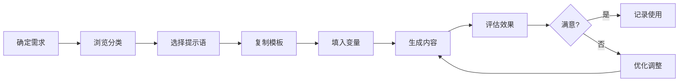

# AI 提示语使用指南

> 本指南帮助你快速上手 AI 提示语库，掌握提示工程的核心技巧。

---

## 📚 目录

1. [什么是提示语](#什么是提示语)
2. [如何使用本库](#如何使用本库)
3. [提示语编写技巧](#提示语编写技巧)
4. [优化与迭代](#优化与迭代)
5. [常见问题](#常见问题)

---

## 什么是提示语

### 定义
提示语（Prompt）是与 AI 模型交互的指令文本。一个好的提示语能够：
- 明确任务目标
- 提供必要的上下文
- 定义输出格式
- 设定质量标准

### 为什么需要提示语库

> [!info] 核心优势
> - **复用性**：避免重复编写相同提示语
> - **一致性**：确保输出质量稳定
> - **积累性**：持续优化，越用越好
> - **团队协作**：共享最佳实践

---

## 如何使用本库

### 目录结构

```
01_Areas/AI提示语/
├── AI提示语中心 MOC          # 总览和导航
├── 01_写作创作/               # 写作相关提示语
│   └── 写作创作 MOC
├── 02_编程开发/               # 编程相关提示语
│   └── 编程开发 MOC
├── 03_学习研究/               # 学习相关提示语
│   └── 学习研究 MOC
├── 04_工作提效/               # 办公相关提示语
│   └── 工作提效 MOC
└── 05_生活助手/               # 生活相关提示语
    └── 生活助手 MOC
```

### 使用流程



### 快速开始

1. **浏览 MOC**：从 [[AI提示语中心 MOC]] 开始
2. **选择分类**：根据需求进入相应分类 MOC
3. **查看提示语**：阅读提示语内容和使用说明
4. **复制使用**：复制提示语到 AI 工具中使用
5. **记录反馈**：更新使用次数和评分

---

## 提示语编写技巧

### 1. 明确角色设定

```markdown
❌ 不好的示例：
帮我写一篇关于 Python 的文章。

✅ 好的示例：
你是一位有10年经验的 Python 技术专家，擅长教授初学者。
请写一篇面向编程新手的 Python 入门指南...
```

### 2. 结构化输出

```markdown
## 请按以下结构输出：
1. 核心概念（3-5个要点）
2. 详细说明（每个概念配示例）
3. 实践建议（3个可执行的步骤）
4. 常见问题（2-3个典型问题及解答）
```

### 3. 提供示例

```markdown
## 参考示例
输入：...
输出：...

请按照类似的风格处理以下内容：
[你的内容]
```

### 4. 设置约束条件

```markdown
## 要求
- 字数控制在 1000-1500 字
- 使用通俗易懂的语言
- 包含至少 3 个代码示例
- 避免使用过于专业的术语（如必须使用，请解释）
```

### 5. 迭代优化

```markdown
第一轮：生成基础内容
第二轮：请优化表达，使其更生动
第三轮：请补充实际案例
第四轮：请检查技术准确性
```

---

## 优化与迭代

### 记录使用效果

每个提示语文件包含以下追踪字段：

| 字段 | 说明 | 更新频率 |
|------|------|----------|
| 使用次数 | 使用此提示语的次数 | 每次使用后 |
| 评分 | 1-5 星评价 | 定期评估 |
| 状态 | 草稿/测试/已验证 | 状态变更时 |
| 更新日期 | 最后修改时间 | 修改时 |

### 优化检查清单

- [ ] 提示语是否清晰明确？
- [ ] 输出是否符合预期？
- [ ] 是否处理了边界情况？
- [ ] 示例是否足够具体？
- [ ] 格式是否便于使用？

### 版本管理

```markdown
## 版本历史

### v1.0 (2024-01-15)
- 初始版本
- 基础功能实现

### v1.1 (2024-02-01)
- 增加示例说明
- 优化输出格式

### v1.2 (2024-02-15)
- 添加约束条件
- 改进变量定义
```

---

## 常见问题

### Q: 如何选择合适的提示语？

**A:** 按照以下步骤：
1. 明确你的具体需求
2. 浏览对应的分类 MOC
3. 查看提示语的"适用场景"
4. 参考"使用示例"判断是否符合

### Q: 提示语需要修改吗？

**A:** 建议根据实际情况调整：
- 修改变量内容
- 调整约束条件
- 增减示例
- 优化输出格式

### Q: 如何创建新的提示语？

**A:** 
1. 复制 [[Templates/AI提示语模板]]
2. 按模板填写内容
3. 进行测试验证
4. 移动到合适的分类目录

### Q: 如何处理 AI 输出不符合预期？

**A:**
1. 检查提示语是否清晰
2. 提供更多上下文信息
3. 增加具体示例
4. 分解任务为多个步骤
5. 调整 Temperature 参数

### Q: 如何与他人协作？

**A:**
1. 使用统一的模板格式
2. 完善元数据信息
3. 记录优化历史
4. 添加使用说明和注意事项

---

## 📖 进阶资源

- [[提示语优化技巧]]
- [[常用 AI 工具对比]]
- [[提示工程最佳实践]]

---

## 💡 小贴士

> [!tip] 使用建议
> 1. **从现有提示语开始**：不要从零开始，先尝试现有模板
> 2. **保持简洁**：提示语过长会降低效果
> 3. **持续迭代**：好的提示语是不断优化出来的
> 4. **记录反馈**：每次使用后记录效果和问题
> 5. **建立习惯**：定期回顾和更新提示语库

---

*最后更新：2026-02-10*
