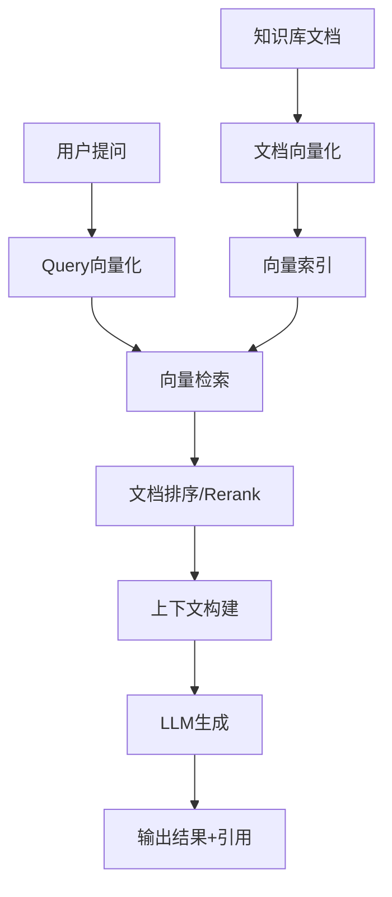
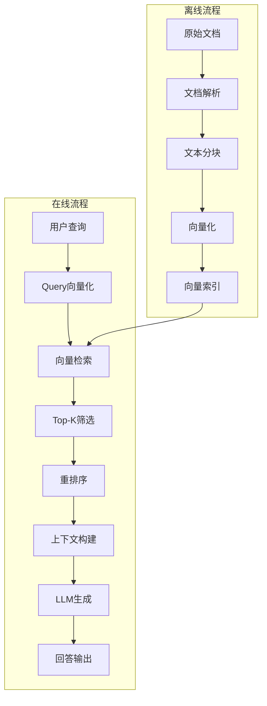

# RAG核心原理与流程解析

> **父级**：[[MOC-RAG]]  
> **上级**：[[RAG-技术概述]]  
> **相关**：[[RAG-数据预处理与索引]], [[RAG-实时检索与重排序]], [[RAG-上下文构建与生成]]

## 技术架构总览

```
用户提问 → 向量化 → 检索 → 文档排序 → 上下文构建 → LLM生成 → 输出
```



## 核心工作流程

### 阶段1：数据预处理与索引（离线）

> [!info] 准备工作
> 在实际问答前，需要先将知识库文档构建为可检索的向量索引。

**流程步骤**：
1. **文档加载** - 读取PDF、Word、Markdown等格式
2. **文本分块** - 将长文档切分为适当大小的chunks
3. **向量化** - 使用嵌入模型将文本转换为向量
4. **索引构建** - 存储到向量数据库（FAISS、Pinecone等）

**关键组件**：
- **嵌入模型**：Sentence-BERT、OpenAI Embeddings
- **向量数据库**：FAISS、Milvus、Chroma、Pinecone
- **分块策略**：固定长度、语义分块、递归分块

详见：[[RAG-数据预处理与索引]]

### 阶段2：实时检索与重排序（在线）

> [!tip] 核心环节
> 用户提问时，系统实时检索最相关的文档片段。

**流程步骤**：
1. **Query向量化** - 将用户问题转换为向量
2. **相似度搜索** - 在向量空间中找到最近邻
3. **初筛Top-K** - 获取K个最相似的文档片段
4. **重排序优化** - 使用更精确的模型重排序

**检索算法**：
- **近似最近邻（ANN）**：HNSW、IVF
- **精确搜索**：Flat L2、内积
- **混合搜索**：向量相似度 + 关键词匹配

详见：[[RAG-实时检索与重排序]]

### 阶段3：上下文构建与生成（在线）

> [!success] 最终生成
> 将检索到的文档组织为提示词，调用LLM生成回答。

**流程步骤**：
1. **文档组织** - 格式化检索结果
2. **提示构建** - 构建System + Context + Query提示
3. **LLM调用** - 调用大模型生成回答
4. **后处理** - 添加引用、格式化输出

**提示模板示例**：
```
基于以下信息回答问题：
[检索到的文档片段1]
[检索到的文档片段2]
...

问题：{用户问题}
答案：
```

详见：[[RAG-上下文构建与生成]]

## 核心增强机制

### 1. 动态知识注入
- **机制**：每次生成前检索最新资料
- **优势**：知识实时更新，不依赖模型训练数据
- **应用**：股票实时数据、新闻动态、产品信息

### 2. 证据可追溯
- **机制**：生成结果附带参考文档片段
- **优势**：提高可信度，便于验证
- **实现**：在回答中标注引用来源

### 3. 长文本处理
- **机制**：通过检索压缩超长上下文
- **优势**：突破模型上下文长度限制
- **技术**：只保留最相关的文档片段

## 系统架构图



## 关键技术指标

### 检索质量指标
| 指标 | 说明 | 目标值 |
|------|------|--------|
| **Recall@K** | Top-K中相关文档比例 | >80% |
| **MRR** | 首个相关文档排名倒数 | >0.6 |
| **NDCG** | 考虑排序质量的得分 | >0.7 |

### 生成质量指标
| 指标 | 说明 | 目标值 |
|------|------|--------|
| **相关性** | 回答与问题相关度 | 高 |
| **忠实度** | 回答与文档一致性 | >90% |
| **流畅度** | 语言表达自然程度 | 高 |

## 技术选型对比

### 嵌入模型选择
| 模型 | 维度 | 语言 | 适用场景 |
|------|------|------|----------|
| text-embedding-ada-002 | 1536 | 多语言 | 通用场景 |
| bge-large-zh | 1024 | 中文 | 中文优化 |
| m3e-base | 768 | 中文 | 轻量级 |
| gte-large | 1024 | 多语言 | 高性能 |

### 向量数据库对比
| 数据库 | 特点 | 适用规模 |
|--------|------|----------|
| FAISS | 轻量、本地 | 小规模 |
| Milvus | 分布式 | 大规模 |
| Pinecone | 托管服务 | 中大规模 |
| Chroma | 易用、开源 | 小到中规模 |

## 性能优化方向

### 1. 索引优化
- **量化压缩**：降低存储和计算成本
- **分层索引**：HNSW加速检索
- **分片策略**：分布式存储

### 2. 检索优化
- **混合搜索**：结合关键词和向量
- **查询扩展**：同义词、相关词扩展
- **重排序**：使用交叉编码器精排

### 3. 生成优化
- **上下文压缩**：只保留最相关信息
- **多路召回**：多种检索策略融合
- **迭代检索**：多轮检索优化

## 相关笔记

- [[RAG-技术概述]] - RAG基础概念
- [[RAG-数据预处理与索引]] - 阶段1详解
- [[RAG-实时检索与重排序]] - 阶段2详解
- [[RAG-上下文构建与生成]] - 阶段3详解
- [[RAG-高级优化策略]] - 进阶优化技术

## 参考资料

- [原文：RAG技术深度解析](https://juejin.cn/post/7501543492502683700)
- [LangChain RAG架构](https://python.langchain.com/docs/concepts/rag/)