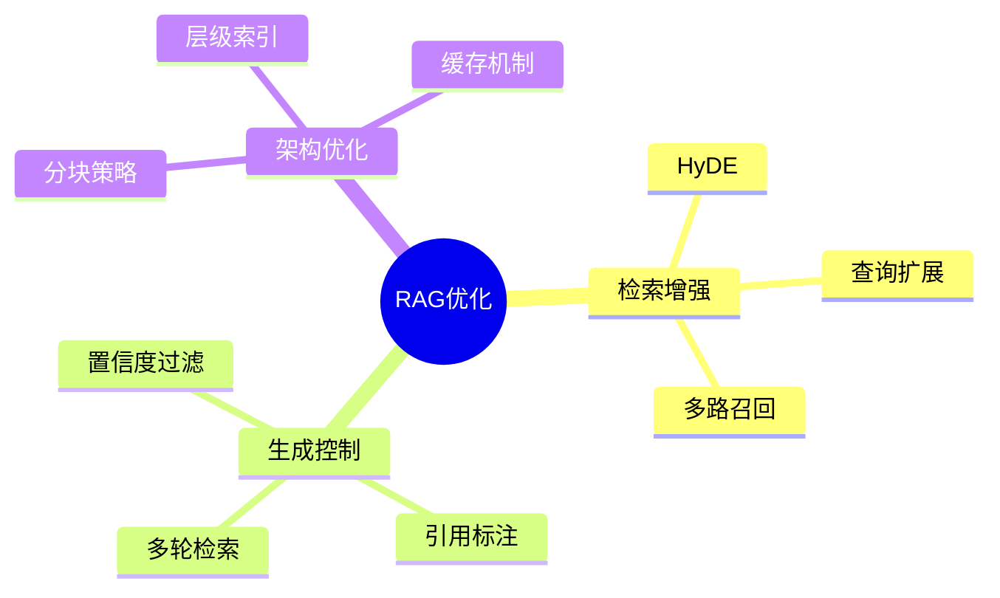

# RAG高级优化策略

> **父级**：[[MOC-RAG]]  
> **上级**：[[RAG-核心原理]]  
> **相关**：[[RAG-实时检索与重排序]], [[RAG-上下文构建与生成]]

## 优化策略概览



## 1. 检索增强策略

### 1.1 HyDE（Hypothetical Document Embeddings）

> [!info] 核心思想
> 先用LLM生成假设答案，再用假设答案检索相关文档，解决查询-文档语义差距问题。

**工作原理**：
```
用户查询 → LLM生成假设答案 → 假设答案向量化 → 向量检索 → 真实文档
```

**代码实现**：

```python
def hyde_retrieve(query, generator, encoder, index, documents):
    """
    HyDE检索：基于假设答案的检索增强
    
    Args:
        query: 用户查询
        generator: 文本生成模型
        encoder: 嵌入模型
        index: 向量索引
        documents: 文档库
    
    Returns:
        检索到的相关文档
    """
    # 步骤1：生成假设答案
    hypo_prompt = f"""请基于你的知识简要回答以下问题：
    
问题：{query}

简要回答（2-3句话）："""
    
    hypo_answer = generator.generate(hypo_prompt)
    
    # 步骤2：用假设答案进行检索
    hypo_embedding = encoder.encode([hypo_answer])
    distances, indices = index.search(hypo_embedding, k=5)
    
    return [documents[i] for i in indices[0]]
```

**适用场景**：
- 查询表述与文档差异较大
- 短查询语义不明确
- 专业术语对齐困难

**优缺点**：
- ✅ 提高短查询的检索效果
- ✅ 弥合查询-文档语义鸿沟
- ❌ 增加一次LLM调用，延迟增加
- ❌ 假设答案质量影响检索效果

### 1.2 查询扩展（Query Expansion）

```python
def expand_query(query, llm_client):
    """
    查询扩展：生成同义词和相关词
    """
    prompt = f"""为以下查询生成3-5个相关的扩展查询，帮助更全面地检索信息。

原查询：{query}

扩展查询（每行一个）："""
    
    expanded = llm_client.generate(prompt)
    expanded_queries = [q.strip() for q in expanded.split('\n') if q.strip()]
    
    # 合并原查询和扩展查询
    all_queries = [query] + expanded_queries
    
    return all_queries

def multi_query_retrieve(queries, encoder, index, documents, k=3):
    """
    多查询检索：用多个查询检索，合并结果
    """
    all_results = []
    
    for query in queries:
        query_emb = encoder.encode([query])
        _, indices = index.search(query_emb, k)
        all_results.extend(indices[0])
    
    # 去重并保留得分最高的
    unique_results = list(set(all_results))
    return [documents[i] for i in unique_results[:k]]
```

### 1.3 多路召回（Multi-Channel Retrieval）

```python
class MultiChannelRetriever:
    def __init__(self):
        self.channels = {
            'vector': VectorRetriever(),
            'keyword': BM25Retriever(),
            'graph': GraphRetriever(),
            'semantic': SemanticRetriever()
        }
    
    def retrieve(self, query, k=5, weights=None):
        """
        多路召回：融合多种检索策略
        
        Args:
            weights: 各通道权重，如 {'vector': 0.4, 'keyword': 0.3, ...}
        """
        if weights is None:
            weights = {name: 1.0/len(self.channels) for name in self.channels}
        
        # 各通道检索
        all_candidates = {}
        for name, retriever in self.channels.items():
            results = retriever.retrieve(query, k=k*2)
            for rank, doc in enumerate(results):
                if doc.id not in all_candidates:
                    all_candidates[doc.id] = {'doc': doc, 'scores': {}}
                all_candidates[doc.id]['scores'][name] = 1.0 / (rank + 1)
        
        # 加权融合
        fused_scores = []
        for doc_id, data in all_candidates.items():
            score = sum(data['scores'].get(ch, 0) * weights.get(ch, 0) 
                       for ch in self.channels.keys())
            fused_scores.append((data['doc'], score))
        
        # 排序返回
        fused_scores.sort(key=lambda x: x[1], reverse=True)
        return [doc for doc, _ in fused_scores[:k]]
```

## 2. 生成控制策略

### 2.1 引用标注

```python
def generate_with_citations(query, documents, llm_client):
    """
    生成带引用标注的回答
    """
    # 构建带标注的上下文
    context_parts = []
    for i, doc in enumerate(documents, 1):
        context_parts.append(f"[{i}] {doc['content']}")
    
    context = "\n\n".join(context_parts)
    
    prompt = f"""基于以下参考信息回答问题。请在回答中使用[1]、[2]等标注引用来源。

参考信息：
{context}

问题：{query}

要求：
1. 回答要准确、全面
2. 每个关键事实后标注引用来源
3. 在回答末尾列出所有引用的文档编号

回答："""
    
    answer = llm_client.generate(prompt)
    return answer
```

### 2.2 置信度过滤

```python
def filter_by_confidence(documents, query, encoder, threshold=0.6):
    """
    根据置信度过滤低质量检索结果
    """
    query_emb = encoder.encode([query])[0]
    
    filtered_docs = []
    for doc in documents:
        doc_emb = encoder.encode([doc['content']])[0]
        similarity = cosine_similarity(query_emb, doc_emb)
        
        if similarity >= threshold:
            doc['confidence'] = similarity
            filtered_docs.append(doc)
    
    return filtered_docs
```

### 2.3 多轮检索（Iterative Retrieval）

```python
def iterative_retrieve(query, retriever, generator, max_rounds=3):
    """
    多轮检索：基于生成结果迭代优化检索
    """
    all_contexts = []
    
    for round in range(max_rounds):
        # 检索
        docs = retriever.retrieve(query, k=3)
        context = format_context(docs)
        
        # 生成
        if round == 0:
            prompt = f"基于以下信息回答问题：\n\n{context}\n\n问题：{query}"
        else:
            prompt = f"基于以下新信息补充回答：\n\n{context}\n\n原问题：{query}\n已收集信息：{all_contexts}"
        
        answer = generator.generate(prompt)
        all_contexts.append(context)
        
        # 检查是否需要更多信息
        if "信息不足" not in answer and round > 0:
            break
        
        # 生成下一轮查询
        query = f"基于回答'{answer}'，还需要了解什么？"
    
    return answer, all_contexts
```

## 3. 架构优化策略

### 3.1 智能分块（Semantic Chunking）

```python
def semantic_chunking(text, encoder, max_chunk_size=500, similarity_threshold=0.8):
    """
    语义分块：基于语义相似度进行智能分块
    """
    # 初始句子分割
    sentences = split_into_sentences(text)
    
    chunks = []
    current_chunk = []
    current_size = 0
    
    for sent in sentences:
        if not current_chunk:
            current_chunk.append(sent)
            current_size = len(sent)
            continue
        
        # 计算与当前chunk的语义相似度
        sent_emb = encoder.encode([sent])
        chunk_text = ' '.join(current_chunk)
        chunk_emb = encoder.encode([chunk_text])
        
        similarity = cosine_similarity(sent_emb, chunk_emb)
        
        # 决定是否合并
        if similarity >= similarity_threshold and current_size + len(sent) <= max_chunk_size:
            current_chunk.append(sent)
            current_size += len(sent)
        else:
            chunks.append(' '.join(current_chunk))
            current_chunk = [sent]
            current_size = len(sent)
    
    # 添加最后一个chunk
    if current_chunk:
        chunks.append(' '.join(current_chunk))
    
    return chunks
```

### 3.2 层级索引（Hierarchical Index）

```python
class HierarchicalIndex:
    """
    层级索引：文档-段落-句子多级索引
    """
    def __init__(self, encoder):
        self.encoder = encoder
        self.doc_index = None  # 文档级索引
        self.chunk_indices = {}  # 各文档的段落级索引
    
    def build(self, documents):
        """构建层级索引"""
        # 1. 文档级索引
        doc_embeddings = []
        for doc in documents:
            doc_emb = self.encoder.encode([doc['summary']])
            doc_embeddings.append(doc_emb[0])
        
        self.doc_index = create_faiss_index(doc_embeddings)
        
        # 2. 段落级索引
        for i, doc in enumerate(documents):
            chunks = doc['chunks']
            chunk_embeddings = self.encoder.encode(chunks)
            self.chunk_indices[i] = create_faiss_index(chunk_embeddings)
    
    def search(self, query, k_docs=3, k_chunks=5):
        """层级检索"""
        query_emb = self.encoder.encode([query])
        
        # 1. 检索相关文档
        _, doc_ids = self.doc_index.search(query_emb, k_docs)
        
        # 2. 在各文档中检索相关段落
        all_chunks = []
        for doc_id in doc_ids[0]:
            chunk_index = self.chunk_indices[doc_id]
            _, chunk_ids = chunk_index.search(query_emb, k_chunks)
            
            for chunk_id in chunk_ids[0]:
                all_chunks.append({
                    'doc_id': doc_id,
                    'chunk_id': chunk_id,
                    'content': documents[doc_id]['chunks'][chunk_id]
                })
        
        return all_chunks
```

### 3.3 缓存优化

```python
import functools
import hashlib
from datetime import datetime, timedelta

class RAGCache:
    def __init__(self, ttl=3600):
        self.cache = {}
        self.ttl = ttl  # 缓存有效期（秒）
    
    def _get_key(self, query):
        """生成查询的缓存key"""
        return hashlib.md5(query.encode()).hexdigest()
    
    def get(self, query):
        """获取缓存结果"""
        key = self._get_key(query)
        if key in self.cache:
            result, timestamp = self.cache[key]
            if datetime.now() - timestamp < timedelta(seconds=self.ttl):
                return result
            else:
                del self.cache[key]
        return None
    
    def set(self, query, result):
        """设置缓存"""
        key = self._get_key(query)
        self.cache[key] = (result, datetime.now())
    
    def clear(self):
        """清理过期缓存"""
        now = datetime.now()
        expired = [k for k, (_, ts) in self.cache.items() 
                  if now - ts > timedelta(seconds=self.ttl)]
        for k in expired:
            del self.cache[k]

# 使用装饰器
def cached_retrieve(cache):
    def decorator(func):
        def wrapper(query, *args, **kwargs):
            # 尝试从缓存获取
            cached_result = cache.get(query)
            if cached_result:
                return cached_result
            
            # 执行检索
            result = func(query, *args, **kwargs)
            
            # 缓存结果
            cache.set(query, result)
            return result
        return wrapper
    return decorator
```

## 4. 评估与监控

### 检索质量评估

```python
def evaluate_retrieval(queries, ground_truth, retriever):
    """
    评估检索质量
    
    Args:
        queries: 查询列表
        ground_truth: 每个查询的真实相关文档
        retriever: 检索器
    """
    metrics = {
        'recall@5': [],
        'recall@10': [],
        'mrr': [],
        'ndcg': []
    }
    
    for query, truth in zip(queries, ground_truth):
        results = retriever.retrieve(query, k=10)
        result_ids = [r['id'] for r in results]
        
        # Recall@K
        for k in [5, 10]:
            retrieved_at_k = set(result_ids[:k])
            relevant = set(truth)
            recall = len(retrieved_at_k & relevant) / len(relevant)
            metrics[f'recall@{k}'].append(recall)
        
        # MRR
        for rank, doc_id in enumerate(result_ids, 1):
            if doc_id in truth:
                metrics['mrr'].append(1.0 / rank)
                break
        else:
            metrics['mrr'].append(0)
    
    # 计算平均值
    return {k: sum(v)/len(v) for k, v in metrics.items()}
```

## 5. 优化策略选择指南

```
┌─────────────────────────────────────────────────────┐
│                 优化策略选择决策树                   │
├─────────────────────────────────────────────────────┤
│                                                     │
│  检索效果不佳？                                      │
│    ├─ 是 → 使用HyDE或查询扩展                        │
│    └─ 否 → 继续                                     │
│                                                     │
│  需要更高精度？                                      │
│    ├─ 是 → 添加重排序层                              │
│    └─ 否 → 继续                                     │
│                                                     │
│  查询多样化？                                        │
│    ├─ 是 → 多路召回                                 │
│    └─ 否 → 继续                                     │
│                                                     │
│  延迟敏感？                                          │
│    ├─ 是 → 使用缓存 + 近似索引                       │
│    └─ 否 → 精确检索                                 │
│                                                     │
└─────────────────────────────────────────────────────┘
```

## 相关笔记

- [[RAG-核心原理]] - 基础架构
- [[RAG-实时检索与重排序]] - 检索实现
- [[RAG-上下文构建与生成]] - 生成实现
- [[RAG-代码示例]] - 完整代码

## 参考资料

- [Precise Zero-Shot Dense Retrieval without Relevance Labels](https://arxiv.org/abs/2212.10496) (HyDE论文)
- [原文：RAG技术深度解析](https://juejin.cn/post/7501543492502683700)