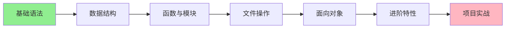

# Python编程 MOC

> Python编程学习地图 - 从这里开始你的Python之旅

---

## 📍 学习路径

---

## 📚 核心文档

### 学习计划
- [[Python学习计划]] - 100天系统学习计划
  - 8个阶段详细规划
  - 每日学习目标
  - 进度检查清单
  
- [[Python-100-Days索引]] - Python-100-Days项目文档索引
  - Day01-20: Python语言基础
  - Day21-35: Python语言应用
  - Day36-45: 数据库基础
  - Day46-60: Django Web开发
  - Day61-65: 网络数据采集
  - Day66-80: 数据分析
  - Day81-90: 机器学习
  - Day91-100: 团队项目开发
  
- [[Python核心知识点]] - 核心知识速查手册
  - 各阶段要点提炼
  - 代码示例和最佳实践
  - 学习路径建议

### 知识体系
- [[Python基础知识]] - 核心语法详解
  - 变量、数据类型、运算符
  - 控制流、循环
  - 列表、字典等数据结构
  - 函数基础
  - 文件操作与异常处理

- [[Python进阶]] - 高级特性
  - 面向对象编程
  - 装饰器与生成器
  - 上下文管理器
  - 函数式编程
  - 并发编程
  - 性能优化

### 实践指南
- [[Python项目实践]] - 实战项目清单
  - 初级项目（6个）
  - 中级项目（6个）
  - 高级项目（4个）

### 资源索引
- [[Python资源汇总]] - 学习资源大全
  - 推荐书籍
  - 在线教程
  - 常用工具
  - 第三方库清单

---

## 🎯 快速开始

### 如果你是初学者
1. 先看 [[Python学习计划]] 了解整体规划
2. 从 [[Python基础知识]] 第1章开始
3. 每周完成一个小项目
4. 遇到问题查 [[Python资源汇总]]

### 如果你有基础想进阶
1. 直接跳转到 [[Python进阶]]
2. 挑选感兴趣的高级特性学习
3. 尝试 [[Python项目实践]] 的中级/高级项目

---

## 📊 学习进度

### 基础阶段
- [ ] 环境搭建
- [ ] 基础语法
- [ ] 数据结构
- [ ] 函数编程
- [ ] 文件操作

### 进阶阶段
- [ ] 面向对象
- [ ] 装饰器
- [ ] 生成器
- [ ] 并发编程
- [ ] 性能优化

### 实战阶段
- [ ] 初级项目 x 3
- [ ] 中级项目 x 2
- [ ] 高级项目 x 1

---

## 🔗 相关链接

### 技术栈关联
- [[后端开发 MOC]] - Python后端开发路线
- [[通用技能 MOC]] - 编程通用能力

### 外部资源
- [Python官方文档](https://docs.python.org/zh-cn/3/)
- [Python Cookbook](https://diveintopython3.problemsolving.io/)

---

## 💡 今日学习建议

> "最好的学习方法就是动手写代码。"

每天建议：
1. 📖 阅读理论知识 30分钟
2. ⌨️ 动手敲代码 60分钟
3. 📝 做学习笔记 15分钟
4. 🔍 解决遇到的问题 15分钟

---

## 🎓 里程碑

| 阶段 | 标志 | 奖励 |
|------|------|------|
| 基础完成 | 能独立写100行程序 | 🌟 |
| 进阶完成 | 理解装饰器和生成器 | ⭐⭐ |
| 第一个项目 | 完成待办事项应用 | ⭐⭐⭐ |
| Web项目 | 完成博客系统 | ⭐⭐⭐⭐ |
| 开源贡献 | 提交第一个PR | ⭐⭐⭐⭐⭐ |

---

*最后更新: 2026-02-10*
