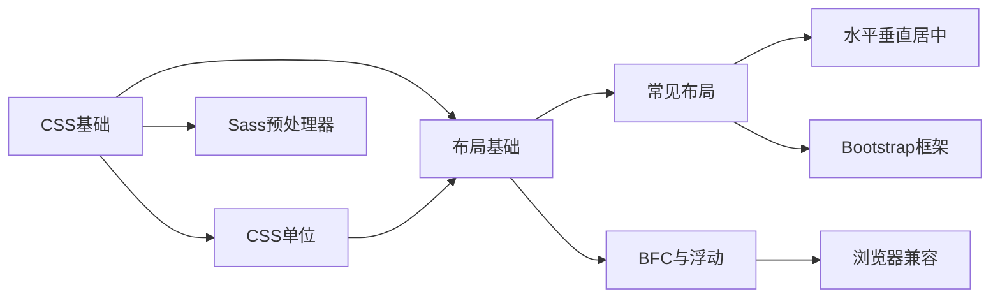

# CSS 学习笔记 - 内容地图 (MOC)

> 本目录汇集了 CSS 相关的系统性学习笔记，从基础语法到高级布局，从前缀处理器到响应式框架。

## 📚 核心文档

### [[CSS]] - CSS 基础
- 书写方式（嵌入式、行内式、外链式、@import）
- 选择器系统（基本、复合、伪类、属性、结构）
- 盒模型（content、padding、border、margin）
- 定位系统（fixed、relative、absolute、sticky）
- CSS3 新特性（弹性盒、栅格、变形、过渡、动画）
- 响应式布局（@media 媒体查询）

### [[Unit]] - CSS 单位详解
- 绝对单位（px、cm、mm、in、pt、pc）
- 相对单位-基于字体（ch、em、ex、rem）
- 相对单位-基于视口（vh、vw、vmin、vmax、%）
- 像素/分辨率详解（dpi、ppi、dppx）

### [[Layout]] - CSS 常见布局
- 单列布局（等宽布局、通栏布局）
- 双列布局（绝对定位、float+BFC、flex、grid、浮动定宽）
- 三列布局（圣杯布局、双飞翼布局、flex/grid）
- 等高布局（flex/grid、绝对定位、table、伪等高）

### [[BFC]] - BFC、浮动与清除浮动
- BFC 的概念与创建条件
- BFC 的应用（清除浮动、避免外边距塌陷、自适应布局）
- 浮动的特性与清除方法

### [[Center]] - 水平垂直居中
- 文字水平居中（`text-align: center`）
- 元素水平居中（margin、定位、flex、grid、fit-content）
- 文字垂直居中（`line-height`、table-cell、伪元素）
- 元素垂直居中（flex、定位、transform）
- 水平垂直都居中（4方向定位+margin、flex、transform）

### [[Sass]] - Sass/SCSS 预处理器
- 嵌套规则与父选择器 `&`
- 变量、数据类型、运算
- 控制指令（@if、@for、@each、@while）
- 混合指令（@mixin、@include）
- 继承（@extend）与函数

### [[Bootstrap]] - Bootstrap 框架
- 全局 CSS 样式（排版、列表、表格、按钮）
- 图片样式（响应式图片、圆角、圆形）
- 栅格系统（12 列布局、响应式类、列偏移）
- 表单与组件

### [[Compatible]] - 浏览器兼容性
- IE 浏览器常见兼容问题
- CSS Hack 技巧
- 事件对象与 DOM 操作兼容性

## 🖼️ 配套资源

### 图片资源
- 存放于 `img/` 目录下
- 包含示意图、代码示例截图、布局效果演示图
- 共 52 张图片（.png + .gif）

## 🔗 学习路径建议

**推荐学习顺序：**
1. **入门阶段**：[[CSS]] → [[Unit]]
2. **进阶阶段**：[[BFC]] → [[Layout]]
3. **实战阶段**：[[Center]] → [[Bootstrap]]
4. **工具阶段**：[[Sass]] → [[Compatible]]

## 📊 文档统计

| 文档 | 行数 | 主要内容 |
|------|------|----------|
| CSS.md | 461 | 完整 CSS 基础 |
| Unit.md | 206 | 单位详解 |
| Layout.md | 820 | 布局大全 |
| BFC.md | 470 | BFC 与浮动 |
| Sass.md | 1078 | SCSS 教程 |
| Bootstrap.md | 120 | 框架速查 |
| Center.md | 627 | 居中方法 |
| Compatible.md | 100 | 兼容性处理 |

**总计：3,882 行代码/笔记**

## 🏷️ 标签体系

- `#css` - CSS 相关
- `#layout` - 布局相关
- `#frontend` - 前端开发
- `#web开发` - Web 开发
- `#tutorial` - 教程

## 🔗 相关链接

### 父级导航
- [[README|返回系列介绍]]

### 子笔记
- [[CSS]] - CSS基础
- [[Unit]] - CSS单位详解
- [[Layout]] - CSS常见布局
- [[BFC]] - BFC、浮动与清除浮动
- [[Center]] - 水平垂直居中
- [[Sass]] - Sass/SCSS预处理器
- [[Bootstrap]] - Bootstrap框架
- [[Compatible]] - 浏览器兼容性

## 💡 使用提示

1. **双向链接**：使用 `[[文件名]]` 快速跳转相关文档
2. **代码示例**：大部分文档包含可直接运行的 HTML/CSS 示例
3. **图片演示**：查看 `img/` 目录中的示意图辅助理解
4. **持续更新**：部分内容标注"待补充"，欢迎扩展

---

*最后更新：2026-02-10*
*维护者：前端开发学习笔记*
