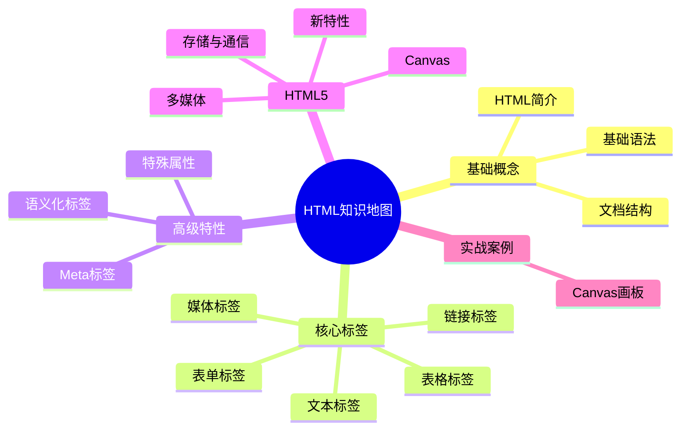

# HTML 完全学习指南

> [!abstract] 简介
> HTML（HyperText Markup Language）是构建网页的标准标记语言，是前端开发的三大基石之一。

## 学习路线

> [!tip] 学习建议
> 按照以下顺序学习，循序渐进掌握HTML

1. **[[01-HTML基础入门|HTML基础入门]]** - 了解HTML的基本概念和文档结构
2. **[[02-HTML标签详解|HTML标签详解]]** - 掌握常用标签的使用方法
3. **[[03-Meta标签详解|Meta标签详解]]** - 理解元信息标签的作用
4. **[[04-HTML特殊属性|HTML特殊属性]]** - 深入理解重要属性的区别
5. **[[05-HTML5新特性|HTML5新特性]]** - 学习现代HTML的新功能
6. **[[06-Canvas实战案例|Canvas实战案例]]** - 动手实践Canvas绘图

## 核心知识点速查

| 主题 | 重要程度 | 相关文件 |
|------|----------|----------|
| 基础标签 | ⭐⭐⭐⭐⭐ | [[02-HTML标签详解]] |
| 表单控件 | ⭐⭐⭐⭐⭐ | [[02-HTML标签详解#表单]] |
| Meta标签 | ⭐⭐⭐⭐ | [[03-Meta标签详解]] |
| src vs href | ⭐⭐⭐⭐ | [[04-HTML特殊属性]] |
| HTML5语义化 | ⭐⭐⭐⭐ | [[05-HTML5新特性]] |
| Canvas绘图 | ⭐⭐⭐ | [[06-Canvas实战案例]] |

## 常用资源

- [MDN HTML文档](https://developer.mozilla.org/zh-CN/docs/Web/HTML)
- [HTML5规范](https://html.spec.whatwg.org/)
- [Can I Use](https://caniuse.com/) - 浏览器兼容性查询

## 学习进度追踪

- [x] HTML基础概念
- [x] 常用标签学习
- [x] Meta标签详解
- [x] 特殊属性理解
- [x] HTML5新特性
- [x] Canvas实战

> [!success] 完成状态
> 所有核心内容已完成学习！

---
*最后更新：2026-02-10*