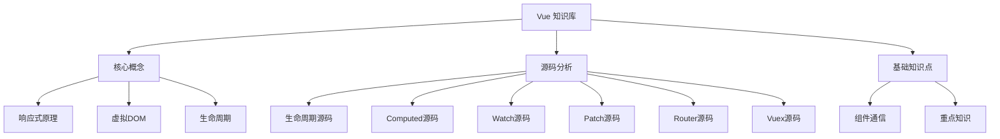

# Vue 知识库索引

> Vue 是一套用于构建用户界面的**渐进式框架**，被设计为可以自底向上逐层应用。核心库只关注视图层，易于上手，便于与第三方库或既有项目整合。

## 📚 知识体系导航

### 🎯 面试知识体系
- [[01-核心概念/Vue面试知识体系|📖 Vue 面试知识点体系]] - 完整面试知识梳理
  - Vue 基础概念与核心特性
  - 生命周期与实例
  - 响应式原理（Vue2 vs Vue3）
  - 虚拟 DOM 与 Diff 算法
  - 组件化开发
  - 组件通信方式
  - 计算属性与侦听器
  - Vue Router 路由
  - Vuex 状态管理
  - 性能优化

---

## 🏗️ 核心概念

### 响应式系统
- [[01-核心概念/响应式原理|双向绑定与响应式原理]]
  - MVVM 架构模式
  - 数据劫持原理（Object.defineProperty）
  - 依赖收集与发布订阅
  - Proxy 实现（ES6+）
  - 完整响应式实现代码

### 虚拟 DOM
- [[01-核心概念/虚拟DOM|虚拟 DOM 与 Diff 算法]]
  - 虚拟 DOM 概念与结构
  - VNode 构造过程
  - Diff 算法原理
  - 双端比较策略
  - Key 的作用与优化

### 生命周期
- [[01-核心概念/生命周期|Vue 生命周期详解]]
  - 8 大生命周期钩子
  - 父子组件执行顺序
  - keep-alive 生命周期
  - 生命周期源码分析

---

## 🔧 源码分析

### 核心模块
- [[02-源码分析/source-live|生命周期源码分析]] - 从 new Vue() 到 mounted 全过程
- [[02-源码分析/source-computed|Computed 源码分析]] - 计算属性缓存与惰性求值
- [[02-源码分析/source-watch|Watch 源码分析]] - 侦听器实现与深度监听
- [[02-源码分析/source-patch|Patch 源码分析]] - DOM 更新与 Diff 算法

### 生态工具
- [[02-源码分析/source-router|Vue Router 源码分析]] - 路由实现与导航守卫
- [[02-源码分析/source-vuex|Vuex 源码分析]] - 状态管理原理

---

## 📝 基础知识点

### 组件开发
- [[03-基础知识点/组件通信|组件间通信方式汇总]]
  - 父子组件通信（props/$emit）
  - 跨级组件通信（provide/inject）
  - 全局通信（Event Bus、Vuex）
  - 其他方式（$attrs/$listeners、ref）

### 进阶特性
- [[03-基础知识点/Vue重点知识|Vue 重点知识详解]]
  - Mixin 混入机制
  - v-if vs v-show
  - v-for 与 v-if
  - computed vs watch
  - 事件处理
  - v-model 与自定义
  - $nextTick
  - Slot 插槽
  - 动态/异步/缓存组件
  - 函数式组件

---

## 🗺️ 知识图谱

---

## 📖 学习路径

### 初级 → 中级 → 高级

**初级**（掌握基础使用）
1. [[01-核心概念/生命周期|生命周期]]
2. [[03-基础知识点/Vue重点知识|基础语法]]
3. [[03-基础知识点/组件通信|组件通信]]

**中级**（理解工作原理）
1. [[01-核心概念/响应式原理|响应式原理]]
2. [[01-核心概念/虚拟DOM|虚拟DOM]]
3. [[01-核心概念/Vue面试知识体系|面试知识体系]]

**高级**（深入源码实现）
1. [[02-源码分析/source-live|生命周期源码]]
2. [[02-源码分析/source-computed|Computed源码]]
3. [[02-源码分析/source-watch|Watch源码]]
4. [[02-源码分析/source-patch|Patch源码]]
5. [[02-源码分析/source-router|Router源码]]
6. [[02-源码分析/source-vuex|Vuex源码]]

---

## 🔗 相关资源

- [Vue 官方文档](https://vuejs.org/)
- [Vue Router 文档](https://router.vuejs.org/)
- [Vuex 文档](https://vuex.vuejs.org/)

---

> [!note] 最近更新
> - [[01-核心概念/Vue面试知识体系|Vue面试知识体系]] - 2025-02-11 整理完成
> - [[02-源码分析/source-vuex|Vuex源码分析]] - 2025-02-11 整理完成

---

*基于掘金文章《2024前端高频面试题之--VUE篇》及个人学习笔记整理*