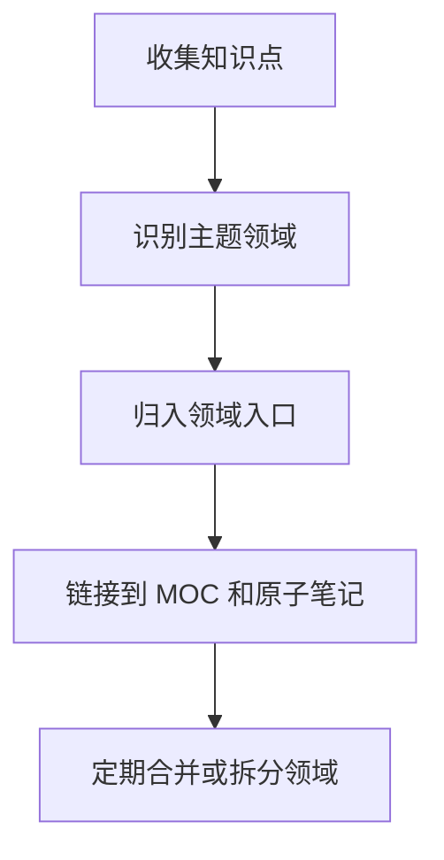

# 04-领域
04-领域是 RAG 或知识库结构中的领域层入口，用于把主题按业务或技术领域归类。

## 领域层作用

领域层负责把零散知识归入稳定主题，例如前端、后端、AI、交易、通用技能。它不是具体知识点，而是帮助检索、导航和权限管理的中间层。

## 组织流程

## 实践检查清单

- 领域是否稳定，不随单篇文章频繁变化。
- 笔记是否能从领域入口找到。
- 领域下是否有 MOC 或导航页承接。
- 交叉领域笔记是否用 wikilink 连接，而不是复制多份。
- 是否定期清理过宽或过窄的领域。

## 案例

“RAG 数据预处理”属于 AI 领域，也可能连接后端数据管道。可以主归入 AI/RAG，再链接到后端的数据处理笔记，避免知识重复。

## 常见误区

- 把领域层做成文件夹分类的复制品。
- 每个新概念都创建新领域，导致导航碎片化。

## 相关概念
- [[RAG-技术概述]]
- [[parse-knowledge]]
