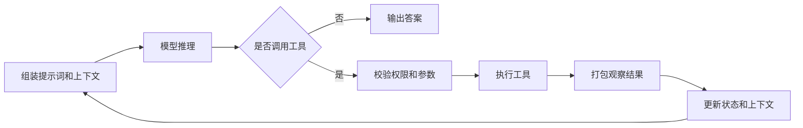

# AI Agent Harness

## 定义

AI Agent Harness 是包裹在 [[LLM]] 外层、让模型具备持续行动能力的软件架构。它负责循环编排、工具调用、记忆、上下文管理、状态持久化、错误处理、权限控制和验证闭环。

换句话说，用户看到的是 [[AI Agent]]，真正让 Agent 稳定运行的是 Harness。

## 核心组件

- [[编排循环]]：驱动“思考、行动、观察”的多轮执行。
- [[Agent 工具层]]：注册工具、校验参数、执行工具并返回观察结果。
- [[Memory]]：管理短期会话、长期记忆和任务中间状态。
- [[上下文工程]]：决定模型每一步看见哪些信息。
- [[验证循环]]：用测试、规则、视觉反馈或模型裁判检查结果。
- [[Agent 护栏]]：在输入、输出和工具调用前后设置风险边界。
- 状态管理：保存任务进度，使中断恢复、回放调试和回滚成为可能。
- 错误处理：把临时错误、可恢复错误、用户可修复错误和意外错误分开处理。

## 关键判断

- Harness 不是简单的 Prompt 包装，而是生产级 Agent 的运行时系统。
- 同一个模型接入不同 Harness，任务成功率可能差异很大。
- 模型越强，Harness 可以变薄，但不会消失，因为系统仍需要管理权限、上下文、执行和验证。
- 生产级 Agent 的难点通常不在“模型会不会回答”，而在“系统能不能稳定完成任务”。

## 架构流程

## 设计取舍

- 单 Agent 还是多 Agent：优先把单 Agent 做稳，再引入多 Agent。
- ReAct 还是先规划后执行：前者灵活，后者通常更快、更省成本。
- 总结上下文还是即时检索：取决于任务是否需要完整历史。
- 自动批准还是人工确认：取决于工具副作用和安全风险。
- 厚 Harness 还是薄 Harness：确定性逻辑越多，系统越可控；留给模型越多，系统越灵活。

## 相关概念

- [[AI Agent]]
- [[Harness Engineering（驾驭工程）]]
- [[上下文工程]]
- [[编排循环]]
- [[验证循环]]
- [[Agent 护栏]]
- [[MCP]]
- [[Sandbox]]

## 参考资料

- [[深度拆解：AI Agent Harness 的构造【译】]]
