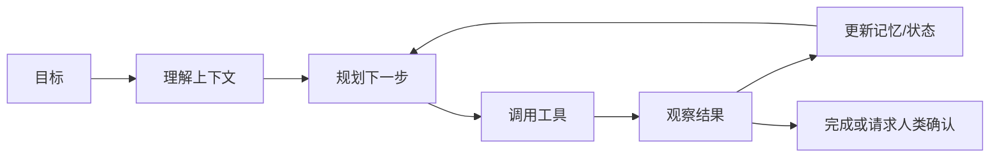

# AI Agent

**定义**: AI Agent（人工智能代理）是一种能够自主感知环境、做出决策并执行行动的 AI 系统。与传统的对话式 AI（如 ChatGPT）不同，Agent 不仅能回答问题，还能主动执行任务。

## 核心特征

| 特征 | 描述 |
|------|------|
| **自主性** | 能够在没有人工干预的情况下独立运作 |
| **感知能力** | 可以感知和理解环境（文本、数据、API 等） |
| **决策能力** | 基于感知信息做出决策 |
| **行动能力** | 能够执行实际操作（调用 API、操作文件、发送消息等） |
| **记忆能力** | 保持上下文和长期记忆 |

## 基本运行循环

Agent 的关键不只是“会调用工具”，而是能围绕目标持续推进：每一步都根据观察结果调整计划，并在风险过高、权限不足或目标不清时停下来请求确认。

## 与传统 AI 的区别

| | 传统 AI（ChatGPT） | AI Agent |
|---|-------------------|----------|
| 交互方式 | 对话式问答 | 任务驱动 |
| 执行能力 | 仅提供建议 | 实际执行操作 |
| 上下文 | 单轮/多轮对话 | 持久记忆 |
| 工具使用 | 有限或无 | 丰富的工具集成 |

## 关键组件

- **模型**：负责理解、推理、规划和生成操作参数，通常由 [[LLM]] 承担。
- **工具**：文件、浏览器、数据库、API、消息系统等可执行能力。
- **记忆**：短期上下文、长期知识、用户偏好和任务状态，可结合 [[RAG]]。
- **规划器**：把大目标拆成可执行步骤，并决定何时继续、回退或停止。
- **权限与边界**：限制 Agent 能访问什么、能改什么、何时需要人工确认。
- **评估器**：检查结果是否满足目标，必要时触发重试、审查或回滚。

## 常见框架

- **OpenClaw**: 开源个人 AI 助理，支持多平台消息和任务自动化
- **LangChain**: 构建 LLM 应用的框架
- **AutoGen**: 微软的多 Agent 协作框架
- **CrewAI**: 角色扮演的多 Agent 系统

## 应用场景

- 个人助理（日程管理、邮件处理）
- 自动化工作流（数据收集、报告生成）
- 客户服务（自动回复、工单处理）
- 代码开发（自动化编程、代码审查）

## 设计案例

以“自动整理日报”为例，一个实用 Agent 可以这样设计：

1. 读取今天的任务、日记和项目进展。
2. 汇总完成项、阻塞项和明天建议。
3. 检查是否有未处理收件箱内容。
4. 生成日报草稿。
5. 在写入知识库或发送消息前请求用户确认。

这里的安全边界很重要：读取和汇总可以自动完成，但删除、归档、对外发送等动作应有明确确认。

## 常见误区

- **把长 Prompt 当 Agent**：没有工具、状态和反馈循环，只是一次复杂问答。
- **完全放开权限**：Agent 可能误删文件、发送错误消息或调用高成本 API。
- **缺少可观测性**：不知道它读了什么、调用了什么、为什么做出某个决定。
- **没有停止条件**：任务失败时无限重试，浪费资源并放大错误。
- **忽略评估**：只看输出是否流畅，不检查事实、格式和业务目标是否达成。

## 相关概念

- [[LLM]] - 大语言模型是 Agent 的"大脑"
- [[RAG]] - 检索增强生成，为 Agent 提供知识
- [[Prompt Engineering]] - 提示工程，指导 Agent 行为
- [[Memory]] - 长期记忆与上下文管理
- [[Skills]] - 可复用能力封装

---
*参考: [[OpenClaw]] 是一个典型的 AI Agent 实现*
