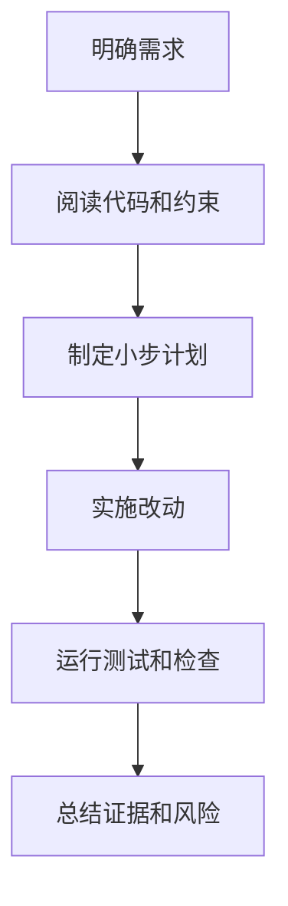

# AI Coding 最佳实践
AI Coding 最佳实践强调明确目标、拆分任务、先读代码、写可验证改动、运行测试并保留可追踪上下文。

## 工作流程

## 检查清单

- 是否先读相关代码，而不是直接生成方案。
- 改动是否有明确边界和验收标准。
- 是否保护用户已有修改。
- 是否运行与改动相关的测试、格式检查或手动验证。
- 最终说明是否包含改动、验证和未完成风险。

## 案例

让 AI 修复登录问题时，应提供复现步骤、期望行为、相关文件和测试命令。AI 应先定位认证流程，再小范围修改，并用测试或手动步骤证明 401 分支已被覆盖。

## 常见误区

- 给 AI 一个模糊目标，却要求一次性完成大范围重构。
- 不运行测试，只相信生成内容。
- 让 AI 改不相关文件，扩大风险。
- 不保存上下文，导致后续接手无法判断改动原因。

## 复盘提示

AI Coding 的核心不是“让模型多写代码”，而是让它在真实工程约束下做小步、可验证、可回滚的改动。每次任务结束都应留下三类证据：改了什么、如何验证、还有什么风险。

## 质量边界

AI 适合加速定位、生成候选实现和整理测试，但不能替代工程验收。权限、数据迁移、安全、并发和财务相关逻辑需要更严格的人类审查和验证证据。

## 协作模式

高质量协作通常是人定义目标和边界，AI 执行搜索、修改和验证，人再审查关键取舍。把所有判断都外包给 AI，会放大上下文缺失和验证不足的问题。

## 相关概念
- [[AI-Coding-50-工作法]]
- [[Prompt 工程指南]]
