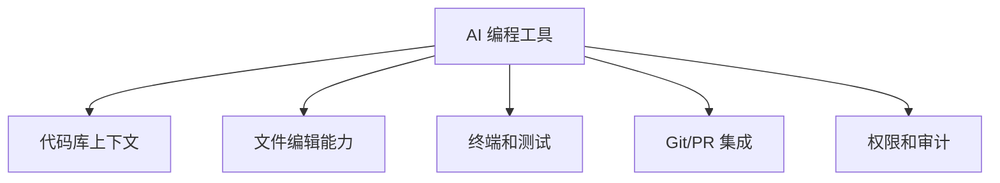

# AI 编程工具对比
AI 编程工具对比用于比较 Codex、Claude Code、Cursor、Copilot 等工具在代码理解、编辑、自动化和集成能力上的差异。

## 对比维度

## 使用场景

- IDE 内补全：适合局部代码和快速补全。
- 仓库级 Agent：适合跨文件修改、测试和重构。
- PR/CI 助手：适合审查、修复检查和生成说明。
- 自动化任务：适合定时扫描、依赖升级和文档维护。

## 检查清单

- 工具是否能读取足够代码上下文。
- 是否能实际编辑文件并运行验证命令。
- 是否能保护用户已有修改。
- 是否能产生可审计的变更记录。
- 成本、速度和权限是否适合团队日常使用。

## 案例

修复跨模块 bug 时，只有补全工具通常不够，需要能读取调用链、改多个文件、运行测试并总结风险的 Agent。写单个函数时，IDE 补全可能更高效。

## 常见误区

- 只比较模型聪明程度，不比较上下文、工具和权限。
- 把补全工具当作代码库级 Agent 使用。
- 让工具直接改生产关键逻辑，却没有测试和审查。
- 忽略隐私、代码上传、审计日志和企业权限策略。

## 复盘提示

工具选择应从任务倒推：需要读全仓、运行测试和提交 PR，就选 Agent；只需要局部补全，就用 IDE 插件；需要团队协作，就看审计、权限和集成能力。

## 评估边界

一次演示效果不能代表长期生产力。真实评估应包含复杂代码库、失败恢复、测试通过率、误改率和团队使用成本。

## 相关概念
- [[AI工具对比]]
- [[Claude Code 配置详解]]
