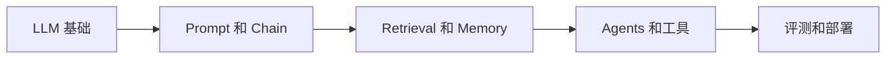

# AI_ML
AI_ML 是机器学习、LLM 应用开发和 LangChain 相关能力的聚合分类。

## 相关概念
- [[LangChain-Agents]]
- [[LangChain-Chains]]
- [[LangChain-Retrieval]]

## 学习路径

## 实践检查清单

- 是否能用最小 Chain 跑通输入、模型和输出解析。
- 检索系统是否有文档切分、向量库和召回评估。
- Memory 是否区分短期状态和长期记忆。
- Agent 工具是否有 schema、权限和错误处理。
- 是否用 LangSmith 或日志记录运行过程。

## 案例

做一个问答机器人时，先实现简单 Prompt，再加入 Retrieval，最后再考虑 Agent 工具调用。这样能逐层定位质量问题。

## 常见误区

- 一开始就上 Agent，基础链路还不可控。
- 把 Memory 当作无限聊天记录存储。
- 没有评测集，调整参数全凭感觉。

## 复盘问题

- 当前问题是否真的需要 Agent，还是 Chain、Retrieval 或普通函数就够。
- 每次调整 Prompt、模型或检索策略后是否有固定评测集对比。
- Memory、工具和检索是否都有权限、成本和失败处理边界。

## 选型边界

AI_ML 聚合入口要帮助避免“看见新框架就上新框架”。如果任务是稳定输入到稳定输出，优先用普通函数、Prompt 或简单 Chain；如果问题依赖外部知识，再引入 Retrieval；如果需要跨系统执行动作，才评估 Agent 和工具调用。每一次复杂度升级都要带来可验证收益，例如更高命中率、更低人工成本或更好的可维护性。没有评测集时，不应把主观感觉当作架构升级依据。
