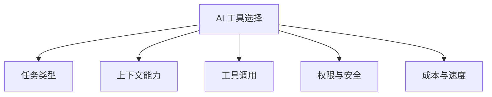

# AI工具对比

## 定义

AI工具对比记录不同 AI 编程、写作、研究和自动化工具的能力边界、适用场景和取舍。它的重点不是排名，而是帮助根据任务选择合适工具组合。

## 对比维度

## 常见场景

- 编程：看代码库、改文件、跑测试、提交 PR。
- 写作：整理材料、生成提纲、改写表达。
- 研究：检索资料、归纳观点、生成报告。
- 自动化：定时任务、监控变化、连接外部系统。

## 检查清单

- 工具是否能访问任务所需上下文。
- 是否支持文件、终端、浏览器或 API 工具调用。
- 输出是否可验证，有没有引用、测试或审计记录。
- 是否适合处理敏感信息。
- 成本、速度和稳定性是否符合使用频率。

## 选择案例

- 需要改代码并运行测试：选择能访问仓库、终端和文件系统的工具。
- 需要写研究报告：选择检索能力强、能保留引用来源的工具。
- 需要日常自动化：选择能定时运行、连接 API、保留执行日志的工具。
- 需要隐私安全：优先看权限隔离、数据保留策略和本地化能力。

## 常见误区

- 只看模型能力，不看工具能否接触真实上下文。
- 把写作工具用于代码修改，却没有测试验证。
- 把一次性聊天当作自动化流程，没有状态和日志。

## 组合策略

复杂任务通常不是选择单一工具，而是按阶段组合：研究阶段需要检索和引用，设计阶段需要长上下文和结构化推理，执行阶段需要文件、终端和测试权限，验收阶段需要可复现的检查记录。工具对比的最终输出应是“在什么任务上用什么工具，以及如何验证结果”。

## 相关概念
- [[AI 编程工具对比]]
- [[AI Coding 最佳实践]]
- [[AI Agent]]
