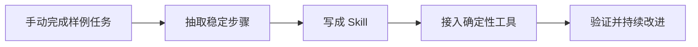

Steve Yegge 说，使用 AI 编程代理的人的生产力"是当今使用 Cursor 和聊天工具的工程师的 10 到 100 倍，大约是 2005 年 Google 工程师的 1000 倍。"

这是一个真实的数字。我亲眼见过，也亲身经历过。但当人们听到这个数字时，他们总是找错了原因——更好的模型、更聪明的 Claude、更多的参数。2x 的人和 100x 的人用的是同样的模型。区别不在于智能，而在于架构——而这个架构可以写在一张索引卡上。

## 装备就是产品

2026 年 3 月 31 日，Anthropic 不小心把 Claude Code 的全部源代码发布到了 npm 注册表上。51.2 万行代码。我读完了。它证实了我在 YC 一直教授的理念：秘密不在模型，而在包裹模型的东西。

实时仓库上下文、提示词缓存、专用工具、上下文膨胀最小化、结构化会话记忆、并行子代理——这些都不能让模型变得更聪明，但它们都能在正确的时刻给模型提供正确的上下文，而不把它淹没在噪音中。

这个包装层叫做**装备（harness）**。每个 AI 构建者都应该问的问题是：什么该放进装备，什么该留在外面？答案有一个特定的形状，我称之为**单薄的装备，厚重的技能（thin harness, fat skills）**。

## 五个定义

瓶颈从来不是模型的智能。模型已经知道如何推理、综合和编写代码。它们失败是因为不了解你的数据——你的模式、你的惯例、你的问题的特定形态。五个定义可以解决这个问题。

**1. 技能文件（Skill files）**

技能文件是一个可复用的 Markdown 文档，教模型如何做某件事。不是做什么——做什么由用户来定。技能提供的是过程。

大多数人忽略的关键洞察：**技能文件的工作方式就像方法调用。** 它接受参数，你用不同的参数来调用它。同样的过程会产生截然不同的能力，取决于你传入了什么。

考虑一个叫 `/investigate` 的技能。它有七个步骤：界定数据集、建立时间线、标注每一份文档、综合分析、正反论证、引用来源。它接受三个参数：TARGET（目标）、QUESTION（问题）和 DATASET（数据集）。把它指向一位安全科学家和 210 万封调查邮件，你会得到一位医学研究分析师，判断一位举报人是否被噤声。把它指向一家空壳公司和 FEC 备案文件，你会得到一位取证调查员，追踪协调一致的政治捐款。

同一个技能。同样的七个步骤。同一个 Markdown 文件。技能描述的是一个判断的过程，而调用提供了整个世界。

这不是提示词工程。这是软件设计，使用 Markdown 作为编程语言，以人类的判断作为运行时。事实上，Markdown 是对能力的更完美的封装，比僵化的源代码更完美，因为它用模型本身思考的语言来描述过程、判断和上下文。

**2. 装备（The harness）**

装备是运行 LLM 的程序。它做四件事：循环运行模型、读写你的文件、管理上下文、执行安全策略。仅此而已。这就是"单薄"。

反面模式是臃肿的装备加上单薄的技能。你一定见过：40+ 个工具定义吃掉了一半的上下文窗口。万能工具每次 MCP 调用需要 2 到 5 秒的往返时间。REST API 包装器把每个端点变成一个单独的工具。三倍的 token 消耗，三倍的延迟，三倍的失败率。

你真正需要的是快速且精准的专用工具。一个 Playwright CLI 可以在 100 毫秒内完成每个浏览器操作，而不是一个 Chrome MCP 需要 15 秒来截图-查找-点击-等待-读取。快了 75 倍。软件不必再那么珍贵了。构建你需要的，仅此而已。

**3. 解析器（Resolvers）**

解析器是上下文的路由表。当任务类型 X 出现时，先加载文档 Y。

技能告诉模型怎么做。解析器告诉它何时加载什么。一个开发者修改了提示词。没有解析器的话，他直接发布了。有了解析器，模型会先读取 `docs/EVALS.md`——上面写着：运行评测套件，比较分数，如果准确率下降超过 2%，就回退并调查。开发者不知道评测套件的存在，解析器在关键时刻加载了正确的上下文。

Claude Code 内置了解析器。每个技能都有一个描述字段，模型会自动将用户意图匹配到技能描述。你永远不需要记住 `/ship` 的存在。描述本身就是解析器。

坦白说：我的 CLAUDE.md 曾经有 20,000 行。每一个怪癖、每一个模式、我遇到过的每一个教训。完全荒谬。模型的注意力下降了。Claude Code 甚至直接告诉我把它精简一下。解决方案是大约 200 行——只是指向文档的指针。解析器在需要时加载正确的文档。两万行的知识，按需获取，不污染上下文窗口。

**4. 潜在空间 vs 确定性（Latent vs. deterministic）**

你系统中的每一步要么是潜在的，要么是确定性的，混淆二者是代理设计中最常见的错误。

**潜在空间**是智能所在的地方。模型阅读、解释、决策。判断。综合。模式识别。

**确定性**是信任所在的地方。同样的输入，同样的输出。每次都一样。SQL 查询。编译后的代码。算术。

一个 LLM 可以安排 8 个人在晚宴上入座，兼顾性格和社交动态。让它安排 800 人，它会编造出一份看起来合理但完全错误的座位表。这是一个确定性问题——组合优化——被强行塞进了潜在空间。最差的系统把错误的工作放在了错误的一边。最好的系统对此毫不留情。

**5. 标注（Diarization）**

标注是让 AI 真正适用于知识工作的那一步。模型阅读关于某个主题的所有内容，写出一个结构化的档案——一页纸的判断，从几十或几百份文档中提炼而来。

没有 SQL 查询能产出这个。没有 RAG 管道能产出这个。模型必须真正阅读，在脑中容纳矛盾，注意什么在何时发生了变化，并综合出结构化的情报。这是数据库查询和分析师简报之间的区别。

## 架构

这五个概念组合成一个简单的三层架构。

**厚重的技能**位于顶层：编码判断、过程和领域知识的 Markdown 程序。90% 的价值在这里。

**单薄的 CLI 装备**位于中间：大约 200 行代码。JSON 进，文本出。默认只读。

**你的应用**位于底层：QueryDB、ReadDoc、Search、Timeline——确定性的基础。

原则是方向性的：把智能推上技能层，把执行推下确定性层，保持装备单薄。这样做的好处是，模型的每一次改进都会自动提升每一个技能，而确定性层始终保持完全可靠。

## 会学习的系统

让我展示这五个定义如何协同工作。不是理论上的——而是在 YC 正在构建的实际系统中。

大通中心。2026 年 7 月。六千位创始人参加创业学校。每人都有结构化的申请表、问卷回答、与顾问一对一聊天的记录，以及公开信号：X 上的帖子、GitHub 提交、展示他们交付速度的 Claude Code 记录。

传统方法：一个 15 人的项目组阅读申请，凭直觉做判断，更新电子表格。这在 200 位创始人时行得通。在 6000 位时就崩溃了。没有人类能在工作记忆中容纳那么多档案，并注意到 AI 代理基础设施领域的三个最佳候选人分别是一位拉各斯的开发者工具创始人、一位新加坡的合规创始人，和一位布鲁克林的 CLI 工具创始人——他们在各自的一对一聊天中用不同的语言描述了同样的痛点。

模型可以。方法如下。

**充实。** 一个叫 `/enrich-founder` 的技能拉取所有来源，运行充实流程，进行标注，并突出创始人说的和他们实际在做的之间的差距。确定性层处理 SQL 查询、GitHub 统计、对 demo URL 的浏览器测试、社交信号拉取、CrustData 查询。一个定时任务每晚运行。六千份档案，始终保持最新。

标注输出能捕捉到任何关键词搜索都找不到的东西：

> 创始人：Maria Santos  公司：Contrail (contrail.dev)  她说："AI 代理的 Datadog"  实际在做：80% 的提交在计费模块。她在构建一个披着可观测性外衣的 FinOps 工具。

这个差距——"说的" vs "实际做的"——需要阅读 GitHub 提交历史、申请表和顾问记录，并同时将三者保持在脑中。没有嵌入相似度搜索能找到这个。没有关键词过滤器能找到它。模型必须阅读完整的档案并做出判断。（这是放在潜在空间的完美决策！）

**匹配。** 这是技能即方法调用的闪光点。同一个匹配技能的三次调用，三种完全不同的策略：

`/match-breakout` 接收 1,200 位创始人，按行业亲和力聚类，每组 30 人。嵌入加确定性分配。`/match-lunch` 接收 600 人，做跨行业的意外匹配，每桌 8 人，不重复——LLM 发明主题，然后确定性算法分配座位。`/match-live` 处理此时在场的所有人，最近邻嵌入，200 毫秒，1:1 配对，排除已经见过面的人。

而模型会做出聚类算法永远做不出的判断："Santos 和 Oram 都是 AI 基础设施，但他们不是竞争对手——Santos 做成本归因，Oram 做编排。把他们放在同一组。"或者："Kim 以'开发者工具'申请，但他的一对一记录显示他在构建 SOC2 的合规自动化。把他移到 FinTech/RegTech。"

没有嵌入能捕捉到 Kim 的重新分类。模型必须阅读完整的档案。

**学习循环。** 活动结束后，一个 `/improve` 技能阅读 NPS 调查，标注那些平庸的回应——不是差的，是那些"还行"的，系统差点就管用了但没完全管用——并提取模式。然后它提出新规则，写回到匹配技能中：

> 当参会者说"AI 基础设施"但创业公司 80%+ 是计费代码：→ 分类为 FinTech，而非 AI Infra。
> 当同一组中的两位参会者已经认识：→ 惩罚邻近性。优先考虑新的介绍。

这些规则被写回技能文件中。下一次运行会自动使用它们。技能重写了自身。

7 月活动：12% 的"还行"评价。下一次活动：4%。技能文件学会了"还行"到底意味着什么，系统在没有人重写代码的情况下变得更好了。

同样的模式可以迁移到任何地方：检索、阅读、标注、计数、综合。然后：调查、研究、标注、重写技能。

如果你想知道 2026 年最有价值的循环是什么，就是这些。我们可以将它们应用于知识工作的每一个学科和领域。

## 技能是永久升级

我发了一条给 OpenClaw 的指令，引发的共鸣超出预期：

> 你不允许做一次性的工作。如果我让你做一件事，而这件事以后还需要再做，你必须：先手动在 3 到 10 个项目上做一遍。给我看输出。如果我批准了，把它编码成技能文件。如果它应该自动运行，放到定时任务上。检验标准：如果我不得不第二次向你要求同一件事，你就失败了。

一千个赞和两千五百个收藏。人们以为这是提示词工程的技巧。不是。这就是我一直描述的架构。你写的每一个技能都是对系统的永久升级。它不会退化。它不会遗忘。它在凌晨 3 点你睡觉时运行。当新模型发布时，每一个技能立刻变得更好——潜在空间步骤中的判断能力提升，而确定性步骤保持完全可靠。

这就是你如何实现 Yegge 说的 100x。不是更聪明的模型。而是厚重的技能，单薄的装备，以及把一切编码化的纪律。

系统会复利增长。构建一次。永远运行。

## 实践流程

## 实践检查清单

- 是否先在多个真实样例上手动验证流程。
- Skill 是否承载判断、上下文和操作步骤。
- Harness 是否保持薄，只做输入输出、权限和工具调用。
- 确定性工具是否可测试、可重放、可审计。
- 失败样本是否回流到 Skill 规则中。

## 案例

知识库整理可以先人工处理 5 篇笔记，确认补充结构，再沉淀成“扫描短笔记、补流程图、校验 wikilink”的 Skill。之后每次整理都复用同一流程。

## 常见误区

- Harness 写得过重，把业务判断塞进工具代码。
- 没有真实样例就抽象 Skill，结果不贴合任务。
- Skill 运行后不复盘失败样本，无法复利改进。
