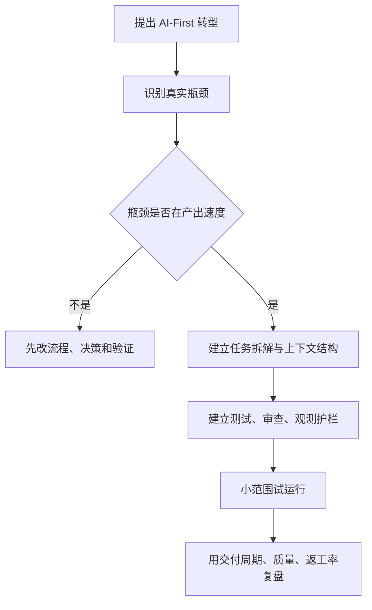

99% of our production code is written by AI. Last Tuesday, we shipped a new feature at 10 AM, A/B tested it by noon, and killed it by 3 PM because the data said no. We shipped a better version at 5 PM. Three months ago, a cycle like that would have taken six weeks.我们99%的产品代码都是由AI编写的。上周二，我们在上午10点发布了一个新功能，中午进行了a /B测试，并在下午3点取消了它，因为数据说不行。我们在下午5点发布了一个更好的版本。三个月前，这样的周期需要六周。

We didn't get here by adding Copilot to our IDE. We dismantled our engineering process and rebuilt it around AI. We changed how we plan, build, test, deploy, and organize the team. We changed the role of everyone in the company.我们不是通过将Copilot添加到我们的IDE中来实现这一点的。我们拆除了我们的工程流程，并围绕AI进行了重建。我们改变了计划、构建、测试、部署和组织团队的方式。我们改变了公司里每个人的角色。

CREAO is an agent platform. Twenty-five employees, 10 engineers. We started building agents in November 2025, and two months ago I restructured the entire product architecture and engineering workflow from the ground up.CREAO是一个代理平台。25名员工，10名工程师。我们从2025年11月开始构建代理，两个月前，我从头开始重构了整个产品架构和工程工作流程。

OpenAI published a concept in February 2026 that captured what we'd been doing. They called it harness engineering: the primary job of an engineering team is no longer writing code. It is enabling agents to do useful work. When something fails, the fix is never "try harder." The fix is: what capability is missing, and how do we make it legible and enforceable for the agent?OpenAI在2026年2月发布了一个概念，抓住了我们一直在做的事情。他们称之为驾驭工程：工程团队的主要工作不再是编写代码。它使代理能够做有用的工作。当某件事失败时，解决办法永远不是“更加努力”。解决办法是：缺失了什么功能，我们如何让它对代理来说清晰可辨、可执行？

We arrived at that conclusion on our own. We didn't have a name for it.这个结论是我们自己得出的。我们还没有给它起名字。

## AI-First Is Not the Same as Using AIAI- first并不等同于使用AI

Most companies bolt AI onto their existing process. An engineer opens Cursor. A PM drafts specs with ChatGPT. QA experiments with AI test generation. The workflow stays the same. Efficiency goes up 10 to 20 percent. Nothing structurally changes.大多数公司将人工智能绑定到现有流程中。工程师打开光标。PM使用ChatGPT起草规范。QA实验与AI测试生成。工作流程保持不变。效率提高了10%到20%。没有结构上的改变。

That is AI-assisted. 这是人工智能辅助的。

**AI-first means you redesign your process, your architecture, and your organization around the assumption that AI is the primary builder. AI-first意味着你要围绕AI是主要构建者的假设重新设计流程、架构和组织。**You stop asking "how can AI help our engineers?" and start asking你不再问“人工智能如何帮助我们的工程师”，而是开始问 "how do we restructure everything so AI does the building, and engineers provide direction and judgment?"“我们如何重组一切，让人工智能负责建筑，让工程师提供方向和判断？”

The difference is multiplicative.两者的差别是成倍的。

I see teams claim AI-first while running the same sprint cycles, the same Jira boards, the same weekly standups, the same QA sign-offs. They added AI to the loop. They didn't redesign the loop.我看到一些团队在运行相同的冲刺周期，相同的Jira董事会，相同的每周站立会议，相同的QA签名时，声称ai优先。他们将AI添加到循环中。他们没有重新设计这个循环。

A common version of this is what people call vibe coding. Open Cursor, prompt until something works, commit, repeat. That produces prototypes. A production system needs to be stable, reliable, and secure. You need a system that can guarantee those properties when AI writes the code. You build the system. The prompts are disposable.一个常见的版本是人们所说的感应编码。打开光标，提示直到有东西工作，提交，重复。这就产生了原型。生产系统需要稳定、可靠、安全。当AI编写代码时，你需要一个能够保证这些属性的系统。你建立了这个系统。提示符是一次性的。

## Why We Had to Change我们为什么要改变

Last year, I watched how our team worked and saw three bottlenecks that would kill us.去年，我观察了我们的团队是如何工作的，并发现了三个会扼杀我们的瓶颈。

**The Product Management Bottleneck产品管理瓶颈**

Our PMs spent weeks researching, designing, specifying features. Product management has worked this way for decades. But agents can implement a feature in two hours. When build time collapses from months to hours, a weeks-long planning cycle becomes the constraint.我们的项目经理花了数周时间研究、设计和指定功能。产品管理以这种方式运作了几十年。但是代理可以在两个小时内实现一个功能。当构建时间从几个月缩短到几个小时时，一个长达数周的计划周期就成为了约束。

It doesn't make sense to think about something for months and then build it in two hours.花几个月的时间思考某件事，然后在两个小时内完成，这是没有意义的。

PMs needed to evolve into product-minded architects who work at the speed of iteration, or step out of the build cycle. Design needed to happen through rapid prototype-ship-test-iterate loops, not specification documents reviewed in committee.项目经理需要发展成为具有产品意识的架构师，以迭代的速度工作，或者走出构建周期。设计需要通过快速的原型-交付-测试-迭代循环进行，而不是在委员会中审查规范文档。

**The QA Bottleneck QA瓶颈**

Same dynamic. After an agent shipped a feature, our QA team spent days testing corner cases. Build time: two hours. Test time: three days.相同的动态。在代理发布了一个功能后，我们的QA团队花了几天的时间测试角落用例。构建时间：2小时。测试时间：三天。

We replaced manual QA with AI-built testing platforms that test AI-written code. Validation has to move at the same speed as implementation. Otherwise you've built a new bottleneck ten feet downstream from the old one.我们用ai构建的测试平台取代人工QA，测试ai编写的代码。验证必须以与实现相同的速度进行。否则你就在旧瓶颈下游十英尺处建了一个新瓶颈。

**The Headcount Bottleneck 员工数量瓶颈**

Our competitors had 100x or more people doing comparable work. We have 25. We couldn't hire our way to parity. We had to redesign our way there.我们的竞争对手有100倍甚至更多的人在做类似的工作。我们有25个。我们无法通过雇佣来实现平等。我们不得不重新设计我们的路线。

Three systems needed AI running through them: how we design product, how we implement product, and how we test product. If any single one stays manual, it constrains the whole pipeline.有三个系统需要人工智能贯穿其中：我们如何设计产品，我们如何实施产品，以及我们如何测试产品。如果任何一个仍然是手动的，它就限制了整个管道。

## The Bold Decision: Unifying the Architecture大胆的决定：统一架构

I had to fix the codebase first.我必须先修复代码库。

Our old architecture was scattered across multiple independent systems. A single change might require touching three or four repositories. From a human engineer's perspective, it is manageable. From an AI agent's perspective, opaque. The agent can't see the full picture. It can't reason about cross-service implications. It can't run integration tests locally.我们的旧架构分散在多个独立的系统中。单个更改可能需要接触三到四个存储库。从人类工程师的角度来看，这是可控的。从人工智能代理的角度来看，这是不透明的。代理人看不到全貌。它不能推断出跨服务的含义。它不能在本地运行集成测试。

I had to unify all the code into a single monorepo. One reason: so AI could see everything.我必须把所有的代码统一到一个单orepo中。一个原因是：这样人工智能就能看到一切。

This is a harness engineering principle in practice. The more of your system you pull into a form the agent can inspect, validate, and modify, the more leverage you get. A fragmented codebase is invisible to agents. A unified one is legible.这是实际应用中的线束工程原理。您将系统的更多内容拉入代理可以检查、验证和修改的表单中，您获得的杠杆作用就越大。碎片化的代码库对代理来说是不可见的。统一的字体是易读的。

I spent one week designing the new system: planning stage, implementation stage, testing stage, integration testing stage. Then another week re-architecting the entire codebase using agents.我花了一周的时间设计新系统：规划阶段、实施阶段、测试阶段、集成测试阶段。然后再过一周，使用代理重新构建整个代码库。

CREAO is an agent platform. We used our own agents to rebuild the platform that runs agents. If the product can build itself, it works.CREAO是一个代理平台。我们使用自己的代理来重建运行代理的平台。如果产品可以自我构建，那它就成功了。

## The Stack 堆栈

Here is our stack and what each piece does.这是我们的堆栈和每个部分的作用。

**Infrastructure: AWS 基础设施:AWS**

We run on AWS with auto-scaling container services and circuit-breaker rollback. If metrics degrade after a deployment, the system reverts on its own.我们在AWS上运行自动伸缩容器服务和断路器回滚。如果指标在部署后降级，系统将自行恢复。

CloudWatch is the central nervous system. Structured logging across all services, over 25 alarms, custom metrics queried daily by automated workflows. Every piece of infrastructure exposes structured, queryable signals. If AI can't read the logs, it can't diagnose the problem.CloudWatch是中枢神经系统。所有服务的结构化日志记录，超过25个警报，由自动化工作流每天查询的自定义指标。每个基础设施都暴露了结构化的、可查询的信号。如果人工智能不能读取日志，它就不能诊断问题。

**CI/CD: GitHub Actions**

Every code change passes through a six-phase pipeline:每个代码更改都要经过六个阶段的流程：

Verify CI → Build and Deploy Dev → Test Dev → Deploy Prod → Test Prod → Release验证CI；构建和部署开发；测试开发；部署产品；测试产品；发布

The CI gate on every pull request enforces typechecking, linting, unit and integration tests, Docker builds, end-to-end tests via Playwright, and environment parity checks. No phase is optional. No manual overrides. The pipeline is deterministic, so agents can predict outcomes and reason about failures.每个拉取请求上的CI门强制执行类型检查、检查、单元和集成测试、Docker构建、通过剧作家进行的端到端测试以及环境奇偶校验。没有阶段是可选的。没有手动覆盖。管道是确定性的，因此代理可以预测结果并对失败进行推理。

**AI Code Review: Claude**

Every pull request triggers three parallel AI review passes using Claude Opus 4.6:每个拉取请求触发三个并行AI审查通过使用Claude Opus 4.6：

Pass 1: Code quality. Logic errors, performance issues, maintainability.第一步：代码质量。逻辑错误、性能问题、可维护性。

Pass 2: Security. Vulnerability scanning, authentication boundary checks, injection risks.通行证2：安全。漏洞扫描，身份验证边界检查，注入风险。

Pass 3: Dependency scan. Supply chain risks, version conflicts, license issues.步骤3：依赖项扫描。供应链风险，版本冲突，许可证问题。

These are review gates, not suggestions. They run alongside human review, catching what humans miss at volume. When you deploy eight times a day, no human reviewer can sustain attention across every PR.这些只是回顾，不是建议。它们与人类的审查一起运行，捕捉人类大量遗漏的东西。当您每天部署8次时，没有人能够在每个PR中保持注意力。

Engineers also tag [@claude](https://x.com/@claude) in any GitHub issue or PR for implementation plans, debugging sessions, or code analysis. The agent sees the whole monorepo. Context carries across conversations.工程师还在任何GitHub问题或PR中标记@claude，用于实施计划，调试会话或代码分析。代理人看到了整个事件。语境贯穿对话。

**The Self-Healing Feedback Loop自我修复反馈循环**

This is the centerpiece. 这是中心装饰。

Every morning at 9:00 AM UTC, an automated health workflow runs. Claude Sonnet 4.6 queries CloudWatch, analyzes error patterns across all services, and generates an executive health summary delivered to the team via Microsoft Teams. Nobody had to ask for it.每天早上9:00 UTC，运行一个自动运行状况工作流。Claude Sonnet 4.6查询CloudWatch，分析所有服务的错误模式，并生成通过Microsoft Teams交付给团队的执行运行状况摘要。没人需要请求。

One hour later, the triage engine runs. It clusters production errors from CloudWatch and Sentry, scores each cluster across nine severity dimensions, and auto-generates investigation tickets in Linear. Each ticket includes sample logs, affected users, affected endpoints, and suggested investigation paths.一小时后，分诊引擎启动。它将来自CloudWatch和Sentry的生产错误聚类，在九个严重性维度上对每个集群进行评分，并在Linear中自动生成调查票。每个票据包括示例日志、受影响的用户、受影响的端点和建议的调查路径。

The system deduplicates. If an open issue covers the same error pattern, it updates that issue. If a previously closed issue recurs, it detects the regression and reopens.系统执行重复数据删除。如果开放的问题包含相同的错误模式，则更新该问题。如果先前关闭的问题再次出现，它会检测到回归并重新打开。

When an engineer pushes a fix, the same pipeline handles it. Three Claude review passes evaluate the PR. CI validates. The six-phase deploy pipeline promotes through dev and prod with testing at each stage. After deployment, the triage engine re-checks CloudWatch. If the original errors are resolved, the Linear ticket auto-closes.当工程师推送修复时，同样的管道处理它。三个Claude评审通过，评估PR， CI验证。六个阶段的部署管道通过每个阶段的测试来促进开发和生产。部署后，分流引擎会重新检查CloudWatch。如果原始错误得到解决，线性票证将自动关闭。

Each tool handles one phase. No tool tries to do everything. The daily cycle creates a self-healing loop where errors are detected, triaged, fixed, and verified with minimal manual intervention.每个工具处理一个阶段。没有工具试图做所有的事情。每日循环创建了一个自我修复的循环，在这个循环中，错误被检测、分类、修复和验证，而人工干预最少。

I told a reporter from Business Insider: "AI will make the PR and the human just needs to review whether there's any risk."我对《商业内幕》的记者说：“人工智能会做公关，人类只需要检查是否有风险。”

**Feature Flags and the Supporting Stack特性标志和支持堆栈**

Statsig handles feature flags. Every feature ships behind a gate. The rollout pattern: enable for the team, then gradual percentage rollout, then full release or kill. The kill switch toggles a feature off instantly, no deploy needed. If a feature degrades metrics, we pull it within hours. Bad features die the same day they ship. A/B testing runs through the same system.Statsig处理特性标志。每一项功能都要经过一扇门。推出模式：为团队启用，然后逐步百分比推出，然后完全发布或终止。kill开关可以立即关闭一个功能，不需要部署。如果一个功能降低了指标，我们会在几个小时内将其移除。糟糕的功能在发布当天就会消失。A/B测试运行在同一个系统中。

Graphite manages PR branching: merge queues rebase onto main, re-run CI, merge only if green. Stacked PRs allow incremental review at high throughput.石墨管理PR分支：合并队列重新基于主队列，重新运行CI，只有在绿色时才合并。堆叠pr允许在高吞吐量下进行增量审查。

Sentry reports structured exceptions across all services, merged with CloudWatch by the triage engine for cross-tool context. Linear is the human-facing layer: auto-created tickets with severity scores, sample logs, and suggested investigation. Deduplication prevents noise. Follow-up verification auto-closes resolved issues.Sentry报告所有服务的结构化异常，并通过跨工具上下文的分流引擎与CloudWatch合并。线性是面向人类的层：自动创建带有严重性分数的票据、示例日志和建议的调查。重复数据删除可避免噪音。后续验证自动关闭已解决的问题。

## How a Feature Moves from Idea to Production一个功能是如何从想法转变为产品的

**New Feature Path 新特性路径**

1. The architect defines the task as a structured prompt with codebase context, goals, and constraints.架构师将任务定义为具有代码库上下文、目标和约束的结构化提示。
2. An agent decomposes the task, plans implementation, writes code, and generates its own tests.代理分解任务、计划实现、编写代码并生成自己的测试。
3. A PR opens. Three Claude review passes evaluate it. A human reviewer checks for strategic risk, not line-by-line correctness.公关打开。三克劳德审查通过评估它。人工审查人员检查战略风险，而不是逐行检查正确性。
4. CI validates: typecheck, lint, unit tests, integration tests, end-to-end tests.CI验证：类型检查、lint、单元测试、集成测试、端到端测试。
5. Graphite's merge queue rebases, re-runs CI, merges if green.石墨的合并队列重置，重新运行CI，如果为绿色则合并。
6. Six-phase deploy pipeline promotes through dev and prod with testing at each stage.六个阶段的部署管道通过开发和生产推进，每个阶段都进行测试。
7. Feature gate turns on for the team. Gradual percentage rollout. Metrics monitored.为团队开启功能大门。逐步按百分比推出。指标监控。
8. Kill switch available if anything degrades. Circuit-breaker auto-rollback for severe issues.如果有任何退化，可使用终止开关。断路器自动回滚严重问题。

**Bug Fix Path Bug修复路径**

1. CloudWatch and Sentry detect errors.CloudWatch和Sentry检测错误。
2. Claude triage engine scores severity, creates a Linear issue with full investigation context.克劳德分类引擎评分严重程度，创建一个线性问题与完整的调查背景。
3. An engineer investigates. AI has already done the diagnosis. The engineer validates and pushes a fix.一名工程师进行了调查。人工智能已经完成了诊断。工程师验证并推送修复。
4. Same review, CI, deploy, and monitoring pipeline.相同的审查、CI、部署和监视管道。
5. Triage engine re-verifies. If resolved, ticket auto-closes.分类引擎重新验证。如果解决了，票据自动关闭。

Both paths use the same pipeline. One system. One standard.两个路径使用相同的管道。一个系统。一个标准。

## The Results 结果

Over 14 days, we averaged three to eight production deployments per day. Under our old model, that entire two-week period would have produced not even a single release to production.在14天的时间里，我们平均每天进行3到8次生产部署。在我们的旧模式下，整个两周的时间甚至不会产生一个发布版本。

Bad features get pulled the same day they ship. New features go live the same day they're conceived. A/B tests validate impact in real time.糟糕的功能在发布当天就会被删除。新功能在构思出来的当天就会上线。A/B测试实时验证影响。

People assume we're trading quality for speed. User engagement went up. Payment conversion went up. We produce better results than before, because the feedback loops are tighter. You learn more when you ship daily than when you ship monthly.人们认为我们是以质量换取速度。用户粘性提高了。支付转化率上升。我们产生了比以前更好的结果，因为反馈回路更紧密了。每天发行比每月发行更能让你学到东西。

## The New Engineering Org 新工程组织

Two types of engineers will exist.将存在两种类型的工程师。

**The Architect 架构师**

One or two people. They design the standard operating procedures that teach AI how to work. They build the testing infrastructure, the integration systems, the triage systems. They decide architecture and system boundaries. They define what "good" looks like for the agents.一两个人。他们设计标准的操作程序，教人工智能如何工作。他们建立测试基础设施，集成系统，分类系统。它们决定了体系结构和系统边界。它们定义了代理的“好”是什么样子。

This role requires deep critical thinking. You criticize AI. You don't follow it. When the agent proposes a plan, the architect finds the holes. What failure modes did it miss? What security boundaries did it cross? What technical debt is it accumulating?这个角色需要深刻的批判性思维。你批评人工智能。你没有遵循它。当代理人提出计划时，建筑师会找出漏洞。它错过了哪些失效模式？它越过了什么安全边界？它积累了什么样的技术债务？

I have a PhD in physics. The most useful thing my PhD taught me was how to question assumptions, stress-test arguments, and look for what's missing. The ability to criticise AI will be more valuable than the ability to produce code.我有物理学博士学位。我的博士教给我的最有用的东西是如何质疑假设，对论点进行压力测试，以及寻找缺失的东西。批评人工智能的能力将比编写代码的能力更有价值。

This is also the hardest role to fill.这也是最难扮演的角色。

**The Operator 操作员**

Everyone else. The work matters. The structure is different.其他人。工作很重要。结构是不同的。

AI assigns tasks to humans. The triage system finds a bug, creates a ticket, surfaces the diagnosis, and assigns it to the right person. The person investigates, validates, and approves the fix. AI makes the PR. The human reviews whether there's risk.人工智能将任务分配给人类。分诊系统发现一个bug，创建一个票据，显示诊断结果，并将其分配给合适的人。该人员调查、验证并批准修复。人工智能负责公关，人类负责评估是否存在风险。

The tasks are bug investigation, UI refinement, CSS improvements, PR review, verification. They require skill and attention. They don't require the architectural reasoning the old model demanded.任务包括漏洞调查、UI优化、CSS改进、PR审查和验证。他们需要技巧和注意力。它们不需要旧模型所要求的架构推理。

**Who Adapts Fastest 谁适应得最快**

I noticed a pattern I didn't expect. Junior engineers adapted faster than senior engineers.我注意到了一个我没有预料到的规律。初级工程师比高级工程师适应得更快。

Junior engineers with less traditional practice felt empowered. They had access to tools that amplified their impact. They didn't carry a decade of habits to unlearn.没有那么传统实践的初级工程师感到被赋予了权力。他们可以使用工具来扩大他们的影响力。他们没有十年来养成的习惯。

Senior engineers with strong traditional practice had the hardest time. Two months of their work could be completed in one hour by AI. That is a hard thing to accept after years of building a rare skill set.具有较强传统实践的高级工程师经历了最艰难的时期。人工智能可以在一个小时内完成他们两个月的工作。在多年积累了一套罕见的技能之后，这是一件很难接受的事情。

I'm not making a judgment. I'm describing what I observed. In this transition, adaptability matters more than accumulated skill.我不是在做判断。我在描述我所观察到的。在这种转变中，适应能力比积累的技能更重要。

## The Human Side 人性的一面

**Management Collapsed 管理崩溃**

Two months ago, I spent 60% of my time managing people. Aligning priorities. Running meetings. Giving feedback. Coaching engineers.两个月前，我60%的时间都花在管理人员上。调整优先级。运行会议。给予反馈。指导工程师。

Today: below 10%. 今天：低于10%。

The traditional CTO model says to empower your team to do architecture work, train them, delegate. But if the system only needs one or two architects, I need to do it myself first. I went from managing to building. I code from 9 AM to 3 AM most days. I design the SOPs and architecture of the system. I maintain the harness.传统的CTO模式是授权你的团队去做架构工作，培训他们，委派任务。但如果系统只需要一两个架构师，我就需要先自己动手。我从管理变成了建设。我代码从上午9点到凌晨3点大多数天。设计了系统的标准操作程序和体系结构。我负责维护挽具。

More stressful. But I'm enjoying building, not aligning.压力更大。但我喜欢建设，而不是调整。

**Less Arguing, Better Relationships争吵少，关系好**

My relationships with co-founders and engineers are better than before.我与联合创始人和工程师的关系比以前好了。

Before the transition, most of my interaction with the team was alignment meetings. Discussing trade-offs. Debating priorities. Disagreeing about technical decisions. Those conversations are necessary in a traditional model. They're also draining.在过渡之前，我与团队的大部分互动都是协调会议。讨论权衡。讨论重点。在技术决策上意见不一。这些对话在传统模式中是必要的。它们也在消耗能量。

Now I still talk to my team. We talk about other things. Non-work topics. Casual conversations. Offsite trips. We get along better because we stopped arguing about work that can be easily done by our system.现在我仍然和我的团队交流。我们谈论其他事情。与工作无关的话题。随意的谈话。站外旅行。我们相处得更好，因为我们不再为我们的系统可以轻松完成的工作争论。

**Uncertainty Is Real 不确定性是真实存在的**

I won't pretend everyone is happy.我不会假装每个人都很开心。

When I stopped talking to people every day, some team members felt uncertain. What does the CTO not talking to me mean? What is my value in this new world? Reasonable concerns.当我不再每天与人交谈时，一些团队成员感到不确定。首席技术官不跟我说话是什么意思？我在这个新世界的价值是什么？合理的担忧。

Some people spend more time debating whether AI can do their work than doing the work. The transition period creates anxiety. I don't have a clean answer for it.有些人花更多的时间讨论人工智能是否可以做他们的工作，而不是做他们的工作。过渡期会带来焦虑。我没有一个明确的答案。

I do have a principle: we don't fire an engineer because they introduced a production bug. We improve the review process. We strengthen testing. We add guardrails. The same applies to AI. If AI makes a mistake, we build better validation, clearer constraints, stronger observability.我确实有一个原则：我们不会因为工程师引入了产品缺陷而解雇他。我们改进审查过程。加强检测。我们加了护栏。这同样适用于人工智能。如果人工智能犯了错误，我们会建立更好的验证，更清晰的约束，更强的可观察性。

## Beyond Engineering 除了工程

I see other companies adopt AI-first engineering and leave everything else manual.我看到其他公司采用人工智能优先的工程，而把其他一切都留给人工操作。

If engineering ships features in hours but marketing takes a week to announce them, marketing is the bottleneck. If the product team still runs a monthly planning cycle, planning is the bottleneck.如果工程师在几个小时内发布功能，但营销部门却要花一周的时间来发布，那么营销就是瓶颈。如果产品团队仍然按月执行计划周期，那么计划就是瓶颈。

At CREAO, we pushed AI-native operations into every function:在CREAO，我们将ai原生操作推进到每个功能中：

- Product release notes: AI-generated from changelogs and feature descriptions.产品发布说明：由变更日志和功能描述生成的ai。
- Feature intro videos: AI-generated motion graphics.功能介绍视频：人工智能生成的动态图形。
- Daily posts on socials: AI-orchestrated and auto-published.社交网站上的每日帖子：人工智能编排和自动发布。
- Health reports and analytics summaries: AI-generated from CloudWatch and production databases.运行状况报告和分析摘要：人工智能从CloudWatch和生产数据库生成。

Engineering, product, marketing, and growth run in one AI-native workflow. If one function operates at agent speed and another at human speed, the human-speed function constrains everything.工程、产品、营销和增长在一个人工智能原生工作流中运行。如果一个函数以代理的速度运行，而另一个以人的速度运行，那么人的速度函数就会约束一切。

## What This Means 这意味着什么？

**For Engineers 为工程师**

Your value is moving from code output to decision quality. The ability to write code fast is worth less every month. The ability to evaluate, criticize, and direct AI is worth more.您的价值是从代码输出转移到决策质量。快速编写代码的能力每月都在贬值。评估、批评和指导人工智能的能力更有价值。

Product sense or taste matters. Can you look at a generated UI and know it's wrong before the user tells you? Can you look at an architecture proposal and see the failure mode the agent missed?产品的感觉或味道很重要。你能在用户告诉你之前就知道生成的UI是错误的吗？您可以查看架构提案并查看代理错过的故障模式吗？

I tell our 19-year-old interns: train critical thinking. Learn to evaluate arguments, find gaps, question assumptions. Learn what good design looks like. Those skills compound.我告诉我们19岁的实习生：培养批判性思维。学会评估论点，发现差距，质疑假设。了解什么是好的设计。这些技能是复合的。

**For CTOs and Founders 对于首席技术官和创始人**

If your PM process takes longer than your build time, start there.如果您的PM过程花费的时间比构建时间长，那么就从这里开始。

Build the testing harness before you scale agents. Fast AI without fast validation is fast-moving technical debt.在扩展代理之前构建测试工具。没有快速验证的快速AI是快速移动的技术债务。

Start with one architect. One person who builds the system and proves it works. Onboard others into operator roles after the system runs.从一位建筑师开始。一个建立系统并证明其有效的人。在系统运行后，将其他人装载为操作员角色。

Push AI-native into every function.将ai原生应用到每个功能中。

Expect resistance. Some people will push back.预计阻力。有些人会反抗。

**For the Industry 行业指南**

OpenAI, Anthropic, and multiple independent teams converged on the same principles: structured context, specialized agents, persistent memory, and execution loops. Harness engineering is becoming a standard.OpenAI、Anthropic和多个独立团队都遵循相同的原则：结构化上下文、专用代理、持久内存和执行循环。线束工程正在成为一种标准。

Model capability is the clock driving this. I attribute the entire shift at CREAO to the last two months. Opus 4.5 couldn't do what Opus 4.6 does. Next-gen models will accelerate it further.模型能力是驱动它的时钟。我把CREAO的整个轮班都归功于过去两个月。Opus 4.5不能做Opus 4.6所做的。下一代车型将进一步加速这一进程。

I believe one-person companies will become common. If one architect with agents can do the work of 100 people, many companies won't need a second employee.我相信一个人的公司会变得很普遍。如果一个带代理的建筑师可以完成100个人的工作，那么许多公司就不需要第二名员工了。

## We're Early 我们早期的

Most founders and engineers I talk to still operate the traditional way. Some think about making the shift. Very few have done it.与我交谈过的大多数创始人和工程师仍然以传统的方式运作。一些人考虑进行转变。很少有人这样做。

A reporter friend told me she'd talked to about five people on this topic. She said we were further along than anyone: "I don't think anyone's just totally rebuilt their entire workflow the way you have."一位记者朋友告诉我，她已经就这个话题和五个人谈过了。她说我们比任何人都走得更远：“我不认为有人像你一样完全重建了他们的整个工作流程。”

The tools exist for any team to do this. Nothing in our stack is proprietary.任何团队都有这样做的工具。我们的堆栈中没有任何东西是专有的。

The competitive advantage is the decision to redesign everything around these tools, and the willingness to absorb the cost. The cost is real: uncertainty among employees, the CTO working 18-hour days, senior engineers questioning their value, a two-week period where the old system is gone and the new one isn't proven.竞争优势在于围绕这些工具重新设计一切的决定，以及承担成本的意愿。成本是实实在在的：员工心中的不确定性，首席技术官每天工作18个小时，高级工程师质疑他们的价值，两周的时间里，旧系统已经过时，新系统还没有得到验证。

We absorbed that cost. Two months later, the numbers speak.我们承担了成本。两个月后，数据说明了一切。

We build an agent platform. We built it with agents.我们建立一个代理平台。我们用代理人来建造它。

## 实践流程：评估 AI-First 是否真的成立

## 案例：工程提速后，产品流程反而成为瓶颈

团队把编码环节交给 Agent 后，功能开发从数天缩短到数小时，但需求澄清、验收、发布说明和增长同步仍按原来的节奏运行。结果不是整体效率提升，而是工程队列前移到产品和运营队列。此时真正要改的是端到端工作流：需求输入要结构化，验收标准要可测试，发布材料要从变更记录自动生成，质量门禁要跟上构建速度。

## 检查清单

- AI-First 不是“所有地方都用 AI”，而是围绕 AI 能力重设计流程。
- 先建立验证系统，再扩大 Agent 自主范围。
- 衡量指标不要只看代码产出，还要看返工率、事故率、交付周期和用户结果。
- 关键岗位的价值会从执行量转向判断力、品味、约束设计和异常处理。
- 任何组织变更都要同步处理人的不确定性、职责边界和反馈机制。

## 常见误区

- 把模型能力当成组织能力；没有上下文、工具、测试和审查，模型只能局部提速。
- 只改工程，不改产品、市场、客服和运营，最后瓶颈会转移而不是消失。
- 认为 AI 出错就应该减少使用；更合理的反应是补验证、约束和可观测性。
