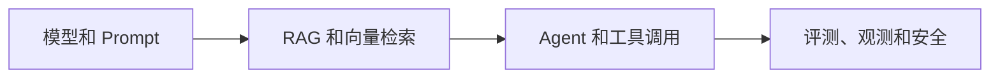

# AI相关
AI相关是 AI 领域概念、架构、模型、检索、向量数据库和工程实践的聚合入口。

上级入口：[[AI MOC]]

## 相关概念
- [[AI Agent]]
- [[RAG]]
- [[Prompt Engineering]]
- [[向量数据库]]

## 学习路径

## 实践检查清单

- 是否区分模型能力、应用架构和工程治理。
- RAG 是否覆盖数据处理、检索、生成和评估。
- Agent 是否明确工具权限和停止条件。
- 是否为 AI 应用建立评测集和可观测性。
- 是否关注隐私、权限和成本控制。

## 案例

企业知识库助手需要同时连接 [[RAG]]、[[向量数据库]]、[[Prompt Engineering]] 和 [[AI工程实践]]，而不是只调一个模型接口。

## 常见误区

- 把 AI 学习等同于堆模型名。
- 只看 Demo，不建立评测和上线边界。
- 忽略数据权限，导致模型引用无权内容。

## 复盘问题

- 当前 AI 学习是在补模型、检索、Agent、工程化，还是安全治理。
- 新增 AI 笔记是否能连接到 RAG、Prompt、Agent、评测或业务项目。
- 一个 Demo 进入生产前，是否已经补齐数据、权限、成本、观测和回归评测。

## 导航方式

这类聚合笔记不应替代具体概念，而是帮助判断下一步该深入哪里。遇到模型效果问题，优先拆成提示词、上下文、检索、工具、数据质量和评测口径；遇到上线问题，优先补权限、成本、延迟、可观测性和回滚策略；遇到学习资料，则归入模型基础、RAG、Agent、工程化或安全治理。每新增一个 AI 笔记，都要至少连接一个上游问题和一个下游实践场景，否则容易变成孤立名词。
