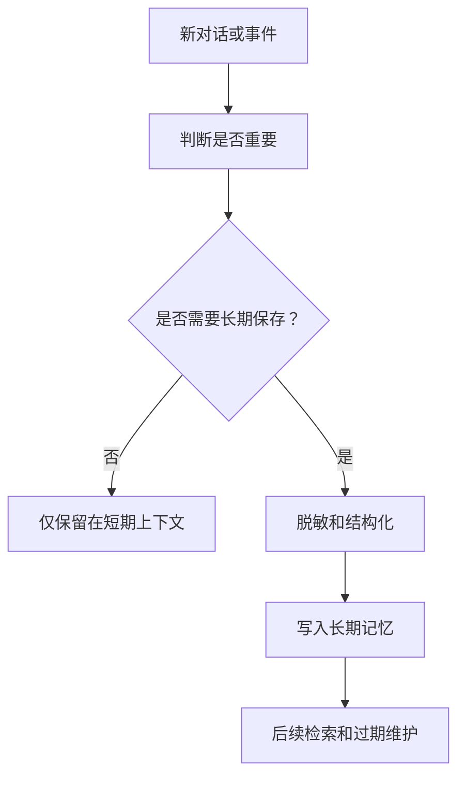

# Memory

## 定义

Memory（记忆系统）是AI Agent用于存储和检索信息的组件，直接影响Agent的智能程度和任务处理能力。一个好的记忆系统应该像人类记忆一样，能够区分短期和长期信息，并根据重要性进行存取。

## 为什么需要记忆系统

**没有记忆的Agent问题**：

- 每次对话都是"重新开始"
- 无法记住用户的偏好和历史
- 无法从过去的经验中学习
- 上下文长度有限，信息容易丢失

**好的记忆系统价值**：

- 保持对话连贯性
- 积累知识和经验
- 个性化交互
- 跨会话保持状态

## 三层记忆架构

借鉴人类记忆机制，Agent记忆通常分为三层：

### 第一层：工作记忆（Working Memory）

**类比**：人脑的短期记忆，当前意识的焦点

**特点**：

- 存储当前对话上下文
- 容量有限（受token限制）
- 快速访问
- 会话结束可能清空

**实现**：

```python
class ConversationBuffer:
    def __init__(self, max_tokens=2000):
        self.messages = []
        self.max_tokens = max_tokens

    def add_message(self, message):
        self.messages.append(message)
        # 超出token限制就删掉最早的消息
        while self.count_tokens() > self.max_tokens:
            self.messages.pop(0)

    def get_context(self):
        return self.messages
```

**优化策略**：

- **Sliding Window**：滑动窗口，只保留最近的N条
- **Token限制**：严格按token数而非消息数限制
- **摘要压缩**：当超出限制时，将早期消息压缩成摘要

### 第二层：短期记忆（Short-term Memory）

**类比**：人脑的中期记忆，最近发生的事情

**特点**：

- 跨会话保持
- 定期总结和整理
- 存储关键信息
- 有一定时效性

**实现**：

```python
class SummaryMemory:
    def __init__(self):
        self.summary = ""  # 累计摘要
        self.recent_messages = []  # 近期消息
        self.summary_threshold = 10  # 每10条消息总结一次

    def add_message(self, message):
        self.recent_messages.append(message)

        # 达到阈值时进行总结
        if len(self.recent_messages) > self.summary_threshold:
            self.summary = self.summarize(
                self.summary,
                self.recent_messages
            )
            self.recent_messages = []

    def summarize(self, existing_summary, messages):
        prompt = f"""
        现有摘要：{existing_summary}

        新消息：
        {format_messages(messages)}

        请更新摘要，保留重要信息，去除细节。
        """
        return llm.generate(prompt)

    def get_memory(self):
        return f"历史摘要：{self.summary}\n\n最近消息：{self.recent_messages}"
```

**应用场景**：

- 用户偏好（"我喜欢简洁的回答"）
- 会话状态（"我们正在讨论项目A"）
- 临时任务信息

### 第三层：长期记忆（Long-term Memory）

**类比**：人脑的长期记忆，持久存储的知识

**特点**：

- 持久化存储（通常用向量数据库）
- 基于语义检索
- 可累积增长
- 支持复杂的查询

**实现**：

```python
class VectorMemory:
    def __init__(self, vector_db):
        self.vector_db = vector_db
        self.embedding_model = EmbeddingModel()

    def store(self, memory_item):
        """存储记忆项"""
        embedding = self.embedding_model.encode(memory_item.text)

        self.vector_db.insert({
            "id": generate_id(),
            "text": memory_item.text,
            "embedding": embedding,
            "timestamp": memory_item.timestamp,
            "importance": memory_item.importance,
            "tags": memory_item.tags,
            "session_id": memory_item.session_id
        })

    def retrieve(self, query, top_k=5, filters=None):
        """基于语义检索相关记忆"""
        query_embedding = self.embedding_model.encode(query)

        results = self.vector_db.search(
            query_embedding,
            top_k=top_k,
            filters=filters
        )

        return results

    def retrieve_by_time(self, start_time, end_time):
        """按时间范围检索"""
        return self.vector_db.query(
            filter=f"timestamp >= {start_time} AND timestamp <= {end_time}"
        )
```

**记忆项设计**：

```python
class MemoryItem:
    def __init__(self, text, importance=1.0, tags=None):
        self.text = text
        self.importance = importance  # 重要性评分（0-1）
        self.tags = tags or []  # 标签分类
        self.timestamp = time.time()
        self.session_id = get_session_id()
```

## 记忆的存储策略

### 重要性评估

```python
def calculate_importance(text):
    """评估记忆的重要性"""
    prompt = f"""
    请评估以下信息的重要性（0-10分）：

    信息：{text}

    考虑因素：
    - 是否包含用户偏好
    - 是否是关键事实
    - 是否具有长期价值

    只返回数字评分。
    """

    score = float(llm.generate(prompt))
    return min(max(score / 10, 0), 1)  # 归一化到0-1
```

### 自动总结触发

```python
def should_summarize(messages):
    """判断是否需要总结"""
    # 1. 消息数量达到阈值
    if len(messages) > 20:
        return True

    # 2. 话题发生变化
    if detect_topic_shift(messages[-5:]):
        return True

    # 3. 用户显式要求总结
    if user_asked_for_summary():
        return True

    return False
```

## 记忆检索增强生成

将记忆融入生成过程的完整流程：

```python
class MemoryAugmentedAgent:
    def __init__(self):
        self.working_memory = ConversationBuffer()
        self.short_term_memory = SummaryMemory()
        self.long_term_memory = VectorMemory()

    def chat(self, user_input):
        # 1. 检索相关长期记忆
        relevant_memories = self.long_term_memory.retrieve(user_input)

        # 2. 构建完整上下文
        context = {
            "long_term": relevant_memories,
            "short_term": self.short_term_memory.get_memory(),
            "working": self.working_memory.get_context()
        }

        # 3. 生成回答
        response = self.generate_with_context(user_input, context)

        # 4. 更新记忆
        self.working_memory.add_message({"role": "user", "content": user_input})
        self.working_memory.add_message({"role": "assistant", "content": response})

        # 5. 判断是否需要存入长期记忆
        if self.is_important(user_input, response):
            self.long_term_memory.store(MemoryItem(
                text=f"User: {user_input}\nAssistant: {response}",
                importance=self.calculate_importance(user_input, response)
            ))

        return response
```

## 记忆管理的挑战

| 挑战             | 解决方案                      |
| ---------------- | ----------------------------- |
| **记忆冲突**     | 时间戳+重要性加权，较新的优先 |
| **记忆膨胀**     | 定期清理低重要性记忆，设置TTL |
| **隐私保护**     | 敏感信息加密，支持遗忘机制    |
| **多用户隔离**   | user_id过滤，确保记忆不串台   |
| **跨会话一致性** | 会话摘要继承，关键状态持久化  |

## 相关概念

- [[AI Agent]] - Agent的核心概念
- [[RAG]] - 检索增强生成，与长期记忆类似
- [[向量数据库]] - 长期记忆的存储基础设施
- [[Embedding]] - 记忆的语义表示
- [[Reflexion]] - 从记忆中学习

## 最佳实践

1. **分层清晰**：明确区分三层记忆的职责和边界
2. **重要性筛选**：不是所有内容都值得长期记忆
3. **定期维护**：清理过期和低价值的记忆
4. **隐私优先**：敏感信息要谨慎存储
5. **可解释性**：记录记忆来源，便于追溯

## 记忆写入流程



## 实践检查清单

- 是否区分用户明确偏好、系统观察和模型推测。
- 写入长期记忆前是否做重要性和隐私判断。
- 检索时是否限制用户、项目和时间范围。
- 记忆冲突时是否保留来源和时间戳。
- 是否支持用户查看、修正和删除记忆。
