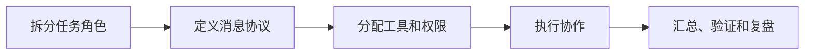

# Multi-Agent

## 定义

Multi-Agent（多智能体）系统是指多个AI Agent协作完成复杂任务的架构。与单个Agent相比，多Agent系统可以处理更复杂的任务，通过分工协作提高效率和能力边界。

## 为什么需要Multi-Agent

1. **任务复杂度**：单个Agent难以处理需要多种专业知识的复杂任务
2. **专业化分工**：不同Agent可以专精于不同领域
3. **并行处理**：多个Agent可以同时处理不同子任务
4. **容错性**：单个Agent失败不会导致整个系统崩溃
5. **可扩展性**：可以动态添加新的Agent角色

## 三种架构模式

### 1. 中心化调度（Centralized Orchestration）

**架构**：

```
        ┌─────────────┐
        │  Master     │
        │  Agent      │
        └──────┬──────┘
               │
    ┌──────────┼──────────┐
    │          │          │
┌───▼───┐  ┌──▼────┐ ┌───▼───┐
│Agent A│  │Agent B│ │Agent C│
└───────┘  └───────┘ └───────┘
```

**特点**：

- 一个主Agent负责任务分配和协调
- 工作Agent专注于执行具体任务
- 控制集中，便于管理

**优点**：

- 架构清晰，易于实现
- 调度策略集中，便于优化
- 全局状态一致性好

**缺点**：

- 主Agent是单点瓶颈
- 扩展性受限
- 主Agent故障影响全局

**适用场景**：

- 任务类型相对固定
- Agent数量不多
- 需要强一致性的场景

### 2. 去中心化协商（Decentralized Negotiation）

**架构**：

```
    ┌───────┐         ┌───────┐
    │Agent A│◄───────►│Agent B│
    └───┬───┘         └───┬───┘
        │                 │
        └────────┬────────┘
                 │
            ┌────▼────┐
            │Agent C  │
            └─────────┘
```

**特点**：

- Agent之间直接通信协商
- 没有中心协调者
- 采用共识算法或拍卖机制分配任务

**优点**：

- 无单点故障
- 高度灵活，可动态加入新Agent
- 扩展性好

**缺点**：

- 协调复杂，容易产生冲突
- 通信开销大
- 难以保证全局最优

**适用场景**：

- Agent数量多且动态变化
- 需要高度自治的场景
- 分布式环境

### 3. 分层管理（Hierarchical Management）

**架构**：

```
          ┌──────────┐
          │  Level 0 │
          │ Manager  │
          └────┬─────┘
               │
       ┌───────┴───────┐
       │               │
   ┌───▼───┐      ┌────▼───┐
   │Level 1│      │ Level 1│
   │Agent A│      │ Agent B│
   └───┬───┘      └───┬────┘
       │              │
   ┌───┴───┐      ┌───┴───┐
   │Level 2│      │Level 2│
   └───────┘      └───────┘
```

**特点**：

- 多层管理结构
- 高层Agent管理低层Agent
- 结合中心化和去中心化的优点

**优点**：

- 架构灵活，可适应不同复杂度
- 分层降低了单层的复杂性
- 兼具控制力和扩展性

**缺点**：

- 架构复杂，设计难度高
- 层级过多会增加延迟
- 需要精心设计分层策略

**适用场景**：

- 任务具有天然层级结构
- 需要多级管理的复杂系统
- 大型企业级应用

## Agent通信协议

### 消息格式

```python
class AgentMessage:
    def __init__(self, sender, receiver, message_type, content):
        self.sender = sender          # 发送者ID
        self.receiver = receiver      # 接收者ID（None表示广播）
        self.type = message_type      # 消息类型
        self.content = content        # 消息内容
        self.timestamp = time.time()  # 时间戳

# 消息类型枚举
class MessageType:
    TASK_ASSIGNMENT = "task_assignment"    # 任务分配
    TASK_RESULT = "task_result"            # 任务结果
    STATUS_UPDATE = "status_update"        # 状态更新
    COORDINATION = "coordination"          # 协调请求
    ERROR = "error"                        # 错误报告
```

### 通信模式

1. **请求-响应模式**：同步通信，适合需要立即结果的场景
2. **发布-订阅模式**：异步通信，适合状态广播
3. **管道模式**：数据流式处理，适合流水线任务

## 冲突解决机制

### 常见冲突类型

1. **资源冲突**：多个Agent争夺同一资源
2. **任务冲突**：任务分配重叠或矛盾
3. **数据冲突**：对共享数据的并发修改
4. **优先级冲突**：不同Agent对任务优先级有不同看法

### 解决策略

```python
class ConflictResolver:
    def resolve_resource_conflict(self, agents, resource):
        """基于优先级和等待时间的资源分配"""
        sorted_agents = sorted(
            agents,
            key=lambda a: (a.priority, -a.wait_time),
            reverse=True
        )
        return sorted_agents[0]

    def resolve_task_conflict(self, task_claims):
        """基于Agent能力和负载的任务分配"""
        best_agent = max(
            task_claims,
            key=lambda c: c.agent.capability_score - c.agent.current_load
        )
        return best_agent
```

## 容错机制

1. **心跳检测**：定期检测Agent存活状态
2. **任务重分配**：Agent故障时将其任务转移给其他Agent
3. **结果验证**：多个Agent交叉验证关键结果
4. **状态恢复**：Agent重启后从 checkpoint 恢复

## 相关概念

- [[AI Agent]] - Agent的核心概念
- [[ReAct]] - 单个Agent的推理-行动模式
- [[Plan-and-Execute]] - 任务规划模式
- [[LangGraph]] - 支持多Agent的框架
- [[消息队列]] - Agent间通信基础设施

## 最佳实践

1. **明确Agent职责**：每个Agent的角色和能力要清晰定义
2. **设计良好的通信协议**：消息格式要标准化，便于扩展
3. **实现完善的监控**：跟踪每个Agent的状态和任务执行情况
4. **预留扩展点**：方便动态添加新的Agent角色
5. **做好错误处理**：单个Agent失败不应影响整体系统

## 实践流程



## 实践检查清单

- 每个 Agent 是否有明确输入、输出、权限和停止条件。
- 协调者是否能处理超时、失败、重复结果和冲突。
- 关键结论是否有验证 Agent 或规则校验。
- Agent 间共享状态是否受控，避免互相污染上下文。
- 是否记录消息、工具调用和最终决策链路。

## 案例

代码迁移任务可以拆成“分析 Agent”“实现 Agent”“测试 Agent”。分析 Agent 只读代码并输出迁移点，实现 Agent 负责修改文件，测试 Agent 独立运行验证并报告失败原因。

## 常见误区

- Agent 越多越好，实际增加协调成本和错误传播。
- 多个 Agent 同时写同一文件，造成冲突和重复劳动。
- 没有最终仲裁和验证机制，多个答案互相矛盾。
