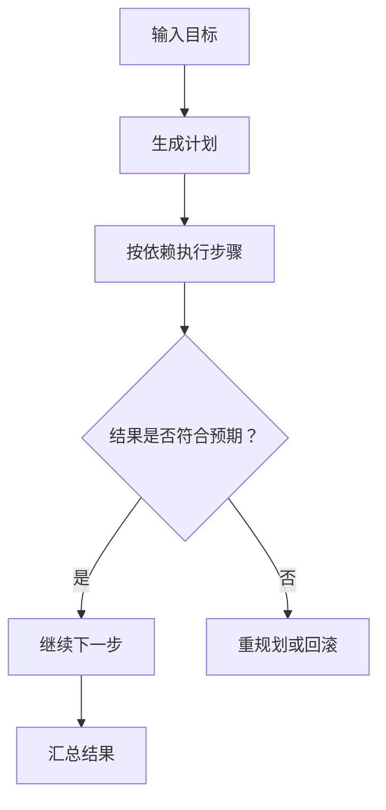

# Plan-and-Execute

## 定义

Plan-and-Execute是一种Agent架构模式，核心思想是**先制定完整的执行计划，再逐步执行**。与ReAct的"边想边做"不同，这种模式强调预先规划，适合目标明确的复杂任务。

## 核心思想

将任务处理分为两个明确的阶段：

1. **规划阶段（Plan）**：
   - 分析任务目标
   - 生成详细的执行步骤
   - 确定步骤间的依赖关系

2. **执行阶段（Execute）**：
   - 按计划顺序执行步骤
   - 监控执行状态
   - 必要时触发重规划

## 工作流程

```python
def plan_and_execute(task):
    # 1. 生成计划
    plan = planner.generate_plan(task)

    # 2. 执行计划
    results = []
    for step in plan.steps:
        result = executor.execute(step, context=results)
        results.append(result)

        # 3. 如果执行失败，重新规划
        if need_replan(result):
            plan = planner.replan(task, results)

    return results
```

## 计划生成器的设计

### 结构化输出

使用JSON Schema约束LLM生成结构化的计划：

```json
{
  "plan": {
    "steps": [
      {
        "id": 1,
        "description": "搜索相关信息",
        "tool": "search",
        "dependencies": [],
        "estimated_time": "5s"
      },
      {
        "id": 2,
        "description": "分析搜索结果",
        "tool": "analyzer",
        "dependencies": [1],
        "estimated_time": "10s"
      }
    ]
  }
}
```

### 依赖关系分析

```python
class PlanStep:
    def __init__(self, id, description, dependencies=None):
        self.id = id
        self.description = description
        self.dependencies = dependencies or []
        self.status = "pending"
        self.result = None

    def can_execute(self, completed_steps):
        return all(dep in completed_steps for dep in self.dependencies)
```

## 重规划策略

### 触发重规划的条件

1. **执行失败**：某一步骤执行出错
2. **发现新信息**：执行过程中获得了原计划未考虑的信息
3. **用户需求变更**：用户在中途修改了任务要求
4. **超时/资源限制**：执行时间或成本超出预期

### 重规划实现

```python
def replan(task, current_results, failure_reason=None):
    prompt = f"""
    原始任务：{task}
    已完成步骤：{current_results}
    {f"失败原因：{failure_reason}" if failure_reason else ""}

    请基于当前状态，生成新的执行计划。
    """

    new_plan = llm.generate_structured(prompt, schema=PlanSchema)
    return new_plan
```

## 并行执行优化

分析步骤依赖关系，识别可以并行执行的步骤：

```python
def get_parallelizable_steps(steps, completed):
    """找出当前可以并行执行的步骤"""
    executable = []
    for step in steps:
        if step.status == "pending" and step.can_execute(completed):
            executable.append(step)
    return executable

# 执行并行步骤
async def execute_parallel(steps):
    tasks = [executor.execute(step) for step in steps]
    results = await asyncio.gather(*tasks)
    return results
```

## 与ReAct的对比

| 特性     | ReAct                          | Plan-and-Execute               |
| -------- | ------------------------------ | ------------------------------ |
| 规划时机 | 逐步规划，边执行边规划         | 预先规划，一次性生成完整计划   |
| 适应性   | 高，每步都可以根据最新观察调整 | 中，需要显式触发重规划         |
| 透明度   | 推理过程完全可见               | 计划可见，但执行过程可能较黑盒 |
| 效率     | 可能产生冗余推理               | 计划优化后执行更高效           |
| 适用场景 | 探索性任务、动态环境           | 目标明确的复杂任务             |
| 实现难度 | 相对简单                       | 需要额外的计划生成和管理逻辑   |

## 适用场景

**适合使用Plan-and-Execute**：

- 任务目标明确，可以预先规划
- 需要多步骤协作完成
- 对执行效率有要求
- 步骤间存在明确的依赖关系

**不适合使用Plan-and-Execute**：

- 任务高度不确定，需要大量探索
- 环境动态变化，计划容易失效
- 单步任务，无需规划

## 相关概念

- [[AI Agent]] - Agent的核心概念
- [[ReAct]] - 推理-行动交替模式
- [[LangGraph]] - 支持复杂工作流的框架
- [[Multi-Agent]] - 多Agent协作系统

## 最佳实践

1. **计划粒度控制**：不要太细（冗余）也不要太粗（失控）
2. **预留重规划触发点**：在关键步骤后检查是否需要重规划
3. **执行超时处理**：为每个步骤设置合理的超时时间
4. **计划版本管理**：保留历史计划，便于回滚和分析

## 执行流程



## 实践检查清单

- 计划是否有明确目标、步骤、依赖和完成标准。
- 执行器是否能报告每一步的输入、输出和失败原因。
- 是否设置重规划触发条件，而不是一次计划走到底。
- 长任务是否有中间检查点和可恢复状态。
- 是否避免把探索性任务过早固定成僵硬计划。

## 案例

“迁移一个服务到 Docker”适合 Plan-and-Execute：先列出 Dockerfile、配置、compose、健康检查、CI 和部署验证，再逐步执行。若构建失败或端口冲突，则在对应步骤重规划，而不是推翻全部计划。
