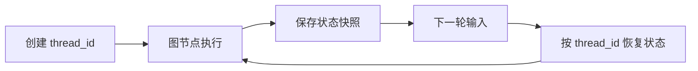

# Checkpointer（检查点器）

## 定义

Checkpointer 是 LangGraph 中用于将智能体状态持久化到数据库的组件。它允许线程在任何时间点被保存和恢复。

## 核心功能

1. **状态持久化**: 将图的状态保存到存储后端
2. **线程恢复**: 通过 thread_id 恢复之前的对话状态
3. **版本控制**: 支持状态的历史版本

## 常见实现

| 实现类 | 用途 | 适用场景 |
|--------|------|----------|
| MemorySaver | 内存存储 | 开发和测试 |
| PostgresSaver | PostgreSQL 存储 | 生产环境 |
| RedisSaver | Redis 存储 | 高性能缓存场景 |
| SQLiteSaver | SQLite 存储 | 轻量级本地应用 |

## 使用示例

```python
from langgraph.checkpoint.memory import MemorySaver
from langgraph.graph import StateGraph

checkpointer = MemorySaver()

builder = StateGraph(State)
# ... 添加节点和边

graph = builder.compile(checkpointer=checkpointer)
```

## 相关概念

- [[LangChain_Memory]] - 记忆系统概述
- [[短期记忆]] - 使用 checkpointer 的短期记忆
- [[Store]] - 长期记忆的存储机制

## 使用流程



## 实践检查清单

- `thread_id` 是否稳定且能隔离用户、会话和任务。
- 生产环境是否使用持久化后端，而不是内存实现。
- 状态中是否避免保存过大的原始文件或敏感字段。
- 是否有状态迁移策略，应对图结构和 State schema 变更。
- 是否监控检查点写入失败、恢复失败和存储容量。

## 案例

多轮审批 Agent 在第一轮收集申请信息，第二轮等待用户补充材料，第三轮调用审批工具。Checkpointer 可以保存每轮图状态，使系统在服务重启后仍能从同一个 `thread_id` 继续执行。

## 常见误区

- 把 Checkpointer 当长期记忆，保存用户永久偏好。
- 开发环境用 MemorySaver 测试通过，生产重启后状态全部丢失。
- State schema 变化后没有迁移，旧检查点无法恢复。
