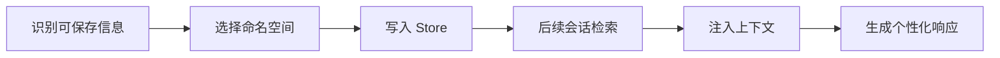

# Store（长期记忆存储）

## 定义

Store 是 LangGraph 提供的长期记忆存储机制，用于跨会话保存和召回用户特定或应用级别的数据。

## 核心特点

1. **持久化**: 数据在会话结束后仍然保留
2. **命名空间**: 使用层级命名空间组织数据
3. **跨线程**: 可在任何线程中访问
4. **JSON 文档**: 以 JSON 格式存储记忆

## 存储结构

```
Namespace (命名空间)
  └── Key (键)
        └── Value (JSON 文档)
```

## API 方法

- `get(namespace, key)`: 获取指定记忆
- `put(namespace, key, value)`: 保存/更新记忆
- `search(namespace, query)`: 搜索记忆
- `delete(namespace, key)`: 删除记忆

## 命名空间设计示例

```python
# 用户偏好
("users", user_id, "preferences")

# 应用配置
("app", "settings")

# 会话历史
("conversations", user_id)
```

## 相关概念

- [[LangChain_Memory]] - 记忆系统概述
- [[Checkpointer]] - 短期记忆的检查点器
- [[长期记忆]] - 长期记忆详细说明

## 使用流程



## 设计检查清单

- 命名空间是否包含用户、应用、租户等隔离维度。
- 保存内容是否经过用户同意，并避免保存敏感信息。
- 记忆是否有来源、更新时间和置信度，便于过期或纠正。
- 检索结果是否限制数量，避免污染提示词上下文。
- 删除和修正记忆是否有明确入口。

## 案例

写作助手可以把用户偏好的文风、常用术语和禁用表达保存到 Store。下一次生成文案时先检索这些偏好，再拼入提示词；但临时对话进度应放在 Checkpointer，而不是长期保存。

## 常见误区

- 把所有聊天记录都当长期记忆保存，导致噪声越来越多。
- 命名空间设计过粗，不同用户或租户的数据串在一起。
- 只会写入不会遗忘，旧偏好持续影响新任务。
