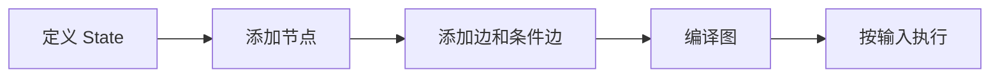

# StateGraph
StateGraph 是 LangGraph 中用于定义有状态工作流图的核心抽象，节点共享并更新图状态。

## 相关概念
- [[LangGraph]]
- [[Plan-and-Execute]]

## 建模流程

## 实践检查清单

- State 字段是否清晰表达工作流需要共享的信息。
- 节点是否单一职责，方便测试和复用。
- 条件边是否覆盖成功、失败、重试和结束状态。
- 是否使用 Checkpointer 保存长流程状态。
- 是否记录每个节点输入输出，便于调试 Agent 行为。

## 案例

资料研究 Agent 可以把“检索资料”“提取要点”“生成摘要”“人工确认”建成不同节点，State 中保存资料列表、摘要草稿和确认状态。

## 常见误区

- 把所有逻辑塞进一个节点，失去图工作流的可观测性。
- State 字段随意增长，节点之间隐式依赖变多。
- 条件边没有失败出口，工具异常后流程卡死。
