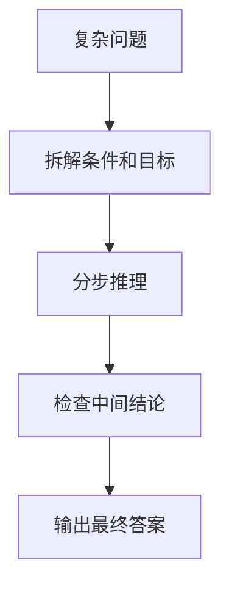

# Chain-of-Thought
Chain-of-Thought 是引导模型显式组织推理步骤的提示方法，常用于复杂推理、规划和问题分解。

## 使用流程

## 适用场景

- 多步数学、逻辑和规划问题。
- 需要解释推理路径的分析任务。
- 复杂代码排查或设计取舍。
- 需要先分解再执行的任务。

## 检查清单

- 问题是否真的需要多步推理。
- 是否要求模型先列约束和已知条件。
- 中间步骤是否可验证。
- 输出是否区分推理过程和最终答案。
- 对敏感或高风险任务是否保留事实依据。

## 案例

排查接口超时时，可以先列出网络、服务、数据库、缓存、限流等可能路径，再逐步排除。CoT 的价值是让排查过程可审计，而不是只给一个猜测结论。

## 常见误区

- 把 CoT 当作万能提示，简单问题也强行要求长推理。
- 只要求“逐步思考”，但没有提供约束、输入和验收标准。
- 中间步骤没有事实依据，推理看似完整但实际是编造。
- 把推理过程直接暴露给终端用户，造成输出冗长或不稳定。

## 复盘提示

CoT 适合内部帮助模型组织思路，最终交付给用户时可以压缩为关键依据、结论和可执行步骤。判断一次 CoT 是否有效，要看它是否减少遗漏和错误，而不是看步骤数量是否足够多。

## 使用边界

在真实产品中，CoT 往往更适合作为内部推理策略，而不是完整暴露给用户。面向用户的回答应保留必要依据、关键判断和可验证步骤，避免把冗长推理当成可靠性本身。

## 相关概念
- [[Prompt Engineering]]
- [[ReAct]]
