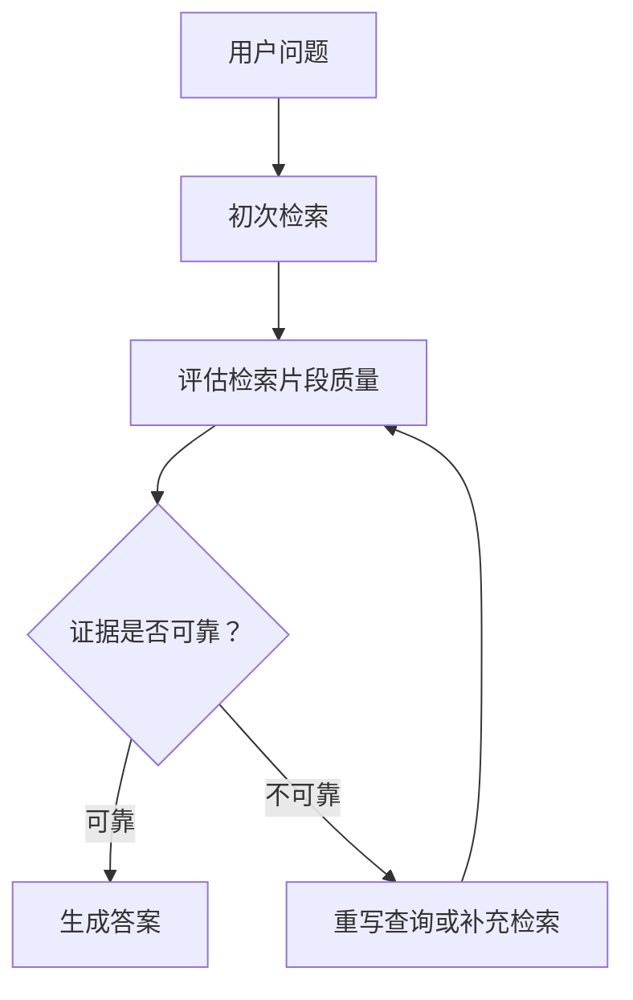

# CRAG
CRAG 是 Corrective RAG，强调对检索结果进行评估、纠偏和补充，减少低质量上下文对生成结果的影响。

## 工作流程

## 核心能力

- 判断检索结果是否相关、完整、可信。
- 对低质量检索结果进行查询改写。
- 必要时扩展检索源或触发网络搜索。
- 生成答案前过滤噪音上下文。

## 实践检查清单

- 是否有检索结果评分或分类器。
- 是否定义“低质量上下文”的判定标准。
- 查询改写是否保留原始用户意图。
- 补充检索是否会增加延迟和成本。
- 答案是否引用被确认的证据。

## 案例

用户问某个项目的部署方式，初次检索只找到无关日志片段时，CRAG 应判断证据不足，改写查询去找 README、部署脚本或 CI 配置，而不是基于噪音直接回答。

## 常见误区

- 只增加检索次数，不评估证据质量。
- 把模型自评当作唯一判断，没有样例集验证。

## 相关概念
- [[RAG]]
- [[Self-RAG]]
