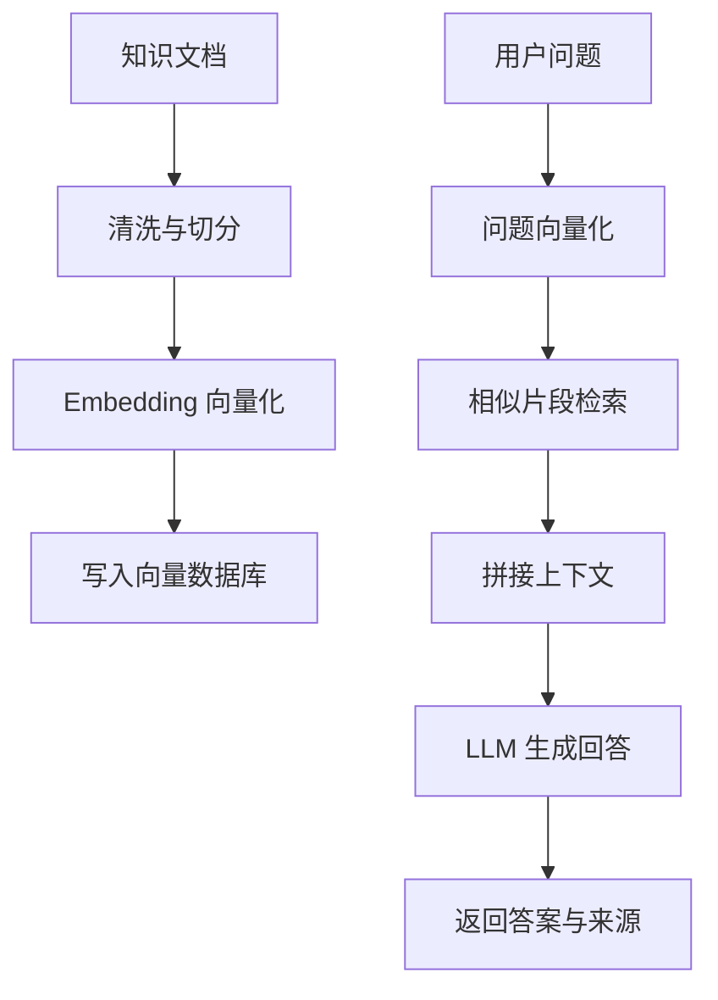

# RAG技术概述

> **父级**：[[MOC-RAG]]  
> **上级**：[[04-领域]]  
> **相关**：[[RAG-核心原理]], [[RAG-数据预处理与索引]]

## 什么是RAG？

**RAG（Retrieval-Augmented Generation，检索增强生成）** 是一种将**信息检索**与**文本生成**相结合的技术。

通过实时从外部知识库中检索相关文档，增强大语言模型（LLM）的生成准确性和事实性。

> [!definition] 核心定义
> RAG = 检索（Retrieval）+ 增强（Augmented）+ 生成（Generation）
> - **检索**：从知识库中找到相关文档
> - **增强**：将检索结果作为上下文
> - **生成**：基于上下文生成回答

## 基本工作流



这个工作流可以分成两条链路：离线索引链路负责把知识变成可检索资产，在线问答链路负责把用户问题匹配到证据并生成回答。

## RAG解决的三大痛点

### 1. 知识固化
- **问题**：LLM的预训练数据是固定的，无法实时更新
- **影响**：无法回答最新事件、实时数据相关问题
- **RAG方案**：动态检索最新文档作为上下文

### 2. 幻觉问题
- **问题**：LLM会生成看似合理但缺乏事实依据的内容
- **影响**：降低回答可信度，可能产生误导
- **RAG方案**：基于检索到的真实文档生成，有据可查

### 3. 领域局限
- **问题**：通用LLM难以直接处理专业领域问题
- **影响**：在专业领域（法律、医疗）表现不佳
- **RAG方案**：接入领域专属知识库

## 典型应用场景

### 智能客服
- 基于企业FAQ知识库的智能问答
- 案例：阿里小蜜日均处理千万级问答
- 特点：准确率高，可处理复杂业务逻辑

### 专业领域问答
- **法律咨询**：案例检索、法条解释
- **医疗辅助**：症状分析、药物说明
- **金融分析**：财报解读、市场动态

### 企业知识库增强
- 内部文档智能检索与问答
- 案例：微软将RAG集成到Copilot
- 价值：提高员工工作效率

### 实时数据应用
- 股票实时数据查询
- 新闻动态摘要生成
- 产品库存状态查询

## 技术优势

> [!success] 核心优势

| 优势 | 说明 |
|------|------|
| **低成本** | 无需微调即可适配新领域 |
| **可解释性** | 检索结果提供生成依据 |
| **安全性** | 通过知识库过滤敏感内容 |
| **动态性** | 支持实时知识注入和更新 |
| **证据可追溯** | 生成结果附带参考文档片段 |
| **长文本处理** | 通过检索压缩超长上下文 |

## RAG vs 传统方法

### 与传统搜索对比
| 维度 | 传统搜索 | RAG |
|------|---------|-----|
| 输出形式 | 文档列表 | 自然语言回答 |
| 理解深度 | 关键词匹配 | 语义理解 |
| 信息整合 | 人工阅读 | 自动综合生成 |

### 与微调（Fine-tuning）对比
| 维度 | 微调 | RAG |
|------|------|-----|
| 成本 | 高（训练资源） | 低（检索+生成） |
| 时效性 | 需重新训练 | 实时更新知识库 |
| 适用性 | 通用能力提升 | 特定领域增强 |
| 可解释性 | 低 | 高（有检索依据） |

## 落地判断

RAG 更适合以下问题：

- 答案必须依赖企业内部文档、产品手册、代码库或实时资料。
- 知识更新频繁，不适合每次都重新训练模型。
- 需要给出引用来源，方便用户核查。
- 可以接受检索和生成带来的额外延迟。

RAG 不适合以下问题：

- 主要目标是固定输出风格或格式，微调或提示模板可能更简单。
- 问题不依赖外部知识，只需要模型通用推理。
- 知识权限复杂但系统没有权限过滤能力。
- 没有评估集，无法判断检索和回答是否变好。

## RAG发展历程

```
2020 - RAG论文首次提出（Facebook AI）
  ↓
2022 - 向量数据库兴起（Pinecone, Milvus）
  ↓
2023 - LangChain/LlamaIndex框架成熟
  ↓
2024 - 多模态RAG、Agentic RAG兴起
```

## 学习路径建议

1. **理解基础概念** ← 当前位置
2. [[RAG-核心原理]] → 掌握工作流程
3. [[RAG-数据预处理与索引]] → 动手实践
4. [[RAG-高级优化策略]] → 进阶优化

## 常见问题

> [!question] Q: RAG适合什么场景？
> A: 需要结合外部知识、对准确性要求高、知识频繁更新的场景。

> [!question] Q: 搭建RAG系统需要哪些技术栈？
> A: 向量数据库（FAISS/Pinecone）、嵌入模型（Sentence-BERT）、LLM（GPT/Claude）、框架（LangChain/LlamaIndex）。

> [!question] Q: RAG和微调如何选择？
> A: 知识密集型任务选RAG，行为/风格调整选微调，两者可以结合使用。

## 实践检查清单

- 文档来源是否可信、可追溯、可更新。
- 切分策略是否能保留标题、表格、代码块和上下文关系。
- 检索结果是否经过重排序或过滤，避免把无关片段塞给模型。
- 回答是否要求基于上下文，不知道时明确说明不知道。
- 是否保留用户问题、检索片段、最终答案和反馈，用于持续评估。

## 参考资料

- [原文：RAG技术深度解析](https://juejin.cn/post/7501543492502683700)
- [Retrieval-Augmented Generation for Knowledge-Intensive NLP Tasks](https://arxiv.org/abs/2005.11401) (原始论文)
- [LangChain RAG教程](https://python.langchain.com/docs/use_cases/question_answering/)
