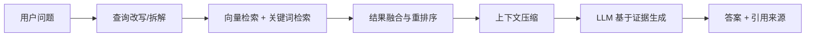

# RAG

## 定义

RAG（Retrieval-Augmented Generation，检索增强生成）是一种将外部知识检索与LLM生成能力结合的技术架构。通过检索相关文档来增强LLM的回答质量，解决知识截止和幻觉问题。

## 核心思想

**问题背景**：

- LLM有知识截止时间，不了解最新信息
- LLM可能产生"幻觉"，生成看似合理但错误的内容
- LLM无法访问私有数据或企业知识库

**RAG解决方案**：
在生成回答前，先从外部知识库检索相关信息，将检索结果作为上下文输入给LLM，让LLM基于这些事实生成回答。

## 流程图



生产级 RAG 的重点不只是“把文档塞给模型”，而是让问题、检索、上下文和答案形成可评估的闭环。

## 基础架构（Naive RAG）

```python
def naive_rag(query):
    # 1. 检索相关文档
    docs = vector_db.search(query, top_k=5)

    # 2. 构建上下文
    context = "\n".join(docs)

    # 3. 生成回答
    response = llm.generate(
        f"基于以下上下文回答问题：\n\n"
        f"上下文：{context}\n\n"
        f"问题：{query}"
    )

    return response
```

## Naive RAG的局限

1. **检索质量差**：查询和文档的语义匹配不够精确
2. **上下文窗口浪费**：检索到的文档可能包含无关信息
3. **无法处理多跳推理**：复杂问题需要多步推理，单次检索不够
4. **缺乏可解释性**：不知道回答基于哪些文档

## 生产级RAG的三阶段优化

### 第一阶段：Query优化

**目标**：让查询更适合检索

| 技术                    | 描述                         | 适用场景             |
| ----------------------- | ---------------------------- | -------------------- |
| **Query Rewriting**     | 重写用户查询，使其更适合检索 | 用户查询口语化、模糊 |
| **Query Decomposition** | 将复杂问题拆成子问题         | 多条件、多步骤问题   |
| **HyDE**                | 生成假设答案后再检索         | 需要深入理解的查询   |
| **Query Expansion**     | 扩展查询词，增加同义词       | 专业术语检索         |

**HyDE示例**：

```python
def hyde_retrieval(query):
    # 1. 生成假设答案
    hypothetical_answer = llm.generate(
        f"请简要回答这个问题（不需要准确，只是假设）：{query}"
    )

    # 2. 用假设答案去检索
    docs = vector_db.search(hypothetical_answer, top_k=5)

    return docs
```

### 第二阶段：检索优化

**Hybrid Search（混合检索）**：

```python
def hybrid_search(query, alpha=0.5):
    # 向量检索（语义匹配）
    vector_results = vector_db.search(query, top_k=10)

    # 关键词检索（BM25）
    keyword_results = bm25_search(query, top_k=10)

    # 融合结果（RRF - Reciprocal Rank Fusion）
    fused_results = reciprocal_rank_fusion(
        vector_results,
        keyword_results,
        alpha=alpha
    )

    return fused_results
```

**Reranking（重排序）**：

```python
def rerank_documents(query, docs):
    # 使用Cross-Encoder进行精确重排序
    scores = []
    for doc in docs:
        # Cross-Encoder同时看query和doc
        score = cross_encoder.predict([(query, doc.text)])
        scores.append((doc, score))

    # 按分数排序
    ranked = sorted(scores, key=lambda x: x[1], reverse=True)
    return [doc for doc, _ in ranked[:5]]  # 取Top5
```

**Contextual Compression（上下文压缩）**：

```python
def compress_context(query, docs):
    compressed = []
    for doc in docs:
        # 提取与查询最相关的段落
        relevant_parts = extract_relevant_sections(doc, query)
        compressed.append(relevant_parts)
    return compressed
```

### 第三阶段：生成优化

**Self-RAG**：

```python
def self_rag(query):
    context = ""
    max_iterations = 3

    for i in range(max_iterations):
        # 让模型判断是否需要检索
        need_retrieval = llm.generate(
            f"问题：{query}\n"
            f"当前上下文：{context}\n"
            f"是否需要更多检索？（是/否）"
        )

        if "否" in need_retrieval:
            break

        # 检索更多文档
        new_docs = vector_db.search(query, top_k=3)
        context += "\n" + "\n".join(new_docs)

    # 最终生成
    return llm.generate(f"基于以下上下文：{context}\n\n回答：{query}")
```

**CRAG（Corrective RAG）**：

```python
def crag(query):
    docs = vector_db.search(query, top_k=5)

    # 评估检索质量
    relevance_scores = [
        evaluate_relevance(query, doc) for doc in docs
    ]

    avg_relevance = sum(relevance_scores) / len(relevance_scores)

    if avg_relevance < 0.5:
        # 检索质量差，回退到网络搜索
        docs = web_search(query)
    elif avg_relevance < 0.8:
        # 质量一般，知识精炼
        docs = refine_knowledge(query, docs)

    return generate_answer(query, docs)
```

## RAG Pipeline完整示例

```python
class AdvancedRAG:
    def __init__(self):
        self.vector_db = VectorDB()
        self.bm25 = BM25Index()
        self.cross_encoder = CrossEncoder()
        self.llm = LLM()

    def query(self, user_query):
        # 1. Query优化
        optimized_query = self.rewrite_query(user_query)

        # 2. 混合检索
        vector_results = self.vector_db.search(optimized_query, top_k=10)
        keyword_results = self.bm25.search(optimized_query, top_k=10)

        # 3. 结果融合
        fused_results = self.fuse_results(vector_results, keyword_results)

        # 4. 重排序
        reranked_results = self.rerank(optimized_query, fused_results)

        # 5. 上下文压缩
        compressed_context = self.compress(reranked_results)

        # 6. 生成回答
        answer = self.llm.generate(
            context=compressed_context,
            query=user_query
        )

        return {
            "answer": answer,
            "sources": reranked_results,
            "confidence": self.calculate_confidence(reranked_results)
        }
```

## 评估指标

| 指标                  | 描述                         | 计算方法                      |
| --------------------- | ---------------------------- | ----------------------------- |
| **Context Precision** | 检索到的文档中相关文档的比例 | 相关文档数 / 总检索文档数     |
| **Context Recall**    | 所有相关文档中被检索到的比例 | 检索到的相关文档 / 总相关文档 |
| **Answer Relevance**  | 回答与问题的相关度           | 人工评分或模型评分            |
| **Faithfulness**      | 回答是否忠实于检索内容       | 事实一致性检查                |
| **Latency**           | 端到端响应时间               | 从查询到回答的时间            |

## 落地检查清单

- 文档切分是否保留标题、层级、来源、时间和权限元数据。
- 检索是否结合 [[Embedding]]、关键词和过滤条件，而不是只靠向量相似度。
- 是否对 Top K、重排序、上下文长度和引用数量做离线评估。
- 回答是否明确引用来源，无法从上下文回答时是否拒答。
- 私有知识是否做权限过滤，避免用户检索到无权访问的片段。
- 是否监控检索命中率、无答案率、延迟、成本和用户反馈。

## 常见误区

- 文档未清洗就入库，导航、页脚、重复文本污染检索结果。
- Chunk 过大导致上下文噪声高，过小又丢失语义完整性。
- 只优化 Prompt，不评估检索召回和排序质量。
- 将 RAG 当作事实保证，忽略模型仍可能曲解或遗漏上下文。
- 没有增量更新和删除机制，知识库长期陈旧。

## 相关概念

- [[向量数据库]] - RAG的检索基础设施
- [[HNSW]] - 向量检索算法
- [[Embedding]] - 文本向量化
- [[LangChain]] - 提供RAG实现的框架
- [[Self-RAG]] - 自适应检索的RAG变体
- [[CRAG]] - 纠错型RAG

## 参考资料

- 论文：_Retrieval-Augmented Generation for Knowledge-Intensive NLP Tasks_ (Lewis et al., 2020)
