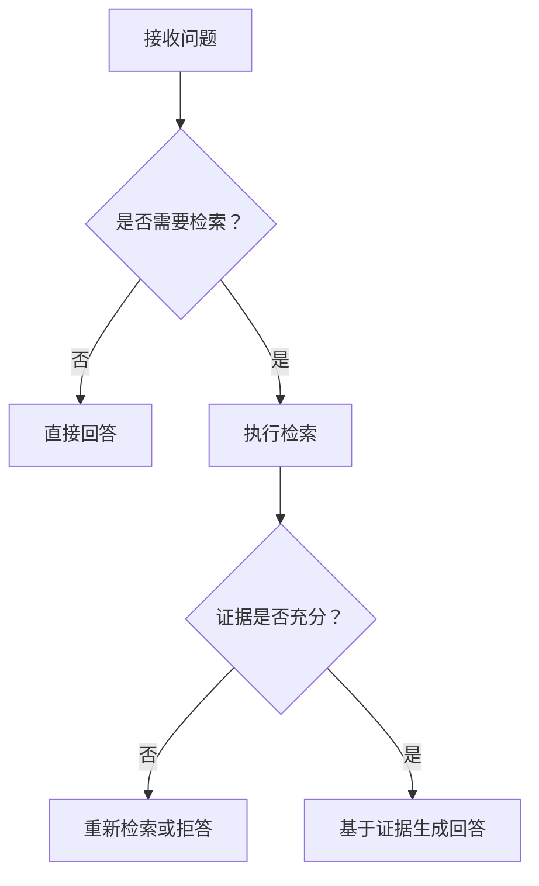

# Self-RAG
Self-RAG 是让模型在生成过程中自我判断是否需要检索、检索是否有用以及回答是否充分的 RAG 思路。

## 决策流程

## 核心能力

- 判断问题是否需要外部知识。
- 评估检索片段是否相关。
- 发现证据不足时补检索或降低回答确定性。
- 在生成后检查答案是否被证据支持。

## 实践检查清单

- 是否定义“需要检索”的判定标准。
- 检索结果是否有相关性评分或引用。
- 证据不足时是否允许拒答。
- 是否记录检索决策，便于调试。
- 是否评估相比普通 RAG 的成本和收益。

## 案例

用户问“这个项目 README 里怎么配置环境变量”时，Self-RAG 应判断需要检索项目文档；若检索不到相关片段，应说明证据不足，而不是凭常识编造。

## 适用边界

Self-RAG 适合问题类型差异明显、检索成本较高、且回答需要证据支撑的场景。它的价值在于避免无意义检索，也避免证据不足时强行回答。若业务问题几乎都依赖外部知识，简单“总是检索”的 RAG 可能更稳定；若问题多为闲聊或写作，频繁判断检索反而会增加复杂度。

落地时要记录每一步决策：为什么检索、检索到了什么、为什么接受或拒绝证据。没有这些日志，Self-RAG 的自我判断很难调试。

## 常见误区

- 让模型自评但没有外部验证。
- 每个问题都检索，增加延迟和噪音。

## 相关概念
- [[RAG]]
- [[CRAG]]
