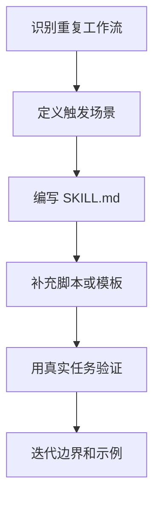

# Claude Code Skills 开发
Claude Code Skills 开发是把可复用工作流、领域知识和工具调用规范沉淀为 Skill 的过程。

## 开发流程

## Skill 内容结构

- 什么时候使用。
- 任务输入和预期输出。
- 必须遵守的步骤和约束。
- 可复用脚本、模板或参考资料。
- 验证方式和失败处理。

## 检查清单

- 触发条件是否具体，避免过度泛化。
- 步骤是否能被另一个 Agent 复现。
- 是否包含真实示例，而不只是原则。
- 是否把大段重复代码放入脚本或模板。
- 是否经过至少一次真实任务回放验证。

## 案例

如果经常整理 Obsidian 笔记，可以把扫描薄弱笔记、补充结构、校验 wikilink 和 frontmatter 的流程沉淀为 Skill。下次同类任务就能直接复用，而不是重新解释规则。

## 常见误区

- 把一次性提示词当作 Skill，缺少可复用边界。
- 只写原则，不写触发条件、输入输出和验证步骤。
- Skill 过大，试图覆盖多个互不相关的工作流。
- 没有真实任务回放，导致说明看似完整但无法执行。

## 复盘提示

好的 Skill 应该像操作手册：另一个 Agent 读完后能在相同任务中稳定复现结果。若每次还需要大量额外解释，说明 Skill 的边界或步骤还不够清楚。

## 质量标准

Skill 至少要回答三个问题：什么时候用、怎么做、如何确认做对了。缺少验证标准的 Skill 很容易变成风格建议，而不是可执行能力。

## 相关概念
- [[Skills]]
- [[Claude Code 配置详解]]
