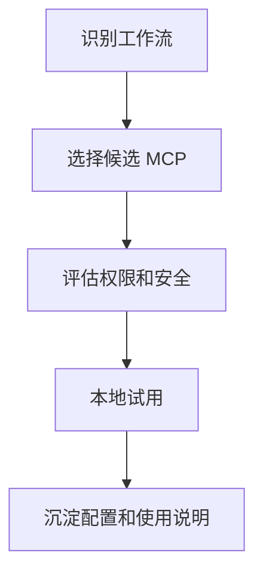

# MCP 服务器推荐
MCP 服务器推荐记录适合接入 LLM 工作流的工具服务器，如文件、数据库、浏览器、GitHub 和知识库连接器。

## 推荐维度

- 任务价值：是否解决高频真实工作流。
- 权限边界：是否能限制读写范围。
- 稳定性：工具返回是否可靠、错误是否清晰。
- 可审计性：是否能记录调用和结果。
- 维护成本：安装、配置和升级是否简单。

## 选择流程

## 实践检查清单

- 是否真的需要 MCP，而不是普通命令或 API。
- 工具权限是否最小化。
- 是否能在失败时给出可理解错误。
- 是否有测试环境先验证。
- 是否记录适用场景和禁用场景。

## 案例

知识库管理适合接入文件系统或 Obsidian 相关 MCP；生产数据库不应直接给 Agent 写权限，最多提供只读、脱敏和限流查询。

## 分级策略

MCP 服务器可以按风险分为三类：只读查询、受限写入、高风险执行。只读查询适合文档检索、仓库浏览、日志查看；受限写入适合创建草稿、更新笔记、生成临时文件；高风险执行包括生产数据库写入、云资源变更、支付和权限修改，应默认禁用或要求人工审批。

推荐 MCP 时要同时写清楚“能做什么”和“不能做什么”。一个好工具服务器不只是功能多，还要有清晰错误、可控权限和可复现配置。

团队共享 MCP 配置时，应记录安装方式、环境变量、权限范围和禁用条件。否则同一个工具在不同机器上行为不一致，排查成本会转移到使用者身上。

## 常见误区

- 只因为工具新就接入，实际没有工作流价值。
- 不设权限边界，让 Agent 能访问过多敏感资源。

## 相关概念
- [[MCP]]
- [[Tool]]
