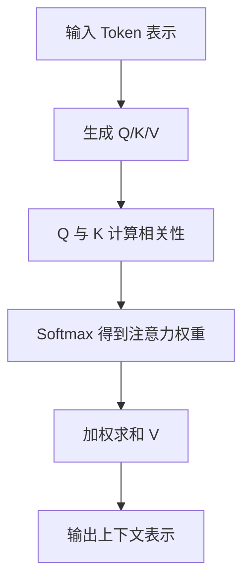

# Attention Mechanism
Attention Mechanism 让模型根据上下文动态分配关注权重，是 Transformer 的核心机制。

## 计算流程

## 核心直觉

Attention 的问题是“当前 token 应该关注哪些其他 token”。Query 表示当前要找什么，Key 表示每个位置能被匹配的特征，Value 表示真正要被聚合的信息。

## 检查清单

- 是否区分 Query、Key、Value 的角色。
- 是否理解 self-attention 中 Q/K/V 来自同一序列。
- 是否知道多头注意力用于学习不同关系子空间。
- 是否理解注意力复杂度与序列长度平方相关。
- 是否能解释位置编码为什么仍然必要。

## 案例

句子“苹果发布了新手机，它很受欢迎”中，“它”需要关注“新手机”而不是“苹果”。Attention 机制通过上下文相关性帮助模型建立这种指代关系。

## 常见误区

- 把 attention 权重直接等同于人类可解释因果。
- 忽视位置编码，导致模型无法区分词序。
- 只关注 self-attention，不理解 cross-attention 在编码器-解码器中的作用。
- 忽略长序列下平方复杂度带来的成本。

## 复盘提示

理解 Attention 时可以始终问三个问题：当前 token 要查询什么，其他 token 提供什么可匹配特征，最终聚合了哪些信息。Q/K/V 的角色一旦清楚，后续多头注意力和 Transformer 结构就更容易串起来。

## 工程边界

Attention 能建模上下文依赖，但并不自动保证事实正确。RAG、工具调用和约束解码仍然需要与模型推理能力配合。

## 相关概念
- [[Transformer]]
- [[BERT]]
- [[GPT]]
