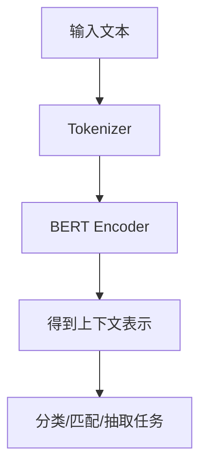

# BERT
BERT 是基于 Transformer Encoder 的预训练语言模型，擅长理解类任务和双向上下文建模。

## 架构特点

- Encoder-only Transformer。
- 双向上下文建模，适合理解任务。
- 预训练任务包括 Masked Language Model。
- 常用于分类、实体识别、句子匹配和检索表示。

## 使用流程

## 实践检查清单

- 任务是否更偏理解而不是生成。
- 输入长度是否符合模型限制。
- 是否需要 fine-tuning 或只用 embedding。
- 中文任务是否选择合适的中文预训练模型。
- 输出是否通过标注集验证，而不是只看单例。

## 案例

客服工单分类可以用 BERT 对文本编码，再接分类层判断问题类型。若任务是生成回复，则更适合 GPT 类生成模型或 RAG 方案。

## 任务选择

BERT 更适合“读懂输入并给出判断”的任务，例如文本分类、实体识别、语义匹配、检索重排和问答抽取。它不擅长长文本开放生成，因为架构目标不是逐 token 续写。选择模型时先判断任务是理解、匹配、抽取，还是生成、规划、对话。

如果只需要句向量检索，通常会使用专门训练的 embedding 模型，而不是直接拿原始 BERT 输出。若要 fine-tune，需要准备标注集、验证集和错误分析流程，否则模型可能只是在少量样例上看起来有效。

## 常见误区

- 用 BERT 做开放式生成。
- 不区分句向量检索和 token 级理解任务。

## 相关概念
- [[Transformer]]
- [[Attention Mechanism]]
