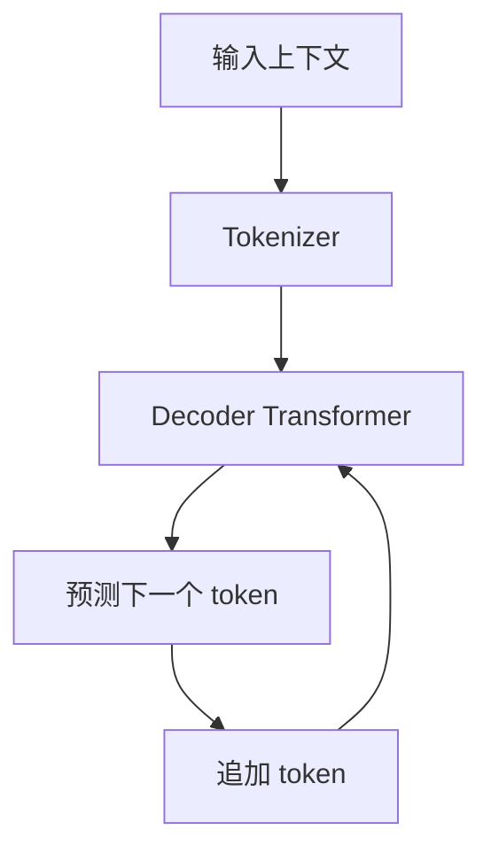

# GPT
GPT 是基于 Transformer Decoder 的生成式预训练模型系列，擅长文本生成、对话和指令跟随。

## 架构特点

- Decoder-only Transformer。
- 自回归生成：根据前文预测下一个 token。
- 使用 causal mask，避免看到未来 token。
- 适合生成、续写、对话、代码和工具调用。

## 生成流程

## 实践检查清单

- 是否理解 GPT 是生成式模型，不等于事实数据库。
- 上下文是否包含完成任务所需信息。
- 生成结果是否需要工具、检索或测试验证。
- 温度、top-p 等参数是否符合任务稳定性要求。
- 是否区分模型能力和产品工具能力。

## 案例

代码 Agent 使用 GPT 类模型时，模型负责理解上下文和生成候选修改，但仍需要文件系统、终端和测试工具来完成真实工程闭环。

## 常见误区

- 把流畅回答当作事实正确。
- 忽视上下文窗口和输入质量对输出的影响。

## 相关概念
- [[Transformer]]
- [[Attention Mechanism]]
