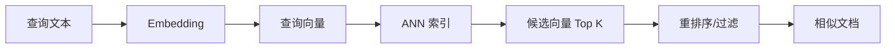

# ANN

## 定义

ANN 是 Approximate Nearest Neighbor，近似最近邻检索，用较低成本在大规模向量中找到相似结果。

精确最近邻会把查询向量和库里所有向量逐一计算距离，数据量大时成本很高。ANN 通过索引结构、分桶、图搜索或量化牺牲一点点召回率，换取数量级的检索速度提升。

## 检索流程

在 [[RAG]] 中，ANN 通常负责第一阶段召回。它要快而广，后续可以再用重排序模型提高精度。

## 常见算法

- **[[HNSW]]**：基于多层图的近似搜索，召回和性能表现好，是很多向量数据库的默认选择。
- **[[IVF]]**：把向量空间聚类分桶，查询时只搜索部分桶，适合大规模数据。
- **PQ/量化**：压缩向量表示，降低内存和磁盘成本，但可能损失精度。
- **混合方案**：先 IVF 缩小范围，再 HNSW 或精确距离重排。

## 关键指标

- **Recall**：真实相关结果是否被召回。
- **Latency**：单次查询延迟，常看 P95/P99。
- **Throughput**：单位时间可处理查询量。
- **Memory**：索引占用内存或磁盘大小。
- **Build Time**：索引构建与增量更新成本。

## 案例

企业知识库有 1000 万个文档片段。每次用户提问都全量计算余弦相似度不可接受。使用 HNSW 后，可以在几十毫秒内召回候选片段，再交给 reranker 精排，最终把 Top 5 片段放进上下文。

## 常见误区

- 只看检索速度，不看召回率，导致答案缺证据。
- 向量库参数照抄默认值，没有用业务评估集调参。
- 忽略过滤条件，例如权限、时间、文档类型，导致召回结果不可用。
- 认为 ANN 能替代重排序；ANN 更适合召回，精排仍然重要。

## 相关概念
- [[HNSW]]
- [[IVF]]
- [[向量数据库]]
- [[Embedding]]
- [[RAG]]
