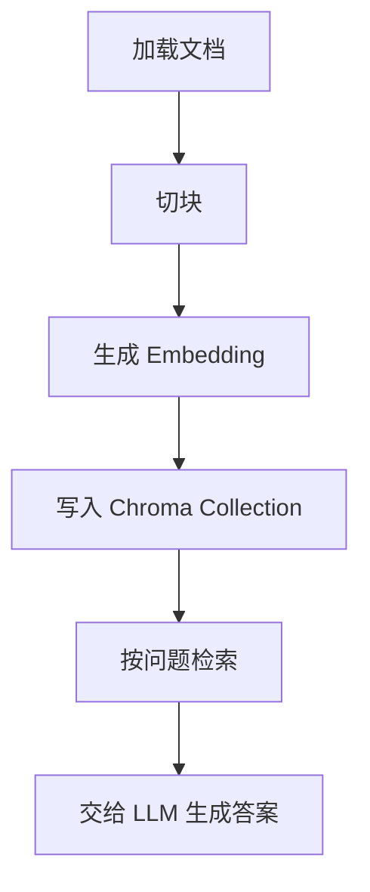

# Chroma
Chroma 是面向 LLM 应用的轻量向量数据库，常用于本地 RAG 原型和小规模检索。

## 使用流程

## 适用场景

- 本地 RAG 原型验证。
- 小规模知识库检索。
- 教学、实验和快速 Demo。
- 与 LangChain、LlamaIndex 等框架集成。

## 实践检查清单

- Collection 命名是否区分项目和版本。
- 文档元数据是否包含来源、时间和权限。
- 持久化目录是否纳入备份或可重建流程。
- 检索结果是否评估相关性，而不只看能否返回。
- 数据规模增大后是否考虑 Milvus、FAISS 服务化或其他方案。

## 案例

个人笔记 RAG 可以先用 Chroma 本地持久化，快速验证切块、检索和提示词效果。若后续需要多用户、权限和高并发，再迁移到更完整的向量数据库架构。

## 使用边界

Chroma 的优势是启动快、集成简单、适合实验和个人知识库原型。它不应该自动等同于生产级检索平台。生产场景往往还需要权限过滤、数据隔离、索引迁移、监控告警、备份恢复和容量规划，这些能力需要结合部署形态和业务风险重新评估。

做原型时也要保留可迁移性：文档切块策略、Embedding 模型名、Collection 版本和元数据字段应清楚记录，避免后续迁移时不知道答案来自哪批数据。

## 常见误区

- 把原型数据库直接当生产检索系统。
- 没有保存文档来源，答案无法追溯。

## 相关概念
- [[向量数据库]]
- [[RAG]]
