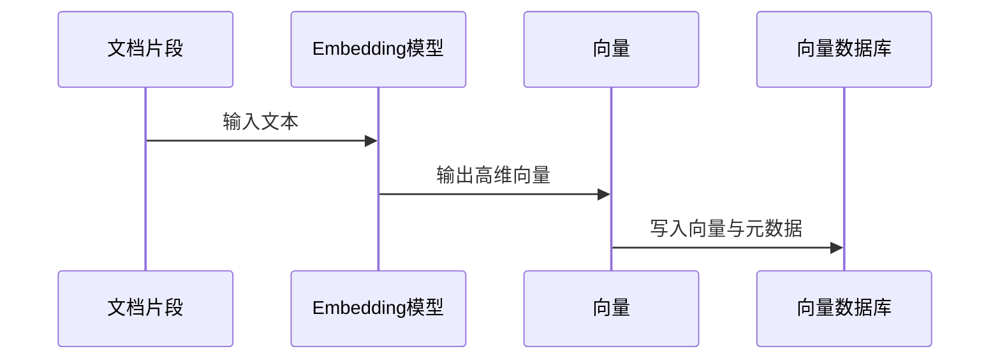

# Embedding

## 定义

Embedding 是把文本、图片、代码等对象编码为向量表示的技术。向量中的数字本身不直接可读，但向量之间的距离可以表达语义相似度，因此 Embedding 是 [[向量数据库]]、语义搜索、聚类和推荐的基础。

## 直观理解

如果把每段文字放到一个高维语义空间里，意思接近的内容会更靠近：

- “如何处理接口超时” 会靠近 “[[超时控制]]”“[[重试]]”“[[熔断器]]”。
- “RAG 怎么召回文档” 会靠近 “[[RAG]]”“[[向量数据库]]”“[[ANN]]”。
- “React 状态缓存” 可能同时靠近 “[[TanStack-Query]]” 和 “[[状态管理 MOC]]”。

## 基本流程

## 使用场景

- **语义检索**：问题与文档不用共享关键词，也能找到相关内容。
- **RAG**：将用户问题和知识片段映射到同一语义空间。
- **相似内容发现**：查找重复 FAQ、相似 issue、相近代码片段。
- **分类聚类**：根据向量距离把大量文本自动分组。

## 实践要点

- Embedding 模型要与语言、领域和任务匹配，中文知识库要确认中文效果。
- 同一索引内应使用同一个模型和同一维度，避免混用。
- 输入文本要清洗并保留标题、层级、来源等上下文。
- 向量检索结果需要重排序或规则过滤，不能完全相信距离分数。
- 对安全敏感内容，要在向量化前确认是否允许进入外部模型或服务。

## 示例

一条笔记标题为“[[前端鉴权与 Token 存储安全]]”，正文包含 Cookie、localStorage、XSS、CSRF。它的向量应该能被这些问题召回：

- “Token 放 localStorage 安全吗？”
- “HttpOnly Cookie 能防什么？”
- “前端如何降低 XSS 窃取登录态风险？”

## 常见问题

- **Embedding 能替代关键词搜索吗？** 不能完全替代。工程上常把向量检索、关键词检索和重排序组合使用。
- **向量越大越好吗？** 不一定。维度越高成本越高，关键是模型质量和任务匹配。
- **相似度高就一定正确吗？** 不一定。召回结果还要看权限、时效、来源质量和上下文完整性。

## 相关概念
- [[向量数据库]]
- [[RAG]]
- [[ANN]]
- [[RAG-数据预处理与索引]]
