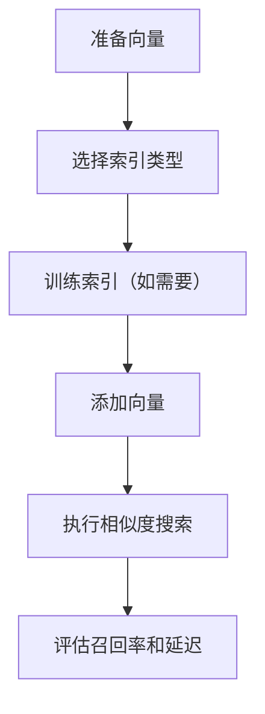

# FAISS
FAISS 是 Meta 开源的向量相似度检索库，适合构建高性能向量索引和 ANN 检索。

## 使用流程

## 常见索引

- Flat：精确检索，简单但数据大时慢。
- IVF：先聚类再检索候选桶，速度和召回折中。
- HNSW：图结构近似检索，适合低延迟场景。
- PQ：压缩向量，降低内存占用。

## 实践检查清单

- 向量维度是否一致。
- 相似度指标是否匹配模型输出。
- 索引类型是否符合数据规模和延迟要求。
- 是否保存向量 ID 与原文档元数据映射。
- 是否用查询集评估召回率，而不只看速度。

## 案例

本地 RAG 原型可以先用 FAISS Flat 索引验证切块和 Embedding 效果；数据量变大后，再评估 IVF 或 HNSW 来降低检索延迟。

## 落地要点

FAISS 更像高性能检索库，而不是完整知识库系统。它擅长向量索引和相似度搜索，但权限过滤、文档元数据、增量更新、备份恢复和多租户隔离通常需要应用层自己设计。用于生产 RAG 时，要把向量 ID、原文片段、来源文档、权限标签和索引版本绑定起来。

评估索引时不要只看单次查询速度。更重要的是召回率、构建时间、内存占用、增量更新成本，以及更换 Embedding 模型后重建索引的流程。

## 常见误区

- 只保存向量，不保存原文档 ID 和权限元数据。
- 更换 Embedding 模型后继续复用旧索引。

## 相关概念
- [[ANN]]
- [[向量数据库]]
