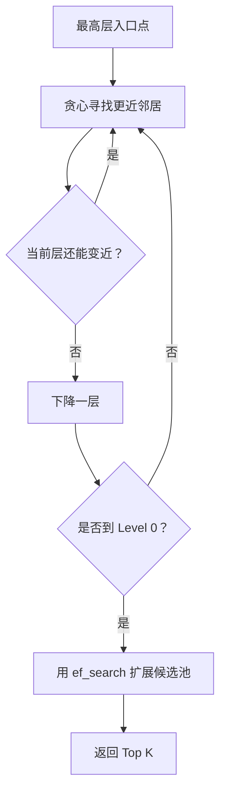

# HNSW

## 定义

HNSW（Hierarchical Navigable Small World，分层可导航小世界）是一种用于高维向量近似最近邻搜索（ANN）的图算法。通过构建多层图结构，实现高效的向量检索。

## 核心思想

**小世界现象**：在社交网络中，任意两个人之间只需要很少的中间人就能建立联系（六度分隔理论）。

**HNSW的洞察**：

- 在向量空间中，数据点也可以形成"小世界"网络
- 通过构建分层图，可以实现从粗到细的快速导航
- 上层图提供长距离跳跃，下层图提供精确搜索

## 算法结构

### 多层图结构

```
Level 2:    ●─────●                    (稀疏，长距离连接)
              \   /
               \ /
Level 1:    ●──●──●──●                 (中等密度)
             \ | / \ |
              \|/   \|
Level 0:    ●─●─●─●─●─●─●─●            (密集，精确连接)
            └──── 所有数据点 ────┘
```

**层级特点**：

- **Level 0**：包含所有数据点，连接最密集
- **Level 1+**：上层只包含部分点，连接稀疏
- **插入概率**：新点有概率进入更高层，概率随层数指数下降

## 搜索流程图



上层图帮助快速接近目标区域，底层图负责扩大候选池并提高召回率。

### 搜索过程

```python
def hnsw_search(query_vector, entry_point, max_level):
    """HNSW搜索算法"""
    current = entry_point

    # 1. 从最高层开始，贪心下降
    for level in range(max_level, 0, -1):
        # 在当前层贪婪搜索最近的邻居
        current = greedy_search_layer(
            query_vector,
            current,
            level
        )

    # 2. 在最底层（Level 0）进行精确搜索
    # 使用候选池（ef参数）扩大搜索范围
    candidates = search_layer_with_ef(
        query_vector,
        current,
        level=0,
        ef=ef_search
    )

    # 3. 返回最近的k个邻居
    return get_top_k(candidates, k)


def greedy_search_layer(query, entry, level):
    """单层贪婪搜索"""
    current = entry
    min_dist = distance(query, current)

    while True:
        # 检查所有邻居
        improved = False
        for neighbor in current.neighbors[level]:
            dist = distance(query, neighbor)
            if dist < min_dist:
                min_dist = dist
                current = neighbor
                improved = True

        # 如果没有更近的邻居，停止
        if not improved:
            break

    return current
```

### 插入过程

```python
def hnsw_insert(new_vector, m, m_max, ef_construction):
    """
    插入新向量
    m: 每层连接数
    m_max: 最大连接数
    ef_construction: 构建时的候选池大小
    """
    # 1. 随机决定新点进入的最高层
    max_level = random_level()  # 指数分布

    # 2. 找到入口点
    entry_point = get_entry_point()

    # 3. 从最高层到第1层，每层找一个最近点作为下一层入口
    for level in range(current_max_level, max_level, -1):
        entry_point = greedy_search_layer(new_vector, entry_point, level)

    # 4. 从max_level到0层，每层建立连接
    for level in range(min(max_level, current_max_level), -1, -1):
        # 搜索ef个候选邻居
        candidates = search_layer_with_ef(
            new_vector,
            entry_point,
            level,
            ef=ef_construction
        )

        # 选择最近的m个作为邻居
        neighbors = select_neighbors(candidates, m)

        # 建立双向连接
        for neighbor in neighbors:
            add_edge(new_vector, neighbor, level)

            # 如果邻居连接数超过m_max，剪枝
            if len(neighbor.neighbors[level]) > m_max:
                prune_neighbors(neighbor, m_max, level)
```

## 关键参数

| 参数                | 描述       | 推荐值  | 影响                     |
| ------------------- | ---------- | ------- | ------------------------ |
| **M**               | 每层连接数 | 5-48    | 越大精度越高，内存越大   |
| **ef_construction** | 构建候选池 | 100-200 | 越大构建越慢，精度越高   |
| **ef_search**       | 搜索候选池 | 50-300  | 越大搜索越慢，召回率越高 |
| **m_max**           | 最大连接数 | 2\*M    | 控制图密度               |

## 优点

1. **查询速度快**：通常是毫秒级
2. **召回率高**：在合理参数下可达95%+
3. **动态更新**：支持增量插入
4. **内存友好**：相比暴力搜索大幅减少内存占用

## 缺点

1. **内存占用大**：需要存储图结构
2. **构建较慢**：构建索引需要较长时间
3. **不支持删除**：标准HNSW难以高效删除节点
4. **参数敏感**：参数调优对性能影响大

## 适用场景

**适合使用HNSW**：

- 高QPS（每秒查询次数）场景
- 数据集规模中等（百万级）
- 内存充足
- 需要高召回率

**不适合使用HNSW**：

- 内存受限环境
- 需要频繁删除数据
- 十亿级超大规模数据（需要分片）

## 与IVF的对比

| 维度     | HNSW           | IVF           |
| -------- | -------------- | ------------- |
| 查询速度 | 极快（1-10ms） | 快（10-50ms） |
| 内存占用 | 大             | 中            |
| 构建时间 | 慢             | 中等          |
| 动态更新 | 支持           | 需重建索引    |
| 召回率   | 高             | 中高          |
| 适用规模 | 百万级         | 千万级        |

## 实际应用

**Milvus中的HNSW配置**：

```python
from pymilvus import Collection, FieldSchema, CollectionSchema

fields = [
    FieldSchema(name="id", dtype=DataType.INT64, is_primary=True),
    FieldSchema(name="embedding", dtype=DataType.FLOAT_VECTOR, dim=768)
]

collection = Collection("my_collection", CollectionSchema(fields))

# 创建HNSW索引
index_params = {
    "metric_type": "L2",
    "index_type": "HNSW",
    "params": {
        "M": 16,              # 连接数
        "efConstruction": 200 # 构建候选池
    }
}

collection.create_index("embedding", index_params)

# 搜索时设置ef
search_params = {
    "metric_type": "L2",
    "params": {"ef": 128}    # 搜索候选池
}
```

## 相关概念

- [[向量数据库]] - 向量存储与检索系统
- [[IVF]] - 另一种向量检索算法
- [[ANN]] - 近似最近邻搜索
- [[Milvus]] - 支持HNSW的开源向量数据库
- [[Embedding]] - 向量表示

## 实践检查清单

- 是否根据召回率和延迟调节 `M`、`ef_construction`、`ef_search`。
- 是否评估内存占用，避免图结构超过预算。
- 是否区分构建参数和查询参数。
- 是否对删除、更新和重建索引有方案。
- 是否用真实查询集评估，而不是只看随机向量 benchmark。

## 参考资料

- 论文：_Efficient and robust approximate nearest neighbor search using Hierarchical Navigable Small World graphs_ (Malkov & Yashunin, 2018)
