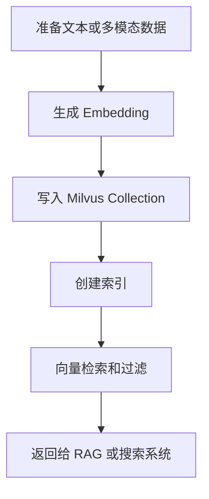

# Milvus
Milvus 是开源向量数据库，适合构建语义搜索、RAG 和多模态检索系统。

## 使用流程

## 核心概念

- Collection：类似表，用于组织向量和元数据。
- Index：加速近似最近邻搜索。
- Metric：相似度度量，如 cosine、L2、inner product。
- Metadata Filter：结合标量条件过滤候选结果。

## 检查清单

- 向量维度是否和 Embedding 模型一致。
- 相似度指标是否匹配模型输出。
- 是否需要按租户、文档类型或权限做过滤。
- 索引参数是否经过召回率和延迟权衡。
- 是否有数据重建、备份和版本策略。

## 案例

知识库 RAG 可以把文档切块后写入 Milvus，查询时先将问题向量化，再检索相似片段，并结合文档权限过滤。检索结果再交给 LLM 生成答案。

## 常见误区

- 只关注向量检索速度，不评估召回率和答案质量。
- 切块策略粗糙，导致检索结果缺少完整上下文。
- 忽视元数据过滤，把无权限或错误版本文档召回。
- Embedding 模型变更后没有重建索引和数据版本。

## 复盘提示

Milvus 项目排查要同时看数据、向量、索引和检索参数。RAG 答案差不一定是 LLM 问题，也可能是切块、Embedding、过滤或重排阶段出了问题。

## 工程边界

向量数据库不是主数据库替代品。业务强一致数据、权限事实和交易状态仍应保存在关系型或事务型系统中，Milvus 主要负责相似检索。

## 相关概念
- [[向量数据库]]
- [[Embedding]]
- [[ANN]]
