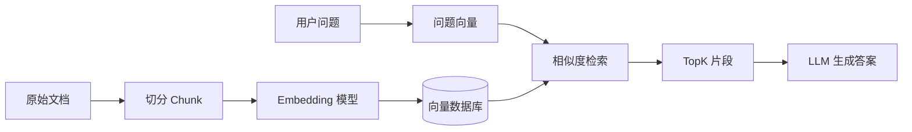

# 向量数据库

## 定义

向量数据库用于存储 [[Embedding]] 向量并执行相似度检索，是 [[RAG]]、语义搜索、推荐系统和多模态检索的重要基础设施。它解决的不是“精确等值查询”，而是“找到语义上最接近的内容”。

## 解决什么问题

- **语义检索**：用户问“如何减少接口超时”，系统能找到“[[超时控制]]”“[[熔断器]]”“[[重试]]”等相关内容，而不要求关键词完全一致。
- **RAG 上下文召回**：先把文档片段转成向量，提问时检索相似片段，再交给模型生成答案。
- **去重与聚类**：发现语义相近的 FAQ、商品描述、知识笔记或代码片段。
- **个性化推荐**：用用户行为、内容特征或查询意图向量做相似匹配。

## 基本流程

## 核心组成

- **向量**：由 [[Embedding]] 模型生成，表达文本、图片或代码的语义位置。
- **索引**：使用 [[ANN]] 算法加速相似度检索，例如 [[HNSW]]、[[IVF]]。
- **元数据过滤**：用标签、时间、权限、来源等结构化条件缩小检索范围。
- **相似度度量**：常见有 cosine similarity、dot product、L2 distance。
- **集合/命名空间**：隔离不同业务、租户或知识库。

## 工程实践

- Chunk 切分要保留语义完整性，不能机械按固定字符切断关键上下文。
- 检索通常不是只看向量相似度，还要结合关键词、权限、时间和重排序。
- 向量库不是事实来源，原文档、数据库或对象存储仍应保留。
- 需要记录 Embedding 模型版本；模型更换后，旧向量通常要重建。
- TopK 不宜盲目调大，召回太多会增加模型上下文噪音。

## 案例

在个人知识库中实现“问答助手”：

1. 把 `40_知识库` 中的笔记按标题和段落切分。
2. 每个片段生成向量，连同文件路径、标题、标签写入向量数据库。
3. 用户提问“前端缓存和后端缓存有什么区别？”
4. 系统先检索 `[[缓存系统总览]]`、`[[Web Vitals 与前端性能监控总览]]`、`[[Stale-While-Revalidate]]` 等片段。
5. LLM 基于检索片段回答，并给出 wikilink 作为证据入口。

## 常见误区

- 把向量数据库当作主数据库使用。
- 只做向量召回，不做元数据过滤和权限过滤。
- 忽略 Chunk 质量，把整篇长文直接向量化。
- 更换 Embedding 模型后继续混用旧向量。

## 相关概念
- [[Embedding]]
- [[ANN]]
- [[HNSW]]
- [[IVF]]
- [[Milvus]]
- [[Chroma]]
- [[FAISS]]
