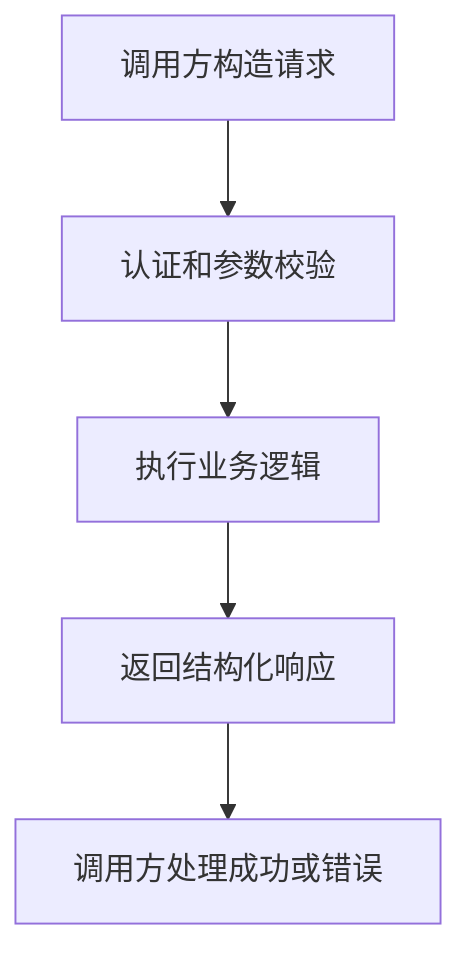

# API
API 是系统之间暴露能力和交换数据的接口契约，可用于模型调用、工具调用和业务服务集成。

## API 设计要素

- 资源或能力：接口到底暴露什么。
- 输入参数：路径、查询、请求体和 Header。
- 输出结构：成功响应、错误响应和分页结构。
- 认证授权：谁可以调用，能做什么。
- 版本和兼容：接口变化如何演进。

## 调用流程

## 实践检查清单

- 请求和响应是否有明确契约。
- 错误码和错误结构是否统一。
- 是否有超时、重试和限流策略。
- 是否记录调用日志和 traceId。
- 是否提供版本管理和废弃策略。

## 案例

模型工具调用 API 需要写清工具名、参数 schema、返回结构和失败类型。否则 Agent 很难判断何时调用、如何填参、失败后是否重试。

## 设计边界

API 是契约，不只是函数入口。一个稳定 API 要让调用方在不知道内部实现的情况下，仍能理解参数含义、成功条件、错误类型和重试策略。字段命名、默认值、幂等性和分页方式一旦发布，就会成为外部依赖，不能随内部代码随意改变。

对 AI 工具调用而言，API 还要足够“可描述”。参数 schema 应避免模糊字段，错误响应要能指导模型下一步是重试、补参数、换工具，还是向用户说明失败。

## 常见误区

- 只写成功响应，不写错误响应。
- 接口语义不稳定，字段随实现细节变化。
- 没有幂等和超时设计，调用方难以恢复。

## 相关概念
- [[RESTful API 设计]]
- [[前后端接口契约]]
