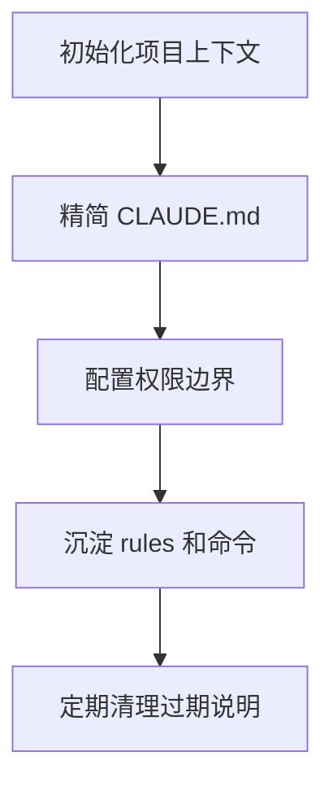

# Claude Code 配置详解

> 大多数人用 Claude Code，根本没打开过 `.claude/` 文件夹。
>
> 这个文件夹是 Claude 的「控制中心」——它决定 Claude 懂不懂你的项目、遵不遵守你的规范、能不能自动完成复杂工作流。配好了是得力助手，没配就是一个记忆力极差的外包。

---

## 核心文件解析

### 1. CLAUDE.md — 项目的「入职文档」

- Claude 每次启动**第一个读它**，直接进系统 prompt
- 写什么它就遵守什么
- **建议控制在 200 行内**：
  - ✅ 构建命令
  - ✅ 架构决策
  - ✅ 约定规范
  - ✅ 踩坑记录
  - ❌ 不要放能用 linter 自动做的事

### 2. rules/ — CLAUDE.md 变长后的解法

- 按关注点拆分成多个 `.md` 文件
- 可设**路径作用域**——只有处理 `src/api/` 下文件时才加载 API 规范
- 不会污染其他上下文

### 3. commands/ — 自定义斜杠命令

- `review.md` → `/project:review`
- 支持 `!bash` 执行并注入输出
- ⚠️ 注意：最新版已将 commands 合并进 skills

### 4. skills/ — 可复用工作流

- **核心区别**：由 Claude **自动触发**，无需手动输入命令
- 每个 skill 是独立子目录
- 可以打包指令 + 支撑文件

### 5. agents/ — 专职子 Agent

- 复杂任务时 Claude 会 spawn 一个独立上下文的 Agent 来处理
- 完成后压缩结果返回主会话
- 可以限制工具权限
- 可以指定更便宜的模型

### 6. settings.json — 权限白名单/黑名单

- `allow` 里的命令免确认
- `deny` 里的永久封锁（比如 `rm -rf *` 和 `.env` 读取）
- 其余命令执行前询问

---

## 两套目录体系

| 级别 | 路径 | 用途 |
|------|------|------|
| **项目级** | `.claude/` | 提交 git，全团队共享 |
| **全局级** | `~/.claude/` | 存个人偏好，跨项目生效 |

---

## 起步建议

不用一步到位：

1. **先 `/init`** 生成 CLAUDE.md，精简到要点
2. **配好 settings.json** 的 allow/deny
3. **再慢慢把 CLAUDE.md 拆进 rules/**

---

## 核心结论

> Agent 质量越来越是**环境设计问题**，不是提示词问题。
>
> 把 `.claude/` 配好，就是把 Claude 变成真正懂你项目的队友。

## 配置流程

## 实践检查清单

- CLAUDE.md 是否写项目特有规则，而不是泛泛而谈。
- 权限 allow/deny 是否覆盖危险命令和敏感文件。
- 项目级配置和个人级配置是否边界清楚。
- 常用工作流是否抽成命令或规则，减少重复提示。
- 配置变更后是否用真实任务验证 Agent 行为。

---

## 相关链接

- [Claude Code 官方文档](https://docs.anthropic.com/en/docs/claude-code/overview)
- [[Claude Code Skills 开发]]
- [[AI 编程工具对比]]
