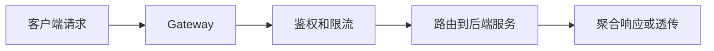

# Gateway
Gateway 是请求入口层，负责路由、鉴权、限流、协议转换和统一治理。

## 相关概念
- [[Spring Cloud Gateway]]
- [[API]]

## 请求流程

## 常见职责

- 路由：根据路径、域名、Header 或租户分发请求。
- 安全：统一认证、签名校验和黑白名单。
- 治理：限流、熔断、灰度、降级和观测。
- 协议适配：对外 HTTP，对内 RPC 或其他协议。

## 实践检查清单

- 是否把通用治理放在网关，把业务规则留在服务内。
- 网关超时是否小于下游总超时预算。
- 是否记录请求 ID、上游、下游、耗时和状态码。
- 灰度规则是否可回滚，且不会破坏会话一致性。

## 常见误区

- 把大量业务逻辑塞进网关，导致入口层臃肿。
- 网关单点故障，没有高可用和容量规划。
- 只做路由，不做可观测和限流，故障时难以定位。
