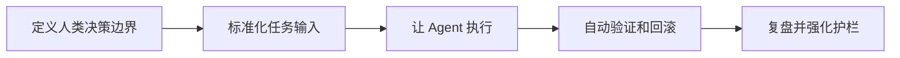

# Harness Engineering（驾驭工程）
## 定义
Harness Engineering（驾驭工程）指的是：把工程团队的主任务从“亲自写代码”转为“构建一套让 AI Agent 可执行、可验证、可回滚、可观测的系统”。

## 核心判断
- 仅在现有流程上加 AI（如写代码助手）通常是 10%~20% 提效。
- 真正的 AI-First 是重构流程与组织：让 AI 执行构建，人类负责目标、边界与风险判断。
- 当“实现速度”远快于“规划/测试/发布速度”时，瓶颈会从开发转移到 PM、QA、运营。

## 与 AI 辅助的区别
| 维度 | AI 辅助 | AI-First（Harness） |
|---|---|---|
| 定位 | 给人提效 | 让 AI 成为主要执行者 |
| 流程 | 原流程不变 | 重构规划、测试、部署、分诊全链路 |
| 质量保障 | 依赖人工补救 | 依赖系统化护栏（测试、回滚、告警、门禁） |
| 组织角色 | 以“编码产出”衡量 | 以“决策质量+约束能力”衡量 |

## 必备系统能力
- **统一上下文**：尽量减少“AI 看不见”的分散系统（如多仓割裂导致跨服务不可推理）。
- **确定性流水线**：固定 CI/CD 阶段和门禁，让 Agent 能预测结果与定位失败。
- **自动化验证**：单测、集成、端到端测试与环境一致性检查成为强制项。
- **可观测与分诊**：日志、指标、错误聚类、自动建单、回归验证、自动关单。
- **发布护栏**：Feature Flag、灰度发布、熔断/自动回滚、快速 Kill Switch。

## 组织形态变化
- **架构师（少数）**：定义 SOP、系统边界、验证标准和失败模式。
- **操作员（多数）**：调查问题、验证修复、评估 PR 风险与体验质量。
- 能力重心由“手写代码速度”转向“批判性思维、系统设计、风险判断”。

## 落地清单（实践版）
1. 先补验证系统，再扩 AI 生成规模（避免“高速制造技术债”）。
2. 把发布流程改成可回放、可审计、可自动回滚的标准流水线。
3. 建立“错误发现→分诊→修复→复验→关单”闭环，减少人工跟单。
4. 统一关键上下文（代码、日志、指标、依赖）并结构化给 Agent 使用。
5. 将 AI-Native 扩展到产品/运营/市场，避免单点提速、全局受限。

## 适用边界
- 适合：迭代快、实验密集、可观测基础较好的产品团队。
- 不适合：缺少基础测试、缺少日志监控、发布流程不可控的团队（需先补底座）。

## 相关概念
- [[AI Agent]]
- [[Prompt Engineering]]
- [[AI-Coding-50-工作法]]

## 实践流程

## 实践检查清单

- 是否先补齐测试、CI、日志和回滚，再扩大 Agent 执行范围。
- Agent 能看到的上下文是否结构化且权限受控。
- 每类任务是否有明确验收标准和失败处理。
- 人类是否聚焦目标、风险和取舍，而不是逐行代写。
- 是否监控吞吐、质量、成本和事故率。

## 案例

需求修复流程可以由 Agent 生成补丁和测试，人类负责确认需求边界与风险。CI 失败时 Agent 根据日志迭代，连续失败则升级给人处理。

## 常见误区

- 把 AI-First 理解成“所有代码都让 AI 随便写”。
- 验证系统薄弱时扩大生成规模，技术债增长更快。
- 只优化编码速度，不优化评审、测试和发布瓶颈。
