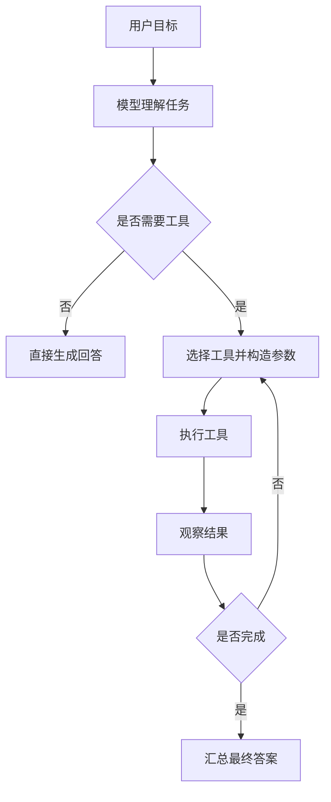

# Agent

Agent 是一种能够感知环境、进行推理并采取行动的智能体。在 LangChain 中，Agent 是一个可以调用工具（Tools）的 AI 系统。

## 核心特征

- **推理能力** - 能够分析输入并决定如何响应
- **工具调用** - 可以访问外部 API、数据库等
- **状态管理** - 维护对话上下文和工作流状态
- **自主决策** - 根据目标自主规划执行步骤

## 使用场景

- 问答系统（结合检索）
- 任务自动化（如预订、查询）
- 代码助手
- 数据分析代理

## 相关概念

- [[Tool]] - Agent 调用的外部功能
- [[Chain]] - Agent 的基础执行单元
- [[Memory]] - 状态管理组件
- [官方文档](https://python.langchain.com/docs/concepts/agents/)

## 工作流程

## 设计检查清单

- 目标是否足够明确，能判断任务何时结束。
- 工具描述是否具体，参数 schema 是否限制了错误输入。
- 工具是否有权限边界，避免 Agent 执行危险操作。
- 中间步骤是否可观测，便于排查错误工具调用。
- 是否限制最大轮数、超时和成本，防止循环调用。

## 案例

“查询某客户最近三个月消费并生成摘要”的 Agent 通常需要先调用客户检索工具，再调用订单查询工具，最后让模型总结。若客户不存在或订单接口失败，Agent 应返回可解释的失败状态，而不是编造结果。

## 常见误区

- 把 Agent 用在简单固定流程上，反而增加不可控性。
- 工具权限过大，模型一次错误决策就能修改真实数据。
- 没有记录工具输入输出，线上问题无法复盘。
