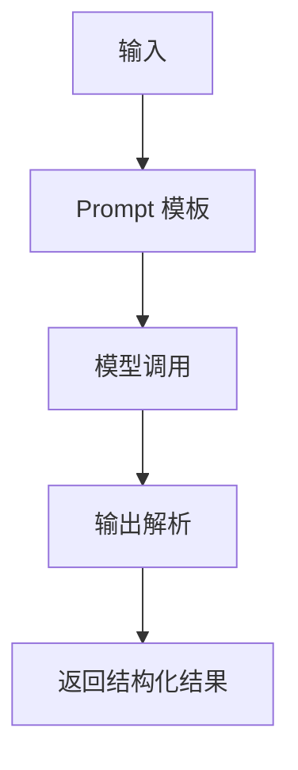

# Chain
Chain 是把模型、提示词、工具和解析器按顺序组合成可复用流程的抽象。

## 组成结构

- Prompt：组织输入和任务说明。
- Model：执行生成或推理。
- Parser：把模型输出转成结构化结果。
- Tool 或 Retriever：在固定位置补充外部能力。
- Runnable：现代 LangChain 中的组合单元。

## 执行流程

## 实践检查清单

- 流程是否固定，不需要模型动态选择工具。
- 输入和输出是否有 schema 或示例。
- 是否处理模型输出不符合预期的情况。
- 是否有测试样例覆盖常见输入。
- 流程变复杂后是否应迁移到 Agent 或 LangGraph。

## 案例

“把用户问题改写成搜索查询”适合 Chain：输入问题，Prompt 约束改写规则，模型生成查询词，Parser 输出字符串或 JSON。它不需要动态工具选择。

## 适用边界

Chain 适合路径固定、输入输出明确的流程。它的优势是可预测、易测试、便于复用；缺点是灵活性有限，遇到需要动态选择工具、循环反思或多分支状态的任务时会变得僵硬。判断是否使用 Chain，可以看流程图是否基本是一条线。

工程上要尽量让每个 Chain 有清晰的输入 schema 和输出 parser。不要让后续代码依赖模型自然语言中的某个词，否则 Prompt 轻微变化就可能破坏流程。

## 常见误区

- 把需要多步决策的任务硬塞进单条 Chain。
- 没有输出解析，后续代码依赖脆弱文本格式。

## 相关概念
- [[LangChain-Chains]]
- [[PromptTemplate]]
