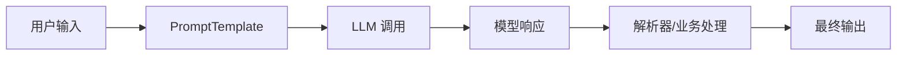

# LLM

## 定义

大语言模型（Large Language Model）是 LangChain 的核心组件，负责理解输入、推理、生成响应，并在 Agent 或 Chain 中作为决策与文本生成引擎。

## 调用流程



LLM 本身只处理输入和输出。真实应用还需要 Prompt、工具、记忆、检索、输出解析和错误处理一起组成稳定链路。

## 支持的模型

| 提供商 | 推荐模型 |
|--------|----------|
| OpenAI | gpt-4o, gpt-4o-mini |
| Anthropic | claude-sonnet-4-5 |
| Google | gemini-pro |
| 开源 | Llama, Mistral (通过 Ollama) |

## 关键参数

- **temperature** - 创造力（0=确定性，1=随机）
- **max_tokens** - 最大输出长度
- **model** - 模型名称
- **timeout** - 调用超时时间，避免请求长时间挂起
- **retry** - 短暂网络故障时的重试策略
- **streaming** - 是否流式输出，改善长答案体验

## 使用示例

```python
from langchain.chat_models import ChatOpenAI

llm = ChatOpenAI(
    model="gpt-4o",
    temperature=0.7
)

response = llm.invoke("你好")
```

## 场景案例

企业知识库问答通常不是直接调用 LLM，而是：

1. 用 [[RAG]] 检索相关文档。
2. 把文档片段注入 Prompt。
3. LLM 只基于上下文回答。
4. 输出答案和引用来源。
5. 对无法回答的问题明确拒答。

## 检查清单

- Prompt 是否明确角色、上下文、输出格式和拒答规则。
- 参数是否按场景设置：事实问答低 temperature，创意生成可适当提高。
- 是否设置超时、重试和错误兜底。
- 输出是否需要结构化解析和校验。
- 是否记录输入、输出、模型、延迟和成本，便于评估。

## 相关概念

- [[PromptTemplate]] - 构建输入
- [[Agent]] - 使用 LLM 的智能体
- [模型提供商](https://python.langchain.com/docs/integrations/providers/)
