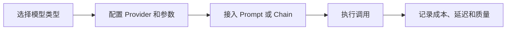

# LangChain-Models
LangChain-Models 指 LangChain 中对聊天模型、文本模型和嵌入模型的统一封装。

## 相关概念
- [[LLM]]
- [[Embedding]]

## 使用流程

## 实践检查清单

- 聊天模型、文本模型和嵌入模型是否分清用途。
- 温度、最大输出、超时和重试是否有明确配置。
- 模型输出是否有结构化约束或解析校验。
- 嵌入模型维度是否和向量库索引一致。
- 是否记录模型版本，避免升级后行为变化不可追踪。

## 案例

客服摘要适合使用聊天模型生成结构化摘要；知识库检索则需要嵌入模型把文档和问题转成向量。两者不要混用同一套评估指标。

## 常见误区

- 只按模型名称选择，不评估延迟、成本和上下文长度。
- Embedding 模型更换后不重建索引。
- 没有固定模型版本，线上输出随供应商升级变化。
