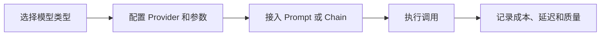

# LangChain-Models
LangChain-Models 指 LangChain 中对聊天模型、文本模型和嵌入模型的统一封装。

## 相关概念
- [[LLM]]
- [[Embedding]]

## 使用流程

## 实践检查清单

- 聊天模型、文本模型和嵌入模型是否分清用途。
- 温度、最大输出、超时和重试是否有明确配置。
- 模型输出是否有结构化约束或解析校验。
- 嵌入模型维度是否和向量库索引一致。
- 是否记录模型版本，避免升级后行为变化不可追踪。

## 案例

客服摘要适合使用聊天模型生成结构化摘要；知识库检索则需要嵌入模型把文档和问题转成向量。两者不要混用同一套评估指标。

## 选择边界

选择模型时应先按任务拆分：生成、分类、抽取、检索、重排和工具调用可能需要不同模型或不同参数。聊天模型擅长上下文理解和生成，Embedding 模型负责语义表示，重排模型负责候选排序。把所有任务交给同一个模型，通常会增加成本或降低稳定性。

模型配置要可追踪。版本、温度、上下文长度、超时、重试和供应商都属于运行契约，变化后应能通过评测集比较效果。

生产应用还要准备模型降级策略，例如主模型不可用时切换备用模型，或在高成本场景下使用更小模型处理低风险任务。

## 常见误区

- 只按模型名称选择，不评估延迟、成本和上下文长度。
- Embedding 模型更换后不重建索引。
- 没有固定模型版本，线上输出随供应商升级变化。

## 复盘问题

- 这个任务需要生成、嵌入、重排还是分类模型。
- 模型升级后是否能用同一评测集比较质量、成本和延迟。
