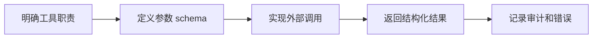

# LangChain-Tools
LangChain-Tools 是让 Agent 调用外部函数、API、数据库或搜索服务的工具抽象。

## 相关概念
- [[Tool]]
- [[LangChain-Agents]]

## 设计流程

## 实践检查清单

- 工具名称和描述是否能让模型准确判断何时调用。
- 参数是否有类型、枚举、范围和必填约束。
- 工具是否幂等，或对写操作增加确认和权限检查。
- 错误返回是否可被模型理解并用于下一步决策。
- 是否记录工具输入、输出摘要、耗时和调用结果。

## 案例

查询订单工具应只接收 `order_id` 或明确的过滤条件，并返回订单状态、金额、用户和时间等结构化字段。不要让模型传任意 SQL。

## 常见误区

- 工具描述太抽象，模型频繁误调用。
- 直接暴露高权限 API，没有最小权限和审计。
- 返回大段非结构化文本，模型难以稳定解析。
